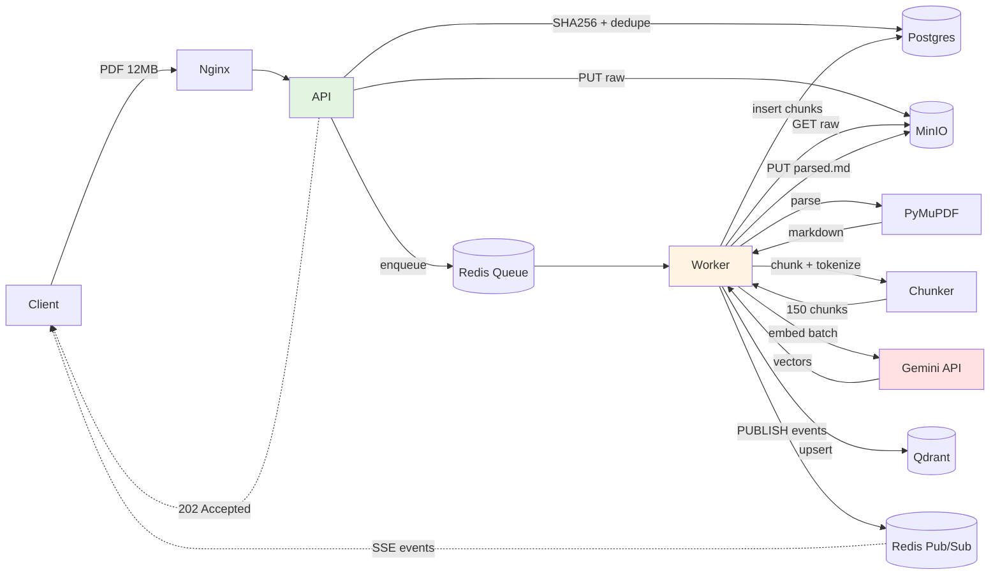
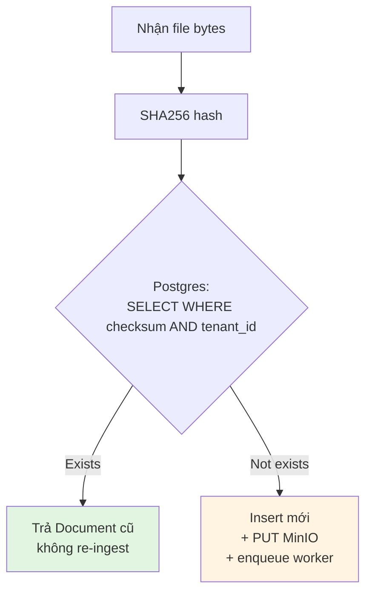
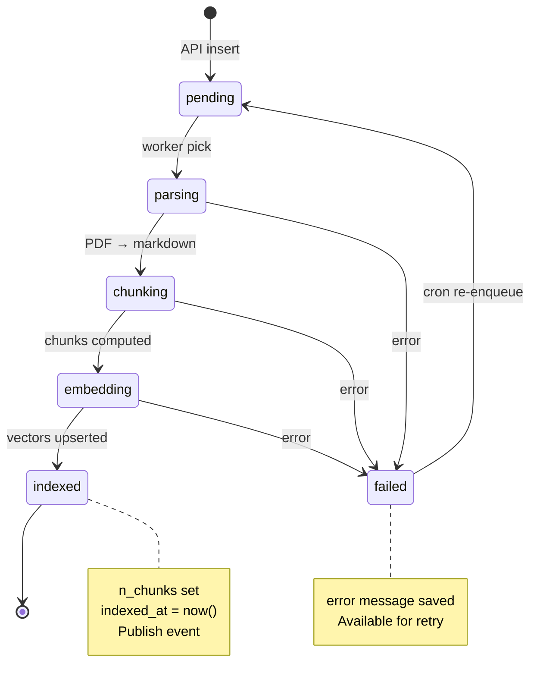
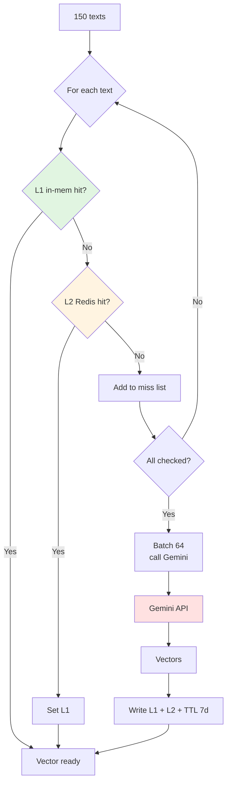

# 08 — Data Lifecycle: từ byte đầu tiên đến vector searchable

Doc này theo dõi **toàn bộ hành trình của 1 file PDF**, từ lúc client gửi
multipart request đến lúc vector đã sẵn sàng search. Mục tiêu: hiểu rõ mỗi
byte đi đâu, được biến đổi thế nào, ghi vào storage nào, và tại sao.

---

## 0. Overview diagram



Mỗi bước được giải thích chi tiết bên dưới.

---

## 1. Bước 0 — Client request đến FastAPI

```
Browser/CLI  ──[HTTP POST /v1/files, multipart, body 12MB]──►  Nginx
                                                                 │
                                                                 ▼
                                                              API container
```

### Tại Nginx
- `client_max_body_size 200m;` — chấp nhận tổng body.
- `proxy_request_buffering on;` — buffer hết body rồi mới forward (KHÔNG stream).
  Tại sao: tránh API thread bị giữ chờ slow client (slowloris). Buffer trên
  disk nếu vượt `client_body_buffer_size 1m;`.
- Round-robin chọn 1 trong N replica API (giả sử 2 replicas, replica `api-1`).

### Tại FastAPI (`api-1`)
- `python-multipart` parse từng `UploadFile` thành stream.
- Code đọc `await up.read()` — **gọi 1 lần, toàn bộ vào RAM**.
  Trade-off: đơn giản, OK cho file ≤50MB. Nếu file lớn hơn → chuyển sang
  streaming + multipart upload thẳng vào MinIO (chưa cần).

→ Tại điểm này, file 12MB đang ở RAM của process `api-1`. **Chưa có gì persist**.

---

## 2. Bước 1 — Validate + Checksum + Dedupe

```python
# src/api/routes/files.py
checksum = hashlib.sha256(data).hexdigest()      # CPU work, ~50ms cho 12MB

existing = await repo.by_checksum(tenant_id=tenant_id, checksum=checksum)
if existing is not None:
    out_docs.append(_doc_to_out(existing))       # short-circuit: dedupe!
    continue
```

### Tại sao SHA-256?
- **Collision-resistant**: practically không trùng cho file khác nội dung.
- **Dedupe per-tenant**: cùng file luật user upload 2 lần → chỉ index 1 lần,
  tiết kiệm embedding cost (~$0.05/100k tokens × tài liệu vài trăm trang =
  vài cent mỗi file).
- **Constraint Postgres**: `UNIQUE(tenant_id, checksum_sha256)` ép DB từ chối
  insert dup → race-safe ở cấp DB.

### Dedupe flow



### Race condition: 2 user upload cùng file cùng lúc?
- T0: User A check checksum → not exists.
- T0+1ms: User B check checksum → not exists.
- T0+50ms: Cả 2 insert.
- Postgres UNIQUE constraint sẽ raise `IntegrityError` cho 1 trong 2.
- Code hiện tại **chưa catch** → user thứ 2 nhận 500.
- Fix nhỏ (TODO): try/except IntegrityError → return existing record. Hiện
  trade-off chấp nhận được vì xác suất < 0.1%.

---

## 3. Bước 2 — Object Storage (MinIO)

```python
storage_key = f"tenants/{tenant_id}/docs/{doc_id}/raw"
await put_object(storage_key, data, content_type=mime)
```

### Key layout
```
rag-files/                                  ← bucket
├── tenants/
│   ├── <tenant_a_uuid>/
│   │   └── docs/
│   │       ├── <doc1_uuid>/
│   │       │   ├── raw                     ← bytes gốc
│   │       │   └── parsed.md               ← sau khi worker parse
│   │       └── <doc2_uuid>/...
│   └── <tenant_b_uuid>/...
└── langfuse-events/                        ← Langfuse dùng cùng bucket
```

### Vì sao layout này?
- **Prefix-based access control**: dễ áp IAM policy nếu chuyển AWS S3 thật
  (`s3:GetObject` chỉ trong `tenants/${aws:PrincipalTag/tenant_id}/*`).
- **Listing per tenant** nhanh: `mc ls local/rag-files/tenants/<tid>/` =
  metadata fetch O(prefix), không scan toàn bucket.
- **Lifecycle policy**: có thể đặt rule "doc không touch >90 ngày → tier
  Glacier" theo prefix.

### Behind-the-scenes MinIO
- File 12MB → MinIO chia thành **erasure-coded blocks** (mặc định 4+2 nếu
  ≥6 drive, single-disk thì plain).
- Healthcheck của container: `GET /minio/health/ready`.
- API trả thành công khi đã fsync. Đây là **point of durability đầu tiên** —
  từ đây nếu API crash, file vẫn an toàn.

---

## 4. Bước 3 — Document row trong Postgres

```python
d = await repo.create(
    tenant_id=tenant_id, user_id=user_id,
    title=up.filename or "untitled",
    mime_type=mime, size_bytes=len(data),
    checksum=checksum, storage_key=storage_key,
)
```

### Row khi insert xong
```sql
SELECT id, status, n_chunks, storage_key, markdown_key, indexed_at FROM documents WHERE ...;
--   <uuid>     pending     NULL       tenants/.../raw     NULL          NULL
```

`status = 'pending'` — chưa có gì parse. Đây là "control plane" của ingestion:
worker sẽ poll/dùng làm source-of-truth.

### Transaction boundary
Tại điểm này code chưa `commit`. Tất cả N file của 1 upload request:
1. PUT từng file lên MinIO.
2. Insert N rows `documents`.
3. Enqueue N jobs vào Redis.
4. **Commit cuối cùng**.

Lý do gom commit: nếu request fail giữa chừng (vd file thứ 3 vượt size limit),
**rollback** N row trước → DB sạch. MinIO objects có thể còn rác → có cron job
sweep object không có row tương ứng sau 24h.

### Outbox alternative (chưa dùng)
Hiện tại dùng "best-effort" pattern: insert DB → enqueue Redis trong cùng
transaction logic, không trong cùng DB transaction. Có khả năng:
- T0: insert DB OK.
- T1: commit DB OK.
- T2: `arq.enqueue_job` fail (Redis transient lỗi).
- Hệ quả: doc stuck `pending` mãi.

Mitigation: cron sweep `WHERE status='pending' AND created_at < now()-5m` →
re-enqueue. Khi scale lớn hơn nên implement **Outbox pattern**: insert event
vào table `outbox` cùng transaction, worker thứ 2 đọc outbox → publish Redis.

---

## 5. Bước 4 — Enqueue ARQ job

```python
arq = await get_arq_pool()
job = await arq.enqueue_job("process_document", str(d.id))
```

### Trong Redis trông thế nào?
ARQ dùng **Redis Streams** + **sorted sets**:
```
arq:queue        ← sorted set, score = scheduled_run_at (epoch ms)
arq:job:<jid>    ← hash chứa serialized args + status
arq:result:<jid> ← hash chứa result + finish time (sau khi xong)
arq:in-progress  ← set jobs đang được worker pick
```

Job được pickle (cẩn thận: object chứa connection sẽ fail) — code chỉ truyền
`str(doc_id)`, an toàn.

### Khi nào worker pick?
- Mọi worker process (giả sử 2 replicas × 8 concurrency = 16 slot) đang
  `BLPOP`/`BZPOPMIN` chờ.
- Redis push job ngay khi `enqueue_job` return → **latency picking < 5ms**.

### Tại sao không enqueue ngay khi upload mới đến (trước cả insert DB)?
- Nếu DB insert fail sau khi enqueue → worker pick job, không tìm thấy doc,
  log warning rồi return. Không nguy hiểm nhưng tốn slot worker.
- Thứ tự "DB trước, queue sau" giúp worker luôn thấy state hợp lệ.

---

## 6. Bước 5 — Worker xử lý



Worker `worker-1` pick job, gọi `process_document(ctx, doc_id_str)`.

### 6.1. Load row
```python
async with session_scope() as session:
    doc = await repo.get_internal(doc_id)
    if doc.status == "indexed":
        return  # idempotent: re-delivered job không re-process
    storage_key, mime_type, title, user_id, tenant_id = ...
    await repo.set_status(doc_id, "parsing")
```

Snapshot fields trước khi commit để dùng sau khi ra khỏi session — ORM object
sẽ "detached" sau commit, access lazy attribute sẽ raise.

### 6.2. Download từ MinIO
```python
data = await get_object_bytes(storage_key)
```
12MB lại vào RAM của worker. Worker container có `mem_limit` riêng → cô lập
với API.

### 6.3. Parse PDF (PyMuPDF)
```python
parsed = await parse_file(data, mime_type=mime_type, filename=title)
# ~ 800ms cho PDF 200 trang text-only
```

Chạy trong `asyncio.to_thread` vì PyMuPDF là sync, CPU-bound. Thread pool
mặc định Python = max(32, os.cpu_count()+4). Nếu nhiều job parse cùng lúc →
GIL contention; mitigation: tăng `WORKER_REPLICAS` thay vì raise concurrency
trong 1 worker.

Output:
```python
ParseResult(
    pages=[ParsedPage(page_number=1, text="..."), ...],
    markdown="## [Page 1]\n\n...\n\n## [Page 2]\n\n...",
    meta={"format": "pdf", "n_pages": 200, "title": "Luật DN", "author": ""}
)
```

### 6.4. Upload markdown lại MinIO
```python
markdown_key = storage_key.rsplit("/", 1)[0] + "/parsed.md"
await put_object(markdown_key, parsed.markdown.encode("utf-8"), "text/markdown")
```

Tại sao lưu markdown song song với raw?
- **Debug**: dev có thể xem markdown đã parse, đối chiếu với output retrieval.
- **Re-chunk**: nếu sau này đổi chiến lược chunking, KHÔNG cần parse lại PDF
  (chậm, đắt) — chỉ cần đọc markdown đã có.
- **Citation enrichment**: với heading_path "Chương II > Điều 5", có thể fetch
  exact context xung quanh từ markdown nếu cần.

### 6.5. Chunk
```python
chunks = chunk_document(parsed)
# ~150 chunks cho 200 trang luật, 100ms
```

Trace bước split (xem [src/ingestion/chunkers/base.py](../src/ingestion/chunkers/base.py)):

1. **Detect**: `re.findall(r"Điều \d+", md)` → 87 matches; `Chương` → 12 matches
   → **is_legal = True**.
2. **Split theo Điều**: tạo 87 sections, mỗi section gồm heading + body.
3. **Per-section token count** (`tiktoken cl100k_base`):
   - Section 1: 320 tokens ≤ 800 → emit 1 chunk.
   - Section 2: 1450 tokens > 800 → recursive split theo `\n\n` → 3 sub-chunks,
     mỗi sub-chunk prepend heading `Chương II > Điều 5\n\n...`.
4. **Mỗi chunk** gồm: `index`, `text`, `n_tokens`, `heading_path`, `page_from/to`.

### 6.6. Update status → embedding

```python
await DocumentRepo(session).set_status(doc_id, "embedding")
await _publish(doc_id, "status", {"status": "embedding", "n_chunks": len(chunks)})
```

`_publish` đẩy event vào Redis Pub/Sub channel `doc:<doc_id>:events`. API
container nào đang giữ SSE connection cho doc này sẽ nhận và forward cho client:
client thấy "đang embedding... 150 chunks".

### 6.7. Embedding với cache



```python
vectors = await emb.embed(texts)
```

Per text trong `embed`:
1. Compute key `make_key("emb", "text-embedding-004", text)` → SHA-256 hex.
2. Look L1 (in-memory LRU, capacity 5000).
3. Miss → look L2 (Redis `GET <key>`).
4. Miss cả 2 → vào batch "misses".

Sau khi gom xong misses, batch (`embedding_batch_size = 64`):
- Mỗi batch call `embeddings.create(model=..., input=[64 strings])`.
- Latency Gemini ~ 400-700ms/batch.
- Cho 150 chunks → 3 batch song song? **Không**, code hiện tại tuần tự — vì
  Gemini có rate limit (~ 1500 RPM ở free tier). Có thể `asyncio.gather` nếu
  account paid và đảm bảo retry.

Sau call, write-back vào L1 + L2 (`SET <key> <vec> EX 604800`).

#### Token cost cho file 200 trang
- ~150 chunks × ~400 tokens/chunk = 60k tokens.
- Gemini embedding pricing free đến nay, sau đó ~$0.025/1M token → ~$0.0015/file.
- Re-upload cùng file → 0 cost vì cache + dedupe.

### 6.8. Upsert Qdrant
```python
points = [PointStruct(id=point_id, vector=v, payload={...}) for ...]
await qc.upsert(collection_name="documents", points=points[i:i+128], wait=True)
```

`wait=True` đảm bảo Qdrant đã ghi vào segment + flush WAL trước khi return.
Trade-off: chậm hơn `wait=False` (~50ms vs ~5ms cho batch 128) nhưng đảm bảo
search ngay sau insert sẽ thấy.

#### Bên trong Qdrant cho mỗi point
- **Vector**: 768 float32 = 3072 bytes.
- **Payload**: ~500 bytes JSON.
- **HNSW graph**: thêm 1 node, kết nối với ~16 neighbors (`m=16`).
- **Memory**: vector mặc định **in-memory** (`on_disk=False`).

→ 150 chunks ≈ 150 × 4KB = **600 KB RAM** trên Qdrant cho 1 file.

Với 1M chunks: ~4 GB RAM. Cần bật quantization (scalar int8 → giảm 4x) hoặc
`on_disk=True` (chậm hơn nhưng RAM thấp) khi data lớn.

### 6.9. Insert chunks vào Postgres
```python
async with session_scope() as session:
    await DocumentRepo(session).bulk_insert_chunks(orm_rows)
    await DocumentRepo(session).set_status(doc_id, "indexed", n_chunks=...)
```

Tại sao lưu cả ở Postgres lẫn Qdrant payload?
- Qdrant payload: phục vụ search response — return text + heading luôn cùng
  vector hit, **không phải roundtrip Postgres**.
- Postgres `document_chunks`: nguồn truth cho rerank/citation/eval; dễ
  scan/SQL/join với `documents`. Khi xoá doc, cascade dễ.

Trùng dữ liệu = trade-off có chủ đích: tăng storage ~2x nhưng giảm read fan-out
ở hot path chat.

### 6.10. Publish event indexed
```python
await _publish(doc_id, "status", {"status": "indexed", "n_chunks": 150})
```

Client SSE nhận event này → close stream → UI cập nhật badge "Sẵn sàng".

---

## 7. Bước 6 — Searchable!

Từ thời điểm này, mọi chat query của bất kỳ user trong cùng tenant đều có thể
hit chunk của file này:

```python
# trong agent retrieve node
hits = await qc.search(
    collection_name="documents",
    query_vector=query_vec,
    query_filter=Filter(must=[
        FieldCondition(key="tenant_id", match=MatchValue(value=str(tenant_id)))
    ]),
    limit=20,
)
```

HNSW search latency cho 1M points: ~5-15ms ở Qdrant default.

---

## 8. Tổng latency cuối cuối (file 200 trang)

| Bước | Thời gian |
|------|-----------|
| Upload + checksum + DB row + enqueue | ~200ms |
| Worker pick job | ~5ms |
| Download MinIO | ~100ms |
| Parse PDF | ~800ms |
| Chunk + token count | ~100ms |
| Embedding (3 batch × 600ms tuần tự, có cache miss hết) | ~1800ms |
| Qdrant upsert (2 batch × 50ms) | ~100ms |
| Insert chunks Postgres | ~50ms |
| **Tổng** | **~3.2s** |

User thấy event `indexed` sau ~3s từ lúc upload xong → UX OK cho file đầu;
file thứ 2 cùng nội dung → instant (dedupe).

---

## 9. Lỗi và recovery ở từng bước

| Lỗi tại bước | Trạng thái Postgres | Recovery |
|--------------|--------------------|---------| 
| MinIO PUT fail (network) | (chưa có row) | API trả 500, client retry |
| DB insert fail (UNIQUE dup) | row cũ tồn tại | trả doc cũ (dedupe) |
| Redis enqueue fail | row `pending` | cron sweep re-enqueue sau 5 phút |
| Worker crash khi parsing | `parsing` | cron sweep `parsing AND updated_at<now-10m` → re-enqueue |
| Embedding API rate limit | `embedding` | tenacity retry 3 lần với jitter; nếu vẫn fail → `failed` |
| Qdrant down | `embedding` | tenacity retry; nếu lâu → `failed`, user thấy error event |
| Insert chunks DB fail | đã upsert Qdrant | next retry sẽ `delete_doc_vectors` trước khi index lại → idempotent |

Tất cả failure modes đều **không mất data gốc** (file luôn ở MinIO) và **không
inconsistent vĩnh viễn** (cleanup phía Qdrant trước retry).

---

## 10. Kiểm chứng

Sau khi index xong, để verify thủ công:
```bash
# 1. Postgres: status indexed, n_chunks > 0
make psql
# > SELECT id,title,status,n_chunks FROM documents ORDER BY created_at DESC LIMIT 5;

# 2. MinIO: cả raw + parsed.md tồn tại
docker compose exec minio sh -c "mc ls local/rag-files/tenants/<tid>/docs/<did>/"

# 3. Qdrant: count vectors theo doc_id
curl -s -XPOST http://localhost:6333/collections/documents/points/count \
  -H 'Content-Type: application/json' \
  -d '{"filter":{"must":[{"key":"doc_id","match":{"value":"<did>"}}]}}' | jq

# 4. Postgres chunks: số dòng == n_chunks
# > SELECT count(*) FROM document_chunks WHERE document_id='<did>';
```

3 con số phải khớp. Nếu không khớp → invariant bị vi phạm, mở [Doc 17 — failure
modes](17-failure-modes.md) check checklist recovery.
