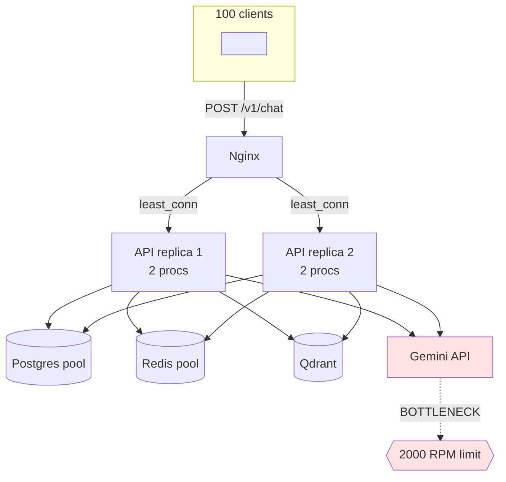
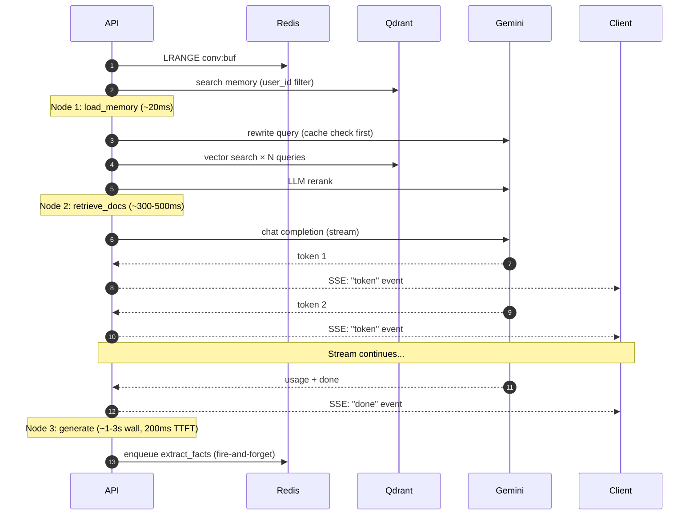

# 09 — Concurrency Model: chuyện gì xảy ra khi 100 user hỏi cùng lúc

Doc này trả lời câu hỏi cụ thể: "**Nếu 100 user gõ Enter cùng giây thì hệ
thống xử lý ra sao? Có nghẽn ở đâu? Tại sao không?**"

---

## 1. Tóm tắt thần kinh học của hệ

```
                        ┌─────────────┐
   100 client gõ Enter  │   Nginx     │  least_conn → distribute
   trong cùng 1 giây    │             │  giữa API replicas
                        └──────┬──────┘
                               │
                ┌──────────────┼──────────────┐
                ▼              ▼              ▼
            API-1          API-2          (... up to N)
        (2 procs × 1     (2 procs × 1                     ← Gunicorn workers
         event loop)      event loop)                       (uvicorn = 1 loop/proc)
                │              │
                └──────┬───────┘
                       │ thousands of coroutines / process
                       ▼
        ┌──────────────────────────────────────────┐
        │   Async I/O fan-out (cùng 1 process):    │
        │   - PG pool (10 conn + 10 overflow)      │
        │   - Redis pool (50 conn)                 │
        │   - Qdrant HTTP (httpx, keep-alive)      │
        │   - Gemini HTTPS (httpx, keep-alive)     │
        └──────────────────────────────────────────┘
```

Hiểu đúng để debug: **mỗi request là 1 coroutine**, không phải 1 thread. Một
process Python (1 event loop) có thể chạy **hàng nghìn coroutine đồng thời**,
mỗi cái ngủ chờ I/O không ngốn thread.

---

## 2. Vì sao "100 user cùng lúc" không gãy

### 2.1. Async I/O thay vì thread-per-request

FastAPI + Uvicorn xử lý theo mô hình **single-threaded event loop**:
- Khi request đến, coroutine handler chạy.
- Tới `await db.execute(...)` → coroutine yield, event loop nhận request khác.
- Network response về → coroutine resume.

Một process Python (~ 300 MB RAM) handle 1000+ coroutine đồng thời dễ dàng,
miễn là **không có blocking sync code** trong handler.

So với mô hình "1 thread / request" (Flask + Gunicorn sync): 100 request →
100 thread → context switch ~1ms/lần, RAM ~10MB/thread → 1GB chỉ để chờ.

### 2.2. Gunicorn workers nhân số process

```yaml
WEB_CONCURRENCY=2          # gunicorn workers / container
API_REPLICAS=2             # containers
# → 2×2 = 4 processes, 4 event loops, ~ 4000 coroutine slot lý thuyết.
```

Vì sao không 1 process? Python có GIL — CPU-bound code chạy serial trong
1 process. JSON serialize, Pydantic validate là CPU; 2-4 process tận dụng
nhiều core.

### 2.3. Load balancing tại Nginx

`least_conn` thay vì round-robin:
- Round-robin: API-1 đang stream SSE 1 phút, request mới vẫn alternating →
  user thứ 2 cũng vào API-1, queue dài.
- Least_conn: Nginx đếm active connection per upstream, đẩy request mới sang
  replica ít việc nhất → fair-share giữa replicas.

---

## 3. Đi theo 100 request chat đồng thời



Giả sử: 100 user, mỗi user 1 conversation, gọi `POST /v1/chat/{cid}/messages`
trong cùng 1 giây.

### Bước 1 — Nginx distribute (T+0ms)
```
API-1: nhận 50 connections
API-2: nhận 50 connections
```

### Bước 2 — Auth + load conv (T+5-20ms)
Mỗi request:
1. Decode JWT (HS256, ~0.1ms CPU).
2. `SELECT user WHERE id=...` — DB pool có 10 conn primary + 10 overflow / process.
3. `SELECT conv WHERE id=...` — query tiếp.

**Tính toán pool**:
- 50 request đồng thời trong 1 process. Mỗi request cần ~ 2 conn-instant trong
  short bursts.
- Pool 10+10 = 20 conn, đủ vì query <10ms, pool reused liên tục.

**Nếu DB chậm** (vd p99 = 500ms):
- 50 request × 2 query = 100 acquire calls cần serialize qua 20 conn.
- Wait time ≈ 100×500ms/20 = 2.5s. Pool timeout 30s → vẫn OK nhưng latency lên.

→ Khi DB là bottleneck, **tăng pool không giúp** (DB CPU limited); cần đặt
**PgBouncer transaction-pool** trước Postgres → pool effective ngàn conn.

### Bước 3 — Persist user message + Redis buffer (T+10-25ms)
- Mỗi user khác conversation_id → 100 key Redis độc lập (`conv:buf:<cid>`).
- Redis pipeline 3 command (RPUSH + LTRIM + EXPIRE) trong 1 round-trip.
- Redis throughput: ~100k op/s single instance → 100 user × 3 op = 300 op trong
  ~3ms. Không lo.

### Bước 4 — Agent chạy 3 nodes
Quan trọng nhất, lâu nhất.

#### Node 1: load_memory (~20ms)
- `LRANGE conv:buf` (~1ms).
- Vector search memory collection user-scoped (~10ms).
- **Tất cả 100 request làm song song** trên cùng Qdrant container.
- Qdrant Rust-based, dùng `tokio` async; throughput ~1000+ search/s nếu vector
  in-memory.

#### Node 2: retrieve (~300-500ms)
- Rewrite query (LLM): cache hit cao (~70%) cho user nói chuyện dài → ~20ms.
  Cache miss → call Gemini Flash ~400ms.
- Vector search 1-3 queries × 20 hits ~ 30-50ms.
- LLM rerank ~ 400-800ms.

**Đây là bottleneck thực sự** — Gemini API.

**Token bucket Gemini**:
- Free tier: 15 RPM / API key (rất thấp).
- Paid tier: 2000 RPM cho Flash.
- 100 concurrent request × 2 LLM call (rewrite + rerank) = 200 RPM trong 1 giây
  → spike ngắn nhưng có thể trigger 429.

**Mitigation hiện tại**:
1. Cache aggressive (rewrite + rerank cache hit ~50-70% sau warm-up).
2. tenacity retry với exponential backoff jitter — nếu 429 từ provider,
   chờ 1-2-4s rồi retry → user nhận token chậm vài giây.

**Mitigation cần thêm** khi scale:
- **Client-side rate limit** trong `LLMClient`: token-bucket trước khi gọi
  upstream, queue overflow → reject sớm.
- **Multiple API keys** round-robin (Gemini cho phép).

### Agent flow per request



#### Node 3: generate (stream, ~1-3s wall, 200ms first-token)
- Mỗi request mở 1 SSE stream về client.
- Connection từ API → Gemini HTTPS, `Transfer-Encoding: chunked`.
- 100 stream đồng thời trên 1 process → **vẫn OK** vì httpx async non-blocking.
  Mỗi stream chiếm ~10KB RAM.

### Bước 5 — Persist + fire-and-forget memory extract (T+end+5ms)
Sau khi stream done:
- INSERT message assistant (1 query).
- RPUSH buffer (1 round-trip Redis).
- `arq.enqueue_job("extract_facts", conv_id)` — return ngay, worker xử lý sau.

---

## 4. Connection pool sizing — công thức tham khảo

Cho 1 process API serving `R` requests/giây với latency trung bình `L` giây:

```
required_connections = R × L × parallel_db_calls_per_request
```

Ví dụ: 50 req/s, L=0.5s, mỗi req 2 query → 50 × 0.5 × 2 = **50 conn**. Pool
20 không đủ → bumping lên hoặc PgBouncer.

Postgres mặc định `max_connections=100`. Với 4 process × 20 conn = 80 — gần
giới hạn. **Đây là lý do PgBouncer ở mức scale lớn hơn**:
- App pool kết nối PgBouncer (rất nhiều).
- PgBouncer multiplex thành ít conn thật sang Postgres.

---

## 5. Stateless: tại sao scale ngang dễ

Mọi state đều ở external store:
- **Conversation state** → Postgres (canonical) + Redis (cached buffer).
- **Agent state** → LangGraph checkpointer (Postgres).
- **Cache** → Redis.
- **Vector** → Qdrant.

Hệ quả:
- User A gửi tin nhắn đầu tiên qua `api-1`, tin tiếp theo qua `api-2` → **mọi
  thứ vẫn đúng** vì cả 2 đọc cùng Redis/Postgres.
- Restart 1 replica giữa stream → request đó fail (1 user thấy lỗi), nhưng
  các stream khác trên replica khác **không ảnh hưởng**.

→ Có thể `docker compose up --scale api=10` mà không cần đổi 1 dòng code.

---

## 6. Worker concurrency

Worker khác API: thực hiện công việc nặng (parse PDF, embed batch). Concurrency
trong 1 worker process được kiểm soát bởi:
```python
class WorkerSettings:
    max_jobs = 8   # tối đa 8 coroutine job đồng thời trong process
```

### Vì sao 8 chứ không 100?
- Embedding API rate limit là quan trọng nhất.
- Parse PDF có CPU spike (`pymupdf` trong thread pool) → 8 thread CPU work
  song song = đủ với 2-4 core, không bottleneck.

Khi scale, **tăng số worker replica** trước, **tăng max_jobs** sau (vì replica
mới có process riêng → GIL không cùng).

### Backpressure tự nhiên
Nếu workload upload đột biến (vd 200 file/phút):
1. ARQ queue chứa job dồn lại trong Redis.
2. Worker pull dần với max_jobs=8/replica.
3. Document status `pending` trong DB → user thấy "đang chờ xử lý".
4. Không có job nào bị mất; chỉ chậm.

Đây là **graceful degradation** — UX kém hơn nhưng không sập.

---

## 7. Hot spot: 1 conversation, nhiều device

Tình huống: user A mở app trên 2 thiết bị, cùng conv. Cả 2 gõ message gần
như đồng thời.

### Race trên buffer Redis
- Device 1: RPUSH "Q1 từ device 1".
- Device 2: RPUSH "Q1 từ device 2".

Redis là single-threaded → 2 RPUSH serialize. Buffer có cả 2, **không mất**.

### Race trên DB
- 2 INSERT messages chạy song song → cả 2 thành công, mỗi cái có id khác.

### Race trên agent + LLM
- Mỗi request → agent run riêng → 2 stream song song. **Đúng** vì agent
  stateless trong runtime (checkpoint là per-thread_id trong LangGraph).
- LangGraph checkpoint dùng `(thread_id, checkpoint_id)`. Hiện tại agent stream
  trực tiếp không qua checkpointer (xem `graph.py`), nên không có conflict.
  Nếu sau này bật checkpointer cho non-stream path, dùng `thread_id =
  conversation_id` → 2 checkpoint song song của cùng thread sẽ ghi đè nhau.
  Mitigation khi cần: dùng `thread_id = f"{conversation_id}:{request_id}"`.

---

## 8. Số liệu lý thuyết tối đa (cho stack hiện tại)

Giả định:
- 2 replicas API × 2 procs × 1 event loop = 4 procs.
- Mỗi proc ổn định 200 concurrent stream (latency p95 = 3s mỗi).
- Throughput steady = `4 × 200 / 3 ≈ 266 RPS` (chat).
- Bottleneck Gemini Flash 2000 RPM = ~ 33 RPS upstream.
- Với cache hit 60% → effective upstream = 0.4 × (267 × 2 LLM/req) = 213 RPS
  → vượt quota.

→ Đó là điểm phải **(a) thêm API key**, **(b) tăng cache hit rate** (ví dụ
prefix cache cho rewrite), **(c) chuyển 1 phần load sang local LLM (Qwen, Llama)**
qua cùng OpenAI-compatible interface.

---

## 9. Quan sát thực tế (gợi ý đo)

Khi load test (xài `locust` hoặc `vegeta`):
```bash
# 50 concurrent users, mỗi user chat 1 lần/giây trong 1 phút
vegeta attack -duration=60s -rate=50 -targets=targets.txt | vegeta report
```

Theo dõi đồng thời:
- **Prometheus**: `http_request_duration_seconds_bucket{handler="/v1/chat/..."}`.
- **Langfuse**: distribution latency theo node (rewrite / retrieve / rerank /
  generate). Tìm node p95 cao nhất.
- **Postgres**: `pg_stat_activity` — số conn active, query wait time.
- **Redis**: `INFO clients` → connected_clients; `INFO memory` → used_memory.
- **Qdrant**: `/metrics` endpoint hoặc dashboard — search latency.

Nếu p95 latency tăng tuyến tính với load → là I/O bound (LLM); nếu jump
sudden ở threshold → pool exhausted hoặc CPU saturated.

---

## 10. Checklist khi user phàn nàn "chậm"

1. **Đo first**: Langfuse trace của 1 request slow. Node nào lâu?
2. **Rerank / Generate lâu**: Gemini latency tăng hoặc rate limited → cache,
   thêm key, đổi model nhẹ hơn.
3. **Retrieve lâu**: Qdrant CPU cao → check số vectors, bật quantization, tăng
   `m` (recall) hoặc tăng resource.
4. **Toàn bộ request lâu kể cả health**: API process saturated → tăng replica
   hoặc gunicorn workers.
5. **DB query > 100ms**: `EXPLAIN ANALYZE`, add index, hoặc tăng resource.
6. **Pool exhausted** (lỗi `QueuePool limit`): tăng pool hoặc đặt PgBouncer.
