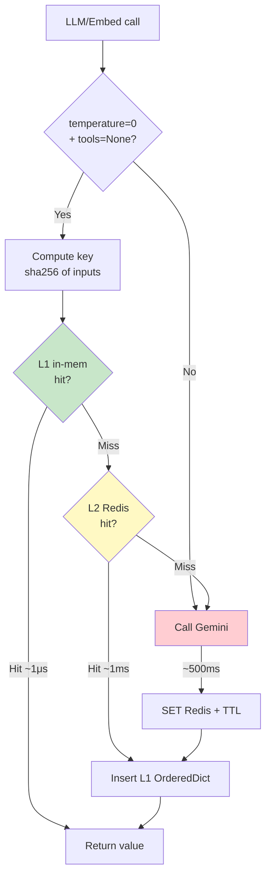
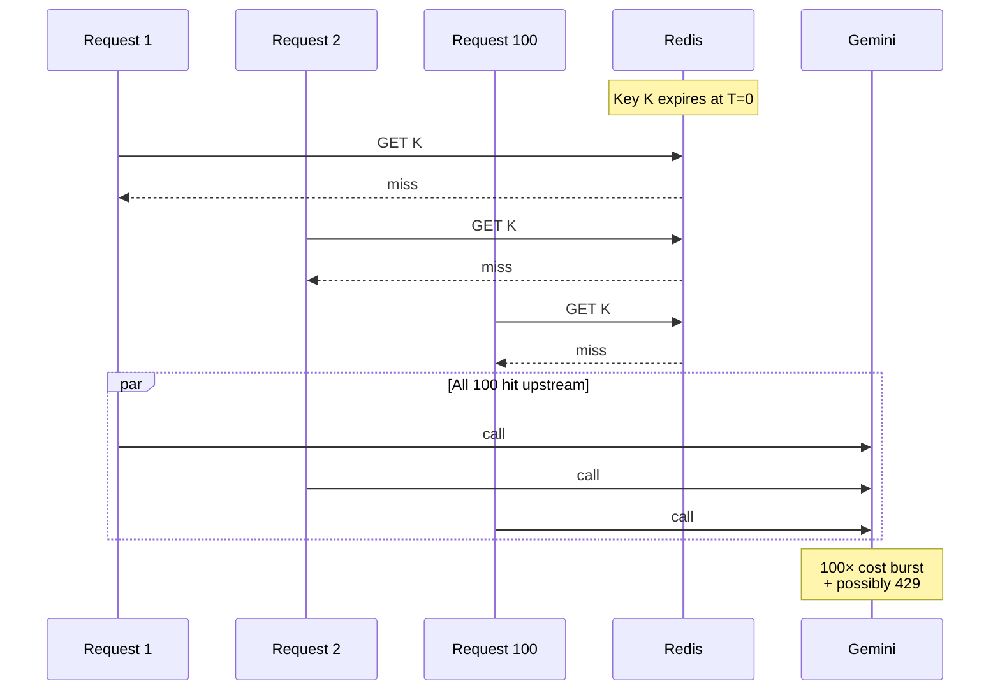

# 10 — Caching Deep Dive: cái gì cache, ở đâu, bao lâu, vì sao

Hệ thống có **5 tầng cache** ở những vị trí có lý do cụ thể. Doc này liệt
kê từng tầng + cost/benefit + cách đo hit rate + invalidation strategy.

---

## 1. Toàn cảnh

```
┌────────────────────────────────────────────────────────────────┐
│                       REQUEST PATH                              │
└────────────────────────────────────────────────────────────────┘
   │
   ▼
┌──────────────────┐
│  Process LRU     │ ◄── L1: per-process, in-memory dict
│  (OrderedDict)   │     - LLM completion (2000 entries)
└────────┬─────────┘     - Embedding (5000 entries)
         │ miss
         ▼
┌──────────────────┐
│  Redis           │ ◄── L2: shared across all replicas
│  (TTL-based)     │     - LLM: 1h
│                  │     - Embedding: 7d
│                  │     - Retrieval search: 5 phút
│                  │     - LLM rerank: 10 phút
│                  │     - Query rewrite: 10 phút
└────────┬─────────┘
         │ miss
         ▼
┌──────────────────┐
│  Upstream        │ ◄── Gemini API, Qdrant
│  (slow + costly) │
└──────────────────┘
```

Ngoài ra có 2 dạng cache "đặc biệt":
- **Short-term conversation buffer** (Redis list): không phải cache đúng nghĩa,
  mà là **hot replica** của tail messages Postgres để tránh đọc DB hot path.
- **Embedding cache key per-text** chứ không per-batch → 1 text từng được
  embed sẽ không bao giờ embed lại.

### Cache lookup flow



---

## 2. Tầng 1 — In-process LRU

### Vị trí
`src/llm/client.py`:
```python
_lru_complete = _LRU(2000)     # LLM completions
_lru_embed    = _LRU(5000)     # Embeddings
```

### Đặc tính
- **Per-process**: 4 process API → 4 cache độc lập. Hit rate trên cùng key
  thấp hơn nếu request bị Nginx route sang process khác.
- **Capacity**: 2000 entries × ~5KB/entry ≈ **10MB** cho LLM cache, 5000 ×
  3KB ≈ **15MB** cho embedding. Negligible.
- **Eviction**: LRU (OrderedDict, `move_to_end` on access, `popitem(last=False)`
  khi vượt capacity).

### Vì sao có L1 dù đã có Redis?
- Redis round-trip ~ 0.5-1ms; L1 ~ 1 microsecond. Với rerank cache hit nhiều
  lần trong 1 request (vì có 3 sub-query) → L1 cắt ~3ms.
- Nếu Redis down, L1 vẫn serve được vài phút (graceful degradation).

### Khi nào L1 vô dụng?
- Sau khi process restart: cold cache.
- Trên 4 process khác nhau: 4 × cold start cho cùng key. → L2 (Redis) bù lại.

---

## 3. Tầng 2 — Redis cache

### Key design

| Use case | Key | TTL | Value |
|----------|-----|-----|-------|
| LLM completion | `llm:<sha256(model+msgs+params)>` | 1h | JSON dump ChatCompletion |
| Embedding | `emb:<sha256(model+text)>` | 7d | JSON array float |
| Query rewrite | `rewrite:<sha256(model+query)>` | 10 phút | JSON array string |
| LLM rerank | `rerank:<sha256(model+query+ids)>` | 10 phút | dict id→score |
| Retrieval | (chưa cache trực tiếp, qua các cache trên) | - | - |

### Tại sao SHA-256?
- **Determinism**: cùng input → cùng key, không phụ thuộc thứ tự dict (dùng
  `orjson.dumps(option=OPT_SORT_KEYS)`).
- **Collision risk**: ~0 ở scale 10⁶ key (xác suất ~10⁻⁴⁰).
- **Fixed length** 64 hex char, không tốn memory key.

### Tại sao TTL khác nhau?

**LLM 1h**: prompt có thể chứa context cũ (lịch sử chat sẽ thay đổi sau 1h
nếu user quay lại). 1h đủ để pickup hit trong 1 phiên làm việc, không quá lâu
để lưu giữ rác.

**Embedding 7 ngày**: text + model về cơ bản deterministic. Lý do không
"forever":
- Nếu Gemini deprecated `text-embedding-004` và ta swap → key cũ vẫn còn → ghi
  đè dần. 7 ngày là buffer dọn dẹp tự động.
- Redis `allkeys-lru` policy + maxmemory cũng eviction sớm nếu hot.

**Query rewrite + Rerank 10 phút**: trong cùng phiên người dùng có thể paraphrase
câu hỏi → cache hit cao trong burst. Sau 10 phút, query khác → cache không
quan trọng.

### Hoạt động (pseudocode đã có trong `llm/client.py`)
```python
cacheable = use_cache and temperature == 0.0 and tools is None
```

Đáng chú ý: **temperature > 0 → bypass cache**. Lý do: với T>0, mỗi lần gọi
có output khác (random sampling). Cache hit sẽ "đóng băng" 1 sample → mất
diversity nếu user mong đợi đa dạng (vd rewrite, creative answer).

### Streaming KHÔNG cache
Trong `complete_stream` không có cache lookup. Lý do:
- UX cần token đầu tiên < 200ms; cache check + decode mất ~5ms — nhỏ nhưng...
- ...đối tượng cần cache (stream với usage cuối) phức tạp khó serialize.
- Trade-off chấp nhận: chat generation luôn miss cache.

---

## 4. Cache invalidation (cái khó nhất của caching)

> "There are only two hard things in Computer Science: cache invalidation and
> naming things." — Phil Karlton

Phân loại invalidation theo từng cache:

### Embedding cache
- **Không bao giờ invalidate**: text + model bất biến → cache vĩnh viễn đúng.
- TTL 7d chỉ để dọn rác / migrate model.

### LLM completion cache
- Nội dung prompt thay đổi → key khác → tự "invalidate".
- **Rủi ro**: prompt cứng `SYSTEM_ANSWER` đổi nhưng quên bump version → cache
  cũ dùng prompt cũ.
- **Mitigation**: thêm prefix version vào key:
  ```python
  cache_key = make_key("llm", PROMPT_VERSION, m, messages, ...)
  ```
  Khi đổi prompt → bump `PROMPT_VERSION` = "v2" → cache cũ unreachable.

### Rerank cache
- Key bao gồm `query + point_ids`. Nếu doc bị xoá, point_ids cũ vẫn cache →
  rerank trả id không tồn tại → fallback dense score.
- TTL 10 phút giới hạn rủi ro.

### Retrieval cache (TODO)
- Hiện chưa cache `retrieve_and_rerank` result trực tiếp.
- Nếu thêm: key = `retrieve:<query>:<tenant>:<filters>`. **Phải invalidate**
  khi tenant có file mới indexed.
- Cách invalidate: sau worker `set_status('indexed')`, `DEL retrieve:*:tenant=X:*` (Redis SCAN + DEL theo prefix). Phức tạp → vì sao chưa làm.

---

## 5. Cache hit rate kỳ vọng

Sau warm-up (1 ngày prod sử dụng):

| Cache | Hit rate kỳ vọng | Lý do |
|-------|------------------|-------|
| L1 LLM | 5-15% | Cross-process miss; chỉ hit khi cùng process |
| L2 LLM | 30-50% | Cùng câu hỏi/rewrite trùng nhau giữa user |
| L1 Embedding | 20-40% | Query mới ít, nhưng chunk text ổn định |
| L2 Embedding | 60-90% | Re-index cùng file → 100%. Search cùng query → cao |
| Query rewrite | 50-70% | User paraphrase tương tự |
| Rerank | 30-50% | Pool retrieve có overlap |

### Đo hit rate trong production
Thêm metric prometheus (gợi ý chưa implement):
```python
from prometheus_client import Counter
cache_hits = Counter("cache_hits_total", "Cache hits", ["layer", "kind"])
cache_misses = Counter("cache_misses_total", "Cache misses", ["layer", "kind"])
```

Trong `llm.client`, gọi `cache_hits.labels("L1", "llm").inc()` mỗi hit.

Grafana panel: `rate(cache_hits_total[5m]) / (rate(cache_hits_total[5m]) +
rate(cache_misses_total[5m]))`.

---

## 6. Cache stampede (thundering herd)




### Vấn đề
Key hot expire lúc T=0. 100 request đồng thời:
- Lookup miss → 100 call upstream song song → quota burn 100x.

### Mitigation đơn giản (chưa implement)
**Lock-based stampede protection**:
```python
async def get_or_set(key, factory, ttl, lock_ttl=10):
    if v := await cache_get(key): return v
    # acquire lock
    if await redis.set(f"lock:{key}", "1", ex=lock_ttl, nx=True):
        try:
            v = await factory()
            await cache_set(key, v, ttl)
            return v
        finally:
            await redis.delete(f"lock:{key}")
    else:
        # wait poll
        for _ in range(20):
            await asyncio.sleep(0.1)
            if v := await cache_get(key): return v
        # fallback compute
        return await factory()
```

Khi hệ thống scale, **bắt buộc** thêm pattern này cho LLM cache, vì 1 cache miss
= $0.001 + 500ms latency. Stampede có thể đốt cả USD/giờ.

### Alternative: jittered TTL
Set TTL ngẫu nhiên ±10% → 100 key không expire đồng thời:
```python
ttl = base_ttl + random.randint(-base_ttl // 10, base_ttl // 10)
```

---

## 7. Negative cache

Không cache LLM error response — nhưng có thể cache *predictably empty results*:
- Rerank trả 0 candidates (tài liệu không liên quan): cache trong 1 phút, tránh
  re-rerank cùng query → rỗng.

Hiện tại không implement; thêm khi nhận thấy %wasted compute đáng kể.

---

## 8. Cache size budgeting

Redis container `--maxmemory 512mb` + `allkeys-lru`.

Ước tính:
- 1M embedding entries × 4KB ≈ 4GB → vượt budget. **Đã thiết kế chấp nhận
  eviction** — entry cũ nhất bị đẩy ra trước.
- Hot subset ~ 10k chunk thường được embed (queries) → 40MB. OK.

Khi data lớn, options:
- Tăng `maxmemory` → 2-4GB.
- Tách Redis instance riêng cho cache (vs queue/session). Cache có thể flush
  bất cứ lúc nào không nguy hiểm.

---

## 9. Cold-start chiến lược

Khi deploy mới hoặc Redis flush:
- Hit rate ~ 0% trong giờ đầu.
- LLM cost spike 2-3x baseline.
- Latency p95 tăng (mỗi request đầy upstream).

### Mitigation
1. **Pre-warm**: script gọi 1 lần các prompt cố định (system prompt + sample
   query) → embed warm L2.
2. **Sticky session** (debate): Nginx `ip_hash` → 1 user vào 1 replica → L1 hot.
   Trade-off: mất least_conn fairness.

Hiện không implement, cold-start chấp nhận được ở scale này.

---

## 10. Khi nào KHÔNG cache

Có những lúc bypass đáng cân nhắc:

| Scenario | Lý do |
|----------|-------|
| `temperature > 0` | Mất diversity |
| Streaming user-facing | Khó serialize stream + cần token đầu nhanh |
| Tool calling | Output không deterministic ở field id |
| User flag `nocache=true` | Debug, A/B test |
| Sensitive content (PII) | Tránh leak qua cache shared multi-tenant |

Cache key luôn bao `tenant_id` nếu data có thể nhạy cảm. Hiện tại key
LLM/embedding KHÔNG có tenant_id vì:
- Embedding = function của text → tenant-agnostic.
- LLM cache = function của prompt → prompt đã chứa context tenant-specific
  (system + history + retrieved chunks) → cùng prompt → cùng tenant.

→ Nhưng nếu prompt vô tình giống nhau giữa 2 tenant → ra cùng answer.
**Edge case** chấp nhận được vì rất hiếm; nếu paranoid → prefix key với
`tenant_id`.

---

## 11. Tổng kết: cost saved bởi cache

Giả sử baseline 1000 chat/ngày:
- Mỗi chat: 2 LLM call (rewrite + rerank) + 1 embedding (query).
- No cache: 2000 LLM × $0.0005 + 1000 embed × $0.00001 ≈ $1.01/ngày.
- Cache hit 60%: $0.40/ngày → **$220/năm savings cho 1 instance**.

Lợi quan trọng hơn cost: **latency cắt 60%** ở các bước có cache, làm UX
mượt hơn nhiều.
