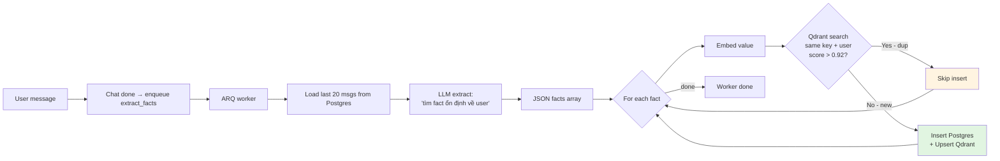
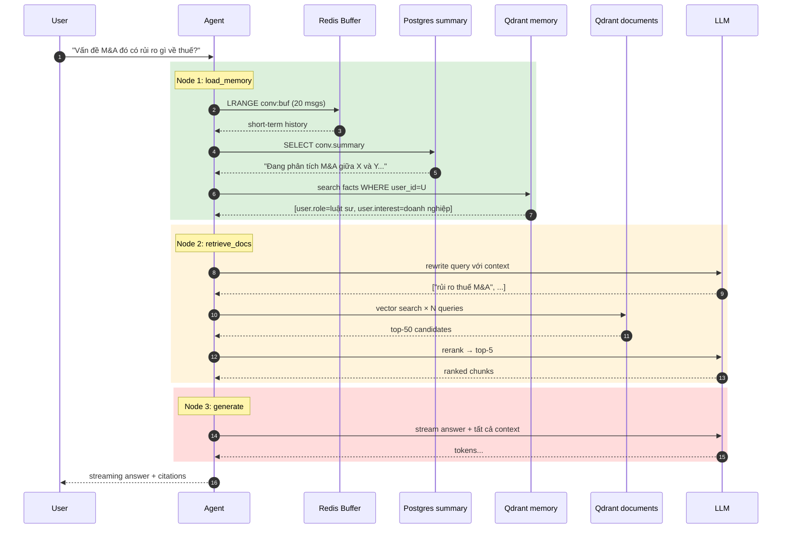

# 11 — Multi-turn Memory: short-term, long-term, và cách chúng tương tác

Multi-turn chat đòi hỏi 3 loại "trí nhớ" khác nhau, mỗi loại có vai trò, vòng
đời và chi phí khác nhau. Doc này giải thích từng tầng + cách chúng "talk"
với nhau khi user hỏi.

---

## 1. Ba loại memory

```
┌───────────────────────────────────────────────────────────────────┐
│                  3 LOẠI MEMORY TRONG HỆ THỐNG                      │
├───────────────────────────────────────────────────────────────────┤
│                                                                    │
│  1. SHORT-TERM (working memory)                                    │
│     - Conversation buffer 20 message gần nhất                      │
│     - Storage: Redis list                                          │
│     - TTL: 24h sau activity                                        │
│     - Scope: 1 conversation                                        │
│                                                                    │
│  2. CONVERSATION SUMMARY (compressed history)                      │
│     - Tóm tắt cuộc hội thoại khi vượt N message                    │
│     - Storage: Postgres conversations.summary                      │
│     - TTL: vĩnh viễn                                               │
│     - Scope: 1 conversation                                        │
│                                                                    │
│  3. LONG-TERM FACTS (semantic user memory)                         │
│     - Facts về user: role, sở thích, ngữ cảnh                      │
│     - Storage: Postgres user_facts + Qdrant memory collection      │
│     - TTL: vĩnh viễn                                               │
│     - Scope: user (cross-conversation)                             │
│                                                                    │
└───────────────────────────────────────────────────────────────────┘
```

So sánh để hiểu purpose:
- **Bạn vừa nói "anh ấy" → cần short-term** để hiểu "anh ấy" là ai.
- **5 phiên chat trước đã thảo luận về M&A → cần summary** để không lặp.
- **User là luật sư, chuyên doanh nghiệp → cần long-term** để adapt tone, depth
  ngay từ message đầu tiên của conversation mới.

---

## 2. Short-term buffer

### Cấu trúc Redis
```
Key:    conv:buf:<conversation_uuid>
Type:   LIST (LPUSH/RPUSH order)
Values: ['{"role":"user","content":"..."}', '{"role":"assistant","content":"..."}', ...]
TTL:    86400s (24h), reset mỗi lần RPUSH
Limit:  20 entries (LTRIM -20 -1)
```

### Update flow
Mỗi message:
```python
# src/memory/short_term.py::append_message
pipe = r.pipeline()
pipe.rpush(key, payload)           # thêm cuối
pipe.ltrim(key, -20, -1)           # giữ 20 cuối
pipe.expire(key, 86400)            # gia hạn TTL
await pipe.execute()
```

3 command 1 round-trip → atomic + nhanh.

### Vì sao 20 message?
- Trung bình mỗi message ~ 100 tokens → 20 × 100 × 2 (user+asst) = 4000 tokens
  trong system context. Cộng retrieved chunks (~3000 tokens) + system prompt
  (~500 tokens) → ~7500 tokens. Gemini Flash context 1M tokens, dư sức nhưng
  chi phí token = thật.
- Quá ít (5 message): mất ngữ cảnh đa lượt phức tạp.
- Quá nhiều (50+): redundant + tốn token + tăng latency LLM.

### Tại sao Redis chứ không phải query Postgres mỗi turn?
- Latency: `LRANGE` Redis ~0.5ms vs Postgres `SELECT ... ORDER BY created_at
  DESC LIMIT 20` ~5-10ms. Mỗi chat đều cần load → tiết kiệm 5-10ms/req.
- Postgres vẫn là source-of-truth: nếu Redis lost (restart), warm-up từ DB
  tự động.

### Warm-up từ DB
```python
# src/api/routes/chat.py
buf = await get_buffer(conv_id)
if not buf.messages:
    msgs = await repo.recent_messages(conversation_id=conv_id, n=20)
    await warmup_from_db(conv_id, [{"role": m.role, "content": m.content} for m in msgs])
```

Race: 2 device cùng load buffer rỗng → 2 lần warm-up cùng dữ liệu. Không sai
nhưng tốn. Mitigation: SETNX lock trong 5s, một bên thắng làm warm-up, bên kia
chờ. Hiện không implement vì cost thấp.

---

## 3. Conversation summary (compressed memory)

### Triết lý
Buffer 20 message OK cho ngắn hạn, nhưng cuộc hội thoại 100 turn? Không thể
nhét 100 vào context (token cost + latency). Giải pháp: **tóm tắt cũ + giữ
20 mới**.

### Trigger
Hiện code đã có field `Conversation.summary` nhưng **chưa implement auto-summarize**.
Đề xuất implement (TODO):

```python
# Khi message_count vượt threshold (vd > 30), worker chạy:
async def summarize_conversation(conv_id):
    msgs = await repo.messages(conv_id, limit=100)
    old_msgs = msgs[:-20]   # giữ 20 mới nguyên gốc
    if len(old_msgs) < 10:
        return
    transcript = format_msgs(old_msgs)
    resp = await llm.complete([
        {"role": "system", "content": "Tóm tắt cuộc hội thoại sau thành 2-3 câu, giữ keyword quan trọng."},
        {"role": "user", "content": transcript},
    ], temperature=0)
    summary = resp.choices[0].message.content
    await repo.set_summary(conv_id, summary)
```

### Cách dùng
Trong `prompts.py`:
```python
sys_parts = [SYSTEM_ANSWER]
if summary:
    sys_parts.append(f"\nTÓM TẮT HỘI THOẠI TRƯỚC ĐÓ:\n{summary}")
```

→ LLM nhận summary + 20 message gần + retrieved docs → ngữ cảnh đầy đủ trong
giới hạn token.

### Trade-off
- Tóm tắt có thể mất nuance. Một số chi tiết cụ thể cần thiết cho câu hỏi
  sau bị lược → user phải nhắc lại.
- Mitigation: dùng prompt summarize hướng dẫn "giữ thông tin có thể tái sử
  dụng" + cập nhật summary incremental thay vì rewrite mỗi lần.

---

## 4. Long-term facts (cross-conversation semantic memory)

### Fact lifecycle




Đây là phần thú vị nhất — **memory persistent của user**, có thể recall ở
conversation hoàn toàn mới.

### Schema
```sql
user_facts
  id uuid
  user_id uuid
  tenant_id uuid
  key varchar(128)          -- "user.role", "user.preferred_language"
  value text                -- "luật sư", "Vietnamese formal"
  confidence float          -- 0.0-1.0
  source_message_ids uuid[] -- audit trail: facts ra từ message nào
  qdrant_point_id uuid      -- link sang vector
  created_at, updated_at
```

### Vòng đời 1 fact

#### Bước 1: Trích xuất
Trigger: sau khi conversation có message mới, API enqueue:
```python
await arq.enqueue_job("extract_facts", str(conv_id))
```

Worker (`src/worker/tasks/memory.py::extract_facts`):
1. Load 20 message gần nhất.
2. Gọi LLM với prompt `EXTRACTION_SYSTEM`:
   > "Chỉ trích xuất fact ổn định về USER. Không trích nội dung hội thoại."
3. LLM trả JSON:
   ```json
   {"facts": [
     {"key": "user.role", "value": "luật sư doanh nghiệp", "confidence": 0.9},
     {"key": "user.interest", "value": "luật doanh nghiệp", "confidence": 0.85}
   ]}
   ```
4. Mỗi fact gọi `save_fact()` → dedupe + insert.

#### Bước 2: Dedupe
```python
# src/memory/long_term.py::save_fact
hits = await qc.search(
    collection_name="memory",
    query_vector=vector,
    query_filter=Filter(must=[
        FieldCondition(key="user_id", match=MatchValue(value=str(user_id))),
        FieldCondition(key="key", match=MatchValue(value=key)),
    ]),
    limit=1,
)
if hits and hits[0].score >= 0.92:
    return False     # duplicate
```

Tại sao 0.92? Empirical:
- < 0.85: cùng key nhưng value khác đáng kể (vd "luật sư hình sự" vs "luật sư
  doanh nghiệp") → khác fact.
- 0.85-0.92: nuance, khó quyết. Hiện code coi là khác → có thể tạo dup nhẹ.
- ≥ 0.92: gần như identical → dup.

Có thể bump confidence của entry cũ thay vì insert mới (TODO).

#### Bước 3: Persist
- INSERT row Postgres.
- Embed value → upsert Qdrant `memory` collection với payload `{user_id, key,
  value, confidence}`.

### Recall ở chat
```python
# src/agent/nodes/memory.py
facts = await retrieve_user_facts(
    user_id=state["user_id"],
    query=state["user_message"],
    top_k=5,
)
```

→ Vector search collection `memory` filter `user_id` → top 5 facts liên quan.

→ Inject vào system prompt:
```
NGỮ CẢNH NGƯỜI DÙNG:
- user.role: luật sư doanh nghiệp
- user.interest: luật doanh nghiệp
```

→ LLM adapt tone (formal, dùng thuật ngữ chuyên ngành) ngay từ câu trả lời đầu.

---

## 5. Cách 3 tầng tương tác trong 1 lượt chat



Giả sử user nói: "Vấn đề M&A đó có rủi ro gì về thuế?"

```
1. API nhận message.
2. load_memory node:
   a. LRANGE conv:buf:<cid>           → 18 message trước trong conv này
      → "M&A đó" sẽ resolve qua history (vd: "Công ty X mua công ty Y...")
   b. retrieve_user_facts("Vấn đề M&A đó có rủi ro gì về thuế?")
      → facts: [user.role: luật sư, user.interest: doanh nghiệp]
   c. conv.summary có thể có: "Đang phân tích M&A giữa X và Y, đã bàn về cấu trúc giao dịch."
3. retrieve_docs node:
   a. rewrite query → ["rủi ro thuế M&A", "Luật thuế TNDN khi mua bán doanh nghiệp", ...]
   b. vector search Qdrant với tenant filter
   c. LLM rerank → top 5 chunks
4. generate node:
   build prompt = SYSTEM_ANSWER + summary + facts + retrieved_chunks + short_term + user_msg
   → stream answer.
```

Mỗi tầng "kéo" thêm context khác nhau → agent có thông tin đa chiều mà không
phải nạp toàn bộ history thô.

---

## 6. Privacy & isolation

Long-term facts cực kỳ nhạy cảm — đại diện cho profile user.

### Bảo vệ
- Qdrant `memory` collection filter **mandatory** `user_id` (không chỉ
  tenant_id). 1 user trong tenant không thấy facts của user khác.
- Postgres `user_facts` có `user_id FK` + index.
- Repository methods nhận `user_id` làm tham số → enforce ở SQL `WHERE`.

### "Right to be forgotten"
Khi user xoá account / yêu cầu xoá memory:
```sql
DELETE FROM user_facts WHERE user_id = :uid;
```
+ Qdrant:
```python
await qc.delete(
    collection_name="memory",
    points_selector=FilterSelector(filter=Filter(must=[
        FieldCondition(key="user_id", match=MatchValue(value=str(user_id)))
    ])),
)
```

API endpoint cho user-controlled deletion: chưa expose (TODO `DELETE /v1/memory`).

### Audit
`source_message_ids` trong fact → trace ngược về message gốc đã trigger trích
xuất. Khi user thắc mắc "sao bạn biết tôi là luật sư?", có thể chỉ chính xác
message nào.

---

## 7. Failure modes

### Fact trích sai
- LLM extract `{"key":"user.role","value":"Đức Phật","confidence":0.4}` từ message
  joke. Confidence thấp nhưng vẫn lưu.
- Mitigation hiện tại: `confidence` field giúp UI hiển thị "soft" facts khác
  "hard" facts.
- Mitigation thêm (TODO): chỉ persist nếu `confidence > 0.6`; mỗi recall
  threshold cao hơn.

### Memory ô nhiễm
- User troll: "Tôi là tổng thống Mỹ".
- LLM tin, ghi fact, conversations sau dùng → kết quả buồn cười.
- Mitigation:
  - Prompt extraction nhấn "fact ổn định" + ví dụ tiêu cực.
  - Allow user inspect + xoá memory: `GET /v1/memory`, `DELETE /v1/memory/{id}`
    (TODO).

### Dedupe sai
- Threshold 0.92 không hoàn hảo. Có thể bỏ sót dup (insert thừa) hoặc bắt
  sai (skip fact mới có nuance).
- Theo dõi qua Langfuse: log `save_fact` calls + tỷ lệ skip.

### Stale facts
- User đã chuyển nghề từ "luật sư" sang "giám đốc". Fact cũ vẫn còn.
- Mitigation (TODO):
  - LLM extraction có thêm "contradiction detection": nếu mâu thuẫn fact cũ
    → mark cũ `confidence=0`.
  - Time-decay confidence: fact cũ giảm dần weight.

---

## 8. Token budget per turn (cụ thể)

Ước tính cho 1 chat turn điển hình:

| Phần | Tokens |
|------|--------|
| SYSTEM_ANSWER | 250 |
| Conversation summary (nếu có) | 100 |
| User facts (5 × 30) | 150 |
| Short-term history (20 × 100) | 2000 |
| Retrieved docs (5 × 400 + heading) | 2200 |
| User message | 50 |
| **Input total** | **~4750** |
| Answer | 300-1000 |

Gemini Flash $/M token: input $0.075, output $0.30. Cost/turn ≈ $0.0007.
1000 chat/ngày ≈ $0.70/ngày = $250/năm. Rất rẻ.

Bottleneck thực sự là **latency**, không phải cost.

---

## 9. Test memory thủ công

```bash
# 1. Login user A
TOKEN=$(curl -s -X POST http://localhost/v1/auth/login -H 'Content-Type: application/json' \
  -d '{"email":"a@b.com","password":"...","tenant_slug":"demo"}' | jq -r .access_token)

# 2. Tạo conv 1, nói gì đó để LLM extract fact
CID1=$(curl -s -X POST http://localhost/v1/conversations -H "Authorization: Bearer $TOKEN" -d '{}' | jq -r .id)
curl -N http://localhost/v1/chat/$CID1/messages -H "Authorization: Bearer $TOKEN" \
  -H 'Content-Type: application/json' \
  -d '{"message":"Tôi là luật sư chuyên về M&A, thường tư vấn cho công ty công nghệ."}'

# 3. Đợi 5-10s (worker xử lý)
sleep 10

# 4. Check Postgres facts
make psql
# > SELECT key, value, confidence FROM user_facts WHERE user_id = '...';

# 5. Tạo conv 2 mới, hỏi 1 câu mơ hồ
CID2=$(curl -s -X POST http://localhost/v1/conversations -H "Authorization: Bearer $TOKEN" -d '{}' | jq -r .id)
curl -N http://localhost/v1/chat/$CID2/messages -H "Authorization: Bearer $TOKEN" \
  -H 'Content-Type: application/json' \
  -d '{"message":"Khuyến nghị gì cho deal sắp tới?"}'
# → LLM nên trả lời với assumption deal = M&A, tone professional → cross-conv memory đã hoạt động.
```

---

## 10. Khi nào tắt long-term memory?

- **User opt-out** (privacy concern): endpoint `PATCH /v1/me/settings
  {memory_enabled: false}` → tag user. Worker check tag trước khi extract.
- **Conversation tạm thời** (one-shot Q&A): client thêm header
  `X-No-Memory: true` → API truyền flag xuống agent, skip retrieve_user_facts
  + skip enqueue extract_facts. **TODO** chưa implement.
- **Domain compliance** (GDPR, HIPAA): tắt mặc định, opt-in.

Bài học: memory là feature mạnh nhưng cũng là rủi ro pháp lý. Có toggle rõ ràng
là essential cho production multi-region.
