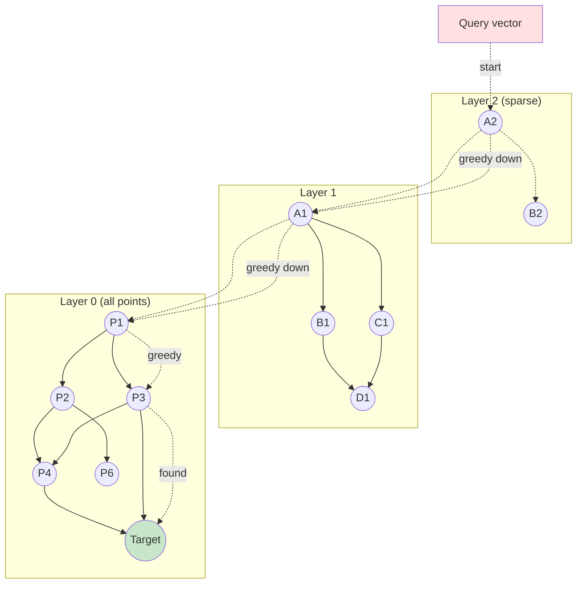
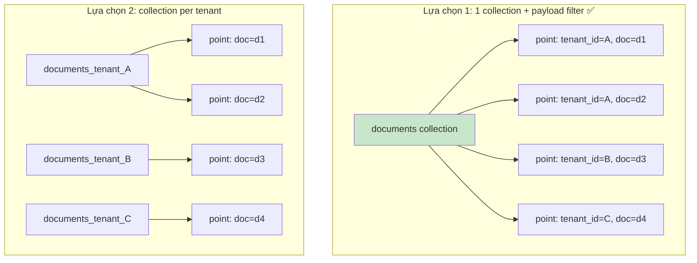
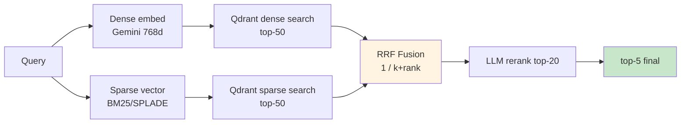

# 12 — Vector Search Internals: Qdrant cơ chế bên dưới

Doc này không phải tutorial Qdrant chung — mà giải thích **cấu hình hiện tại
của hệ thống** và **lý do từng tham số**, đủ để bạn debug được khi retrieve
trả kết quả lạ.

---

## 1. Qdrant fundamentals — chỉ phần liên quan

### Collection = bảng + index
- 1 collection = N points.
- 1 point = (id, vector, payload).
- Index HNSW xây trên vector; index payload xây trên field cụ thể.

### Hai collection trong hệ thống
| Collection | Dùng | Vector | Filter mandatory |
|-----------|------|--------|------------------|
| `documents` | chunk tài liệu | 768d cosine | `tenant_id` |
| `memory` | user facts | 768d cosine | `user_id` |

---

## 2. Vector params — vì sao chọn vậy

### `size: 768`
Embedding `text-embedding-004` của Gemini = 768 dim. Phải khớp chính xác.

Nếu sau này đổi sang `gemini-embedding-001` (3072d):
- Storage tăng 4x.
- HNSW build/search chậm ~2x.
- Recall thường cao hơn 1-3% (quality vs cost trade-off).

→ 768 đủ cho legal docs Vietnamese, scale <1M chunk.

### `distance: Cosine`
3 choice của Qdrant: Cosine, Dot, Euclid.

**Cosine** chuẩn cho text embedding vì:
- Embedding "ý nghĩa" thể hiện qua **hướng** vector, không phải độ dài.
- Cosine = dot product trên vectors đã normalize.
- Gemini embedding đã normalized (norm ≈ 1).

**Dot** dùng khi vector chưa normalize và độ dài mang thông tin (vd ANN search
cho ranking với CTR weight).

**Euclid** ít dùng cho text — kết quả gần như Cosine trên normalized vector
nhưng metric ít trực giác hơn.

### `on_disk: false`
Vector trong RAM → search latency 5-10ms.
- 1M point × 768 × 4 byte = ~3GB RAM. OK cho <1M.
- Khi >5M, bật `on_disk: true` + quantization → RAM <500MB nhưng latency +50%.

---

## 3. HNSW config

HNSW = Hierarchical Navigable Small World — graph-based ANN.



Hiểu sơ:
- Mỗi point được kết nối với ~ M neighbors gần.
- Search bắt đầu từ top layer (sparse), greedy đi xuống tới layer 0.
- Layer cao có ít node nhưng "nhảy xa" → tìm cụm gần query nhanh.
- Layer 0 chứa tất cả node, refine kết quả chính xác.

```python
HnswConfigDiff(m=16, ef_construct=128)
```

### `m=16`: số neighbor per node
- Cao hơn (32): recall tốt hơn, build chậm 2x, memory + 50%.
- Thấp hơn (8): build nhanh, recall giảm rõ ở edge cases.
- 16 = sweet spot Qdrant default.

### `ef_construct=128`: kích thước candidate list khi build
- Cao hơn (200): graph chất lượng cao hơn, build chậm.
- Thấp hơn (64): build nhanh, recall lúc query giảm.

### `ef` (search time, không config trong code, default = ef_construct)
- Tuning tại query time: `qc.search(..., search_params={"hnsw_ef": 64})`.
- Trade-off recall vs latency. Default thường OK.

---

## 4. Payload indexes — vì sao bắt buộc

```python
# src/core/qdrant.py
for field in ("tenant_id", "user_id", "doc_id"):
    await qc.create_payload_index(collection, field, PayloadSchemaType.KEYWORD)
```

Không có payload index → Qdrant phải **scan tất cả point** match filter trước
khi search vector. Với 1M point và 100 tenant → 10000 point/tenant, nhưng quét
1M = O(N) → chậm.

Với index keyword:
- Internal inverted index theo value.
- Filter `tenant_id = X` → bitmap of points matching → search HNSW chỉ trong
  subset. O(log N) thực tế.

### Lưu ý: index theo `payload_index_type`
- `KEYWORD`: exact match (UUID, string). Mình dùng cho IDs.
- `INTEGER`: range queries (vd `page_from > 10`).
- `TEXT` (fulltext-ish): substring match — KHÔNG nhanh, tránh.

---

## 5. Multi-tenancy: payload filter vs separate collection




### Lựa chọn hiện tại: 1 collection + payload filter
```
documents
├── point: vector, payload={tenant_id: A, doc_id: ...}
├── point: vector, payload={tenant_id: A, doc_id: ...}
├── point: vector, payload={tenant_id: B, doc_id: ...}
└── ...
```

### Alternative: collection per tenant
```
documents_tenant_A
documents_tenant_B
documents_tenant_C
```

### Vì sao chọn 1 collection?
| Tiêu chí | 1 collection | Per-tenant |
|----------|--------------|------------|
| Memory overhead | Thấp (1 HNSW graph) | Cao (N graph × overhead) |
| Số tenant scale | Vô hạn về mặt logic | Bị giới hạn (~ hàng nghìn) |
| Cross-tenant query | Dễ (admin) | Khó |
| Isolation guarantee | Filter bug = rò rỉ | Hard isolation (collection name khác) |
| Resize/migrate | 1 collection | Migrate N |

Với scale **<100 tenant lớn hoặc <10k tenant nhỏ**: 1 collection thắng.

Với **enterprise SaaS** có tenant cần SLA tách biệt: per-tenant tốt hơn (1
tenant chậm không ảnh hưởng tenant khác).

### Rủi ro: filter quên = leak
Code phải **bắt buộc** filter `tenant_id` ở mọi search. Nếu dev quên, request
trả về data tenant khác.

Mitigation hiện tại:
```python
# src/retrieval/search.py
must: list = [
    FieldCondition(key="tenant_id", match=MatchValue(value=str(tenant_id))),
]
```
`tenant_id` là tham số bắt buộc của function `vector_search`, không có default.
Linter (mypy strict) sẽ báo lỗi nếu thiếu.

→ Khi review code, **mọi call tới `qc.search` phải có `tenant_id` trong filter**.

---

## 6. Hybrid search (dense + sparse) — kiến trúc mở rộng



Hiện tại chỉ **dense**. Khi cần thêm sparse (BM25-like), Qdrant 1.10+ hỗ trợ
`SparseVectors` native.

### Thêm sparse vào collection
```python
await qc.create_collection(
    collection_name="documents",
    vectors_config={
        "dense": VectorParams(size=768, distance=Distance.COSINE),
    },
    sparse_vectors_config={
        "sparse": SparseVectorParams(),
    },
)
```

### Ingestion: tính sparse vector
Dùng `bm25-pt` hoặc `SPLADE` để tạo sparse. Mỗi chunk có:
- `dense` vector (768d).
- `sparse` vector (vocab × 30k, chủ yếu zero).

### Query với fusion
```python
results = await qc.query_points(
    collection_name="documents",
    prefetch=[
        Prefetch(query=NearestQuery(nearest=dense_vec), using="dense", limit=50),
        Prefetch(query=NearestQuery(nearest=sparse_vec), using="sparse", limit=50),
    ],
    query=FusionQuery(fusion=Fusion.RRF),
    limit=20,
)
```

**RRF (Reciprocal Rank Fusion)**: hợp nhất 2 ranked list theo công thức
`score = Σ 1 / (k + rank)`. Tốt vì không cần normalize 2 score scale khác nhau.

### Vì sao chưa làm
- Legal docs Vietnamese: BM25 cần tokenizer + stopword tiếng Việt. Cần
  `pyvi`/`underthesea`. Dependency thêm.
- Recall dense + LLM rerank đã >90% với dataset hiện tại.
- Sparse thêm ~50% storage + ~20% latency.

Lúc nào nên thêm: khi user phàn nàn search miss với keyword đặc thù (vd số
nghị định "12/2020/NĐ-CP" — dense không strong).

---

## 7. Search params tinh chỉnh

```python
await qc.search(
    collection_name="documents",
    query_vector=v,
    limit=20,
    query_filter=Filter(must=[...]),
    with_payload=True,
    with_vectors=False,            # ← KHÔNG trả vector về (giảm bandwidth)
    score_threshold=0.5,           # ← bỏ qua hits score thấp (chưa dùng)
    search_params=SearchParams(
        hnsw_ef=128,               # tăng ef → recall tốt hơn, chậm hơn
        exact=False,               # exact=True → brute force, dùng cho eval
    ),
)
```

### `with_vectors=False`
Mỗi vector 768 × 4 byte = 3KB. 20 hit × 3KB = 60KB / response. Tắt giúp giảm
network và memory deserialize.

### `score_threshold`
Filter hits score quá thấp ở server side. Giúp khi LLM rerank tránh waste
token rerank candidate rõ ràng không liên quan.

Hiện không set vì rerank xử lý fine; bật khi data lớn để giảm cost.

---

## 8. Snapshot & disaster recovery

```bash
# Tạo snapshot collection
curl -X POST http://localhost:6333/collections/documents/snapshots

# List snapshots
curl http://localhost:6333/collections/documents/snapshots

# Snapshot file ở: /qdrant/storage/snapshots/documents/<name>.snapshot
# Backup ra ngoài bằng mount volume
```

Restore:
```bash
# Copy file vào /qdrant/storage/snapshots/documents/
curl -X PUT http://localhost:6333/collections/documents/snapshots/recover \
  -H 'Content-Type: application/json' \
  -d '{"location":"/qdrant/storage/snapshots/documents/<name>.snapshot"}'
```

### Rebuild from source-of-truth
Nếu Qdrant data mất hoàn toàn:
```python
# pseudo-script
docs = await session.execute("SELECT * FROM documents WHERE status='indexed'")
for d in docs:
    chunks = await get_chunks(d.id)              # Postgres
    texts = [c.text for c in chunks]
    vectors = await embedder.embed(texts)        # cache hits! 7d TTL
    points = [PointStruct(...) for ...]
    await qc.upsert(...)
```

Quan trọng: vì có embedding cache + text in Postgres, **rebuild Qdrant không
cần gọi LLM lại** — chỉ Gemini embedding cho cache miss.

---

## 9. Khi nào search "sai"?

### Trường hợp: recall thấp (miss kết quả đúng)

**Debug step**:
1. Bật `exact=True` cho query đó → brute force, so với HNSW. Nếu kết quả giống
   → embedding không capture được semantic. Nếu khác → HNSW config kém.
2. Tăng `hnsw_ef=256` → recall lên không?
3. Check `n_chunks` của doc — quá ít (file rất ngắn) → có khi điều luật của
   user không có trong chunk nào.

### Trường hợp: precision thấp (kết quả không liên quan)

**Debug**:
1. Check rerank — score top-1 sau rerank thấp (vd <0.3) → confirm không có
   chunk liên quan thật.
2. Embedding model mismatch: text vector hoá khác từ index time vs query
   time? Xảy ra khi đổi model giữa chừng nhưng không re-index. Mitigation:
   tag collection version (vd `documents_v2`).

### Trường hợp: 1 doc dominate kết quả

Doc có nhiều chunk near-duplicate (vd luật trùng template). 5/5 hits cùng doc.

Mitigation:
- **MMR (Maximal Marginal Relevance)** sau rerank: diversify kết quả.
- Group by doc_id, lấy top-K mỗi doc, rồi rerank cross-doc.

Chưa implement, đợi user complaint.

---

## 10. Throughput Qdrant (số thực)

Single Qdrant container, 4 core, 8GB RAM, 100k points:
- Search QPS (HNSW): ~ 2000-5000.
- Upsert throughput: ~ 5000 point/s.
- Filter (1 keyword index): negligible overhead (<5%).

Khi 1M points + 100 concurrent search → ~30k req/s? Không — bottleneck CPU
HNSW. Thực tế ~ 500-1000 search/s. Đủ cho 100 user concurrent (mỗi user 1
search/turn).

Scale lớn hơn: Qdrant cluster mode (sharding + replication). Cấu hình theo
[docs Qdrant clustering](https://qdrant.tech/documentation/guides/distributed_deployment/).

---

## 11. Inspect và debug

```bash
# Đếm point theo tenant
curl -s -X POST http://localhost:6333/collections/documents/points/count \
  -H 'Content-Type: application/json' \
  -d '{"filter":{"must":[{"key":"tenant_id","match":{"value":"<tid>"}}]}}'

# Search thử
curl -s -X POST http://localhost:6333/collections/documents/points/search \
  -H 'Content-Type: application/json' \
  -d '{
    "vector": [/* 768 float */],
    "limit": 5,
    "with_payload": true,
    "filter": {"must":[{"key":"tenant_id","match":{"value":"<tid>"}}]}
  }'

# Collection info
curl -s http://localhost:6333/collections/documents | jq

# UI tương tác: http://localhost:6333/dashboard
```

Qdrant dashboard rất hữu ích để khám phá payload + visualize search results.
