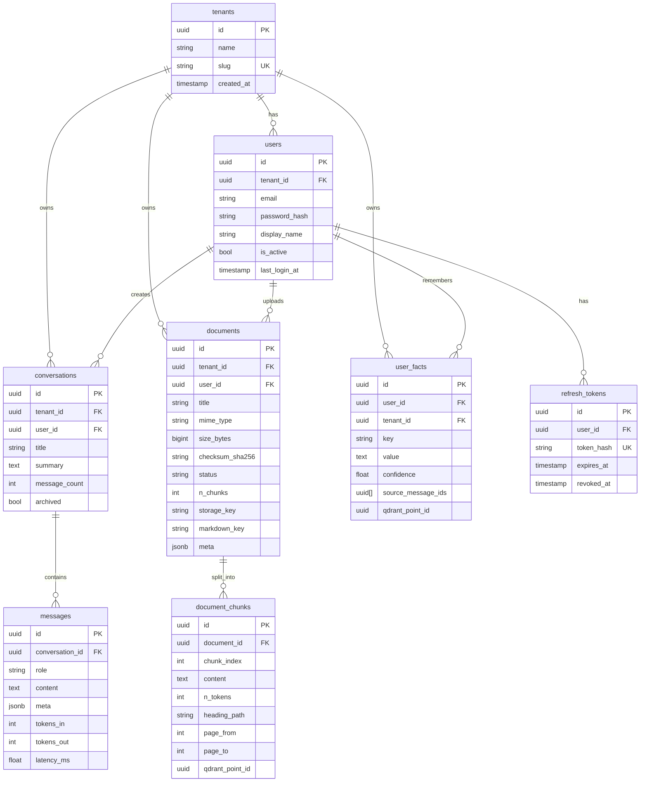
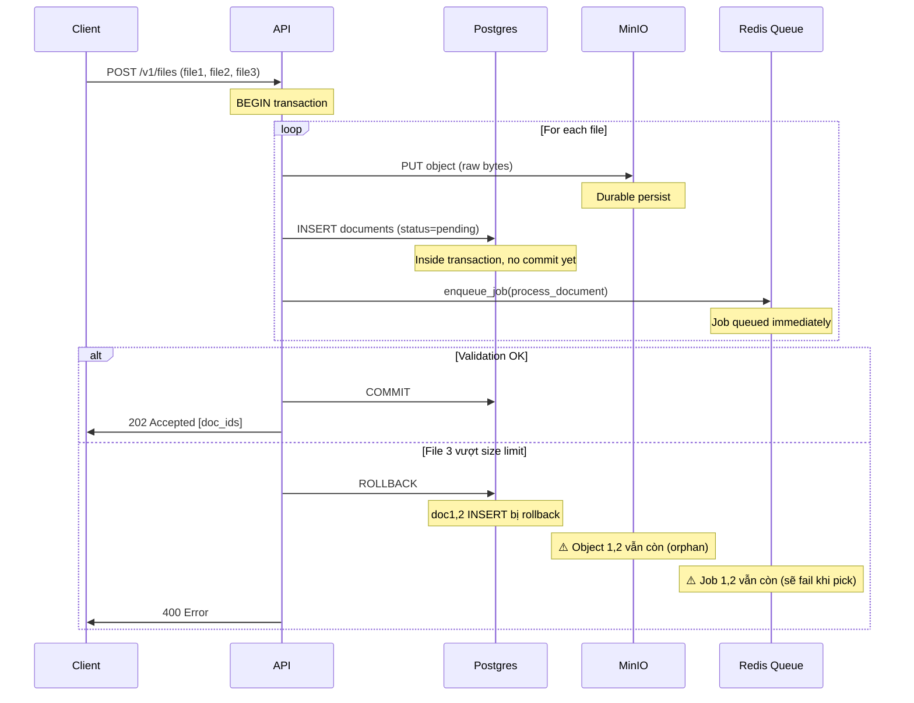
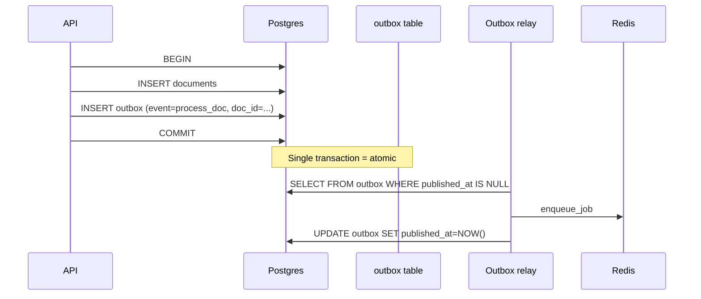
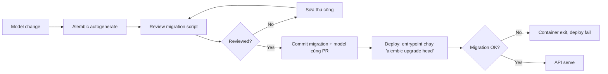

# 13 — Database Design & Transactions

Postgres là **source-of-truth** của toàn bộ hệ thống. Mọi thứ khác (Redis,
Qdrant, MinIO) đều có thể rebuild lại từ Postgres nếu cần. Doc này giải thích
schema và lý do từng quyết định.

---

## 1. ER diagram



8 bảng, 2 cụm chính:
- **Auth cluster**: tenants → users → refresh_tokens.
- **Domain cluster**: conversations/messages + documents/chunks + user_facts.

---

## 2. Vì sao có `tenants` từ đầu

Câu hỏi: nếu chỉ có 1 tổ chức, sao không bỏ tenant?

Trả lời: **multi-tenancy là rất khó retrofit**. Nếu sau này muốn cho công ty
khác dùng cùng app:
- Phải thêm `tenant_id` vào MỌI bảng + index.
- Migration data cũ → tốn thời gian downtime.
- Mỗi query phải `WHERE tenant_id = X` — rủi ro miss leak.

Build sẵn từ đầu = "miễn phí" về complexity, lớn hơn nhiều về future-proof.

Default: nếu user không chọn tenant, auto-tạo `slug="default"`. Single-tenant
deploy hoạt động trong suốt.

---

## 3. Tại sao UUID làm PK (không serial integer)

```sql
id uuid PRIMARY KEY DEFAULT gen_random_uuid()
```

| Tiêu chí | UUID | Serial int |
|----------|------|------------|
| Sinh ID không cần DB | ✅ client/app | ❌ phải INSERT trước |
| Lộ thông tin | ❌ random | ✅ "tôi là user thứ 12" |
| Index size | 16 bytes | 4-8 bytes |
| Sortable theo thời gian | ❌ (UUIDv4) | ✅ |
| Merge data giữa shard | ✅ | ❌ collision |

**Hệ thống chọn UUID** vì:
- Cho phép client tạo trước (vd worker tạo chunk_id trước khi insert).
- Không leak thứ tự (security minor).
- Mạnh khi tương lai shard hoặc distributed.

Trade-off: index lớn hơn ~2x. Với <100M row, không vấn đề.

Có thể nâng cấp sang **UUIDv7** (sortable + UUID) khi cần — Postgres 17 hỗ trợ
native.

---

## 4. Tại sao `created_at` + `updated_at` mặc định ở DB

```python
# src/db/models/_mixins.py::TimestampMixin
created_at = mapped_column(server_default=func.now())
updated_at = mapped_column(server_default=func.now(), onupdate=func.now())
```

- `server_default=func.now()`: Postgres tự sinh, không phụ thuộc clock của app
  (tránh skew khi multi-host).
- `onupdate=func.now()`: SQLAlchemy emit UPDATE statement đặt `updated_at`.
  Lưu ý: chỉ trigger khi UPDATE qua ORM. Bulk update raw SQL phải `SET updated_at = NOW()`.

**Tại sao quan trọng**: debug + audit. "Doc này stuck `parsing` từ bao giờ?"
→ `updated_at` cho ngay.

---

## 5. Transaction boundaries (cực kỳ quan trọng)

### Pattern session_scope

```python
@asynccontextmanager
async def session_scope() -> AsyncIterator[AsyncSession]:
    async with sm() as session:
        try:
            yield session
            await session.commit()        # commit on success
        except Exception:
            await session.rollback()       # rollback on error
            raise
```

→ **Atomicity guarantee**: tất cả thay đổi trong block thành công hoặc fail.

### Ví dụ: upload nhiều file



### Vấn đề: 2-Phase Commit "lite"

Transaction Postgres rollback **không** undo MinIO PUT và Redis ENQUEUE — đây
là phần **distributed transaction** không có giải pháp đẹp.

Cách hệ thống xử lý:
1. **MinIO orphan**: cron job định kỳ scan object không có row tương ứng,
   xoá sau 24h. (TODO)
2. **Redis job orphan**: worker pick job → `doc.get_internal(doc_id)` → None
   → log warning, return. Job không retry.

**Outbox pattern** (TODO khi scale) giải triệt để:


Khi đó: hoặc cả 2 (doc + event) hoặc không có gì.

---

## 6. Indexes hiện có

| Bảng | Index | Mục đích |
|------|-------|----------|
| users | `(tenant_id, email)` UNIQUE | login lookup + dedupe |
| users | `email` | global search (admin) |
| refresh_tokens | `user_id` | list session user |
| refresh_tokens | `expires_at` | sweep expired |
| refresh_tokens | `token_hash` UNIQUE | revoke check |
| conversations | `(user_id, updated_at DESC)` | list "recent chat" |
| conversations | `tenant_id` | admin queries |
| messages | `(conversation_id, created_at)` | load history |
| documents | `(tenant_id, checksum_sha256)` UNIQUE | dedupe |
| documents | `user_id` | "my docs" |
| documents | `tenant_id` | admin |
| documents | `status` | worker sweep stuck jobs |
| document_chunks | `(document_id, chunk_index)` UNIQUE | dedupe |
| user_facts | `(user_id, key)` | fact lookup |

### Index philosophy
- **Composite index**: order matters. `(user_id, updated_at)` hỗ trợ cả
  `WHERE user_id=X` và `WHERE user_id=X ORDER BY updated_at`.
- **Partial index** (chưa dùng): có thể thêm
  `CREATE INDEX ON documents (created_at) WHERE status='pending'` cho sweep
  fast, giảm size index.

### Index growth check
```sql
SELECT
  schemaname, tablename, indexname,
  pg_size_pretty(pg_relation_size(indexrelid)) AS size,
  idx_scan as scans
FROM pg_stat_user_indexes
ORDER BY pg_relation_size(indexrelid) DESC
LIMIT 20;
```

Index `idx_scan=0` sau vài tuần → cân nhắc DROP.

---

## 7. JSONB fields — vì sao và khi nào

```python
# Message.meta: dict[str, Any] = JSONB
# Document.meta: dict[str, Any] = JSONB
```

JSONB phù hợp khi:
- Field không structure cố định (citations, tool_calls có schema khác nhau).
- Read-heavy, không cần update từng field thường xuyên.
- Cần query 1 vài key nhưng không phải tất cả.

**Tránh** JSONB khi:
- Field cần index hiệu năng cao.
- Cần JOIN với bảng khác.
- Cần FK constraint.

### Query JSONB
```sql
-- Tìm message có citation về doc nhất định
SELECT * FROM messages
WHERE meta @> '{"citations":[{"doc_id":"<uuid>"}]}';

-- Đếm citation per message
SELECT id, jsonb_array_length(meta->'citations') AS n_cite FROM messages;
```

### Index JSONB nếu cần
```sql
CREATE INDEX ON messages USING gin (meta jsonb_path_ops);
```

Hiện chưa cần → bỏ qua.

---

## 8. Tenant isolation enforcement chi tiết

Multi-tenancy là rủi ro pháp lý lớn nhất. Cách hệ thống enforce:

### Tầng 1: Application code
Mọi repository method nhận `user_id` hoặc `tenant_id` làm bắt buộc:

```python
async def get(self, conv_id, *, user_id):
    q = select(Conversation).where(
        Conversation.id == conv_id,
        Conversation.user_id == user_id,    # ← enforced
    )
```

Code review: tìm `select(Conversation)` mà không có user_id filter → bug.

### Tầng 2: Postgres Row-Level Security (RLS) — TODO

```sql
ALTER TABLE conversations ENABLE ROW LEVEL SECURITY;

CREATE POLICY conv_tenant_isolation ON conversations
USING (tenant_id = current_setting('app.tenant_id')::uuid);
```

App set `SET LOCAL app.tenant_id = '<uuid>'` đầu mỗi transaction. Forget filter
→ Postgres tự ép.

Hiện chưa bật vì:
- Worker cần cross-tenant access (admin queries).
- Cần coordination giữa connection pool + transaction setup.

Đây là **defense-in-depth khuyến nghị cao** khi go-prod thật.

### Tầng 3: API/Auth layer
JWT chứa `tid` (tenant_id). API decode → load user → so sánh tenant_id
URL/payload với JWT. Mismatch → 403.

---

## 9. Migration philosophy với Alembic



### Quy tắc
1. **1 PR = 1 migration**: không gom nhiều migration cùng PR (khó rollback từng phần).
2. **Tên file descriptive**: `0002_add_user_avatar.py`, không `0002_changes.py`.
3. **Forward-only**: không rollback ở prod (tạo migration mới để revert thay vì
   `downgrade`).
4. **Backwards-compatible deploy**:
   - Step 1: thêm cột nullable / có default.
   - Step 2: code mới đọc/ghi cột mới.
   - Step 3: backfill data cũ.
   - Step 4: (sau khi tất cả replica chạy code mới) thêm NOT NULL nếu cần.

### Idempotent migration trong container
Entrypoint chạy `python -m src.scripts.migrate` mỗi lần start. Race:
- 2 container start cùng lúc, cả 2 chạy `alembic upgrade`.
- Alembic dùng Postgres **advisory lock** trong khi migrate → chỉ 1 chạy được,
  bên kia chờ.

→ Không cần "init container" hay job riêng.

---

## 10. Transaction isolation level

Postgres default: **READ COMMITTED**.

Cảnh báo: ở mức này, **non-repeatable read** xảy ra:
```python
async with session_scope() as s:
    doc1 = await s.execute(select(Document).where(...))
    # ... LLM call mất 5s
    doc2 = await s.execute(select(Document).where(...))
    # doc1.status có thể KHÁC doc2.status nếu worker update giữa chừng
```

### Khi cần stronger isolation
Nếu thực hiện compute dựa trên 2 read và write back:
```python
async with session_scope() as s:
    await s.execute(text("BEGIN ISOLATION LEVEL REPEATABLE READ"))
    ...
```

Hoặc dùng SELECT FOR UPDATE:
```python
doc = (await s.execute(
    select(Document).where(Document.id==did).with_for_update()
)).scalar_one()
```

Lock row đến hết transaction → concurrent writer chờ.

Hệ thống hiện ít cần. Use case duy nhất: idempotent worker check `if status ==
'indexed': return` — race với job khác? Mitigation hiện tại: idempotency ở
Qdrant (delete trước upsert) + UNIQUE constraint trên chunks.

---

## 11. Bottleneck patterns thường gặp

### Pattern 1: N+1 query
```python
convs = await session.execute(select(Conversation).where(...))
for c in convs:
    msgs = await session.execute(select(Message).where(Message.conv_id == c.id))
    # N+1 query!
```

→ dùng `selectinload` hoặc `joinedload`:
```python
q = select(Conversation).options(selectinload(Conversation.messages))
```

Hệ thống tránh được do tách repository + load explicit.

### Pattern 2: Long-running transaction
```python
async with session_scope() as s:
    doc = await s.get(Document, ...)
    await call_gemini(...)        # ← 5s, transaction vẫn open!
    doc.status = "indexed"
```

→ Connection bị giữ 5s, pool exhausted nhanh.

Fix: chia transaction:
```python
async with session_scope() as s:
    doc = await ...
await call_gemini(...)
async with session_scope() as s:
    await update_status(...)
```

Đây là pattern đã áp dụng trong [worker/tasks/ingestion.py](../src/worker/tasks/ingestion.py).

### Pattern 3: Index miss
Query lạ → seq scan → chậm 100x.
```sql
EXPLAIN ANALYZE SELECT * FROM messages WHERE meta->>'role'='tool';
-- nếu thấy "Seq Scan on messages" với rows > 100k → cần index
```

---

## 12. Quan sát DB sống

```bash
make psql

# Connections đang chiếm
SELECT pid, usename, state, query_start, query FROM pg_stat_activity
WHERE state != 'idle' ORDER BY query_start;

# Lock đang chờ
SELECT pg_blocking_pids(pid) AS blocked_by, query FROM pg_stat_activity
WHERE pg_blocking_pids(pid)::text != '{}';

# Bảng lớn nhất
SELECT relname, pg_size_pretty(pg_total_relation_size(relid))
FROM pg_catalog.pg_statio_user_tables
ORDER BY pg_total_relation_size(relid) DESC LIMIT 10;

# Slow queries (cần pg_stat_statements extension)
SELECT mean_exec_time, calls, query FROM pg_stat_statements
ORDER BY mean_exec_time DESC LIMIT 10;
```
