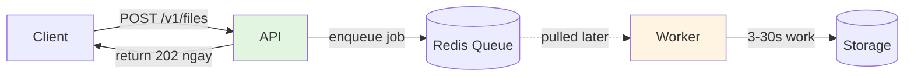
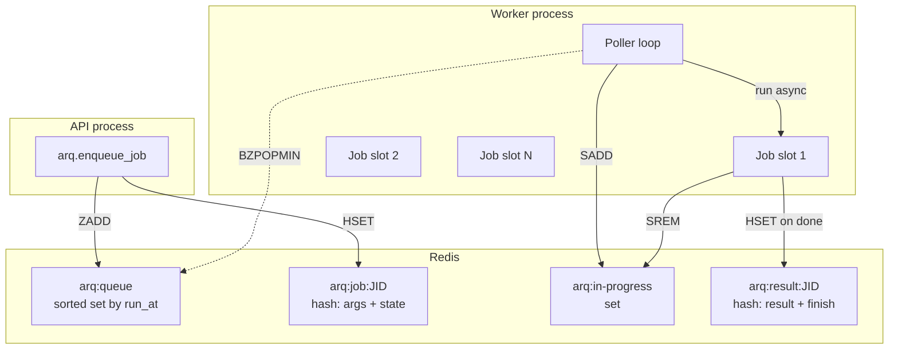
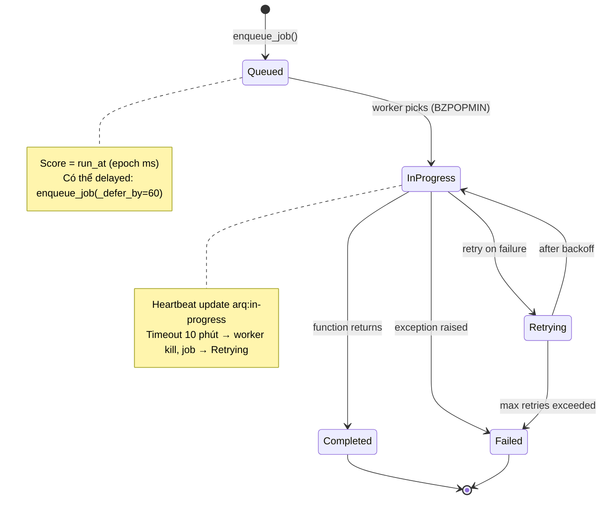
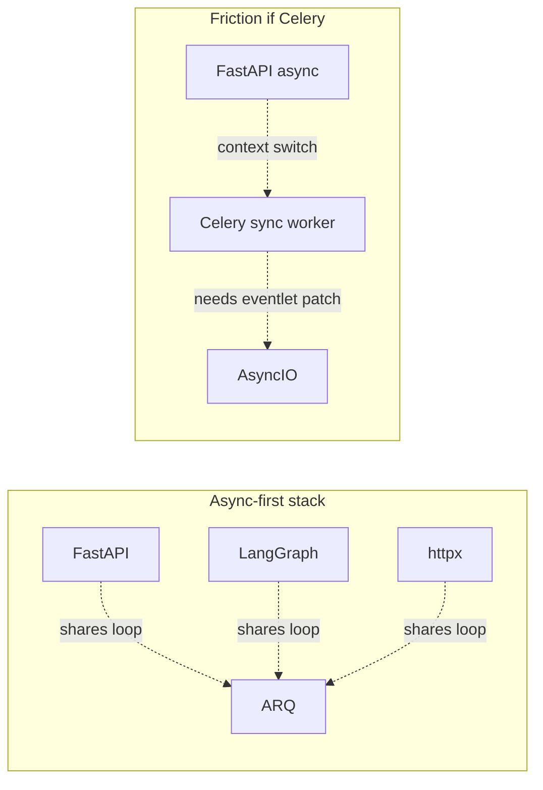
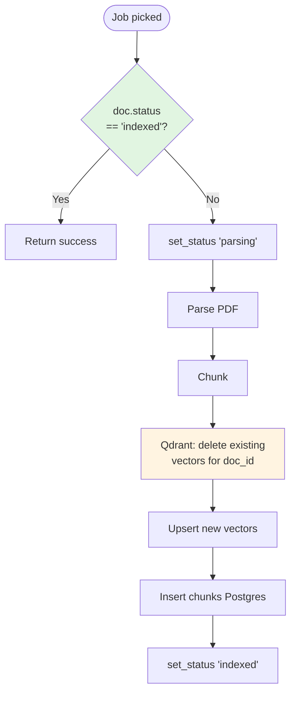
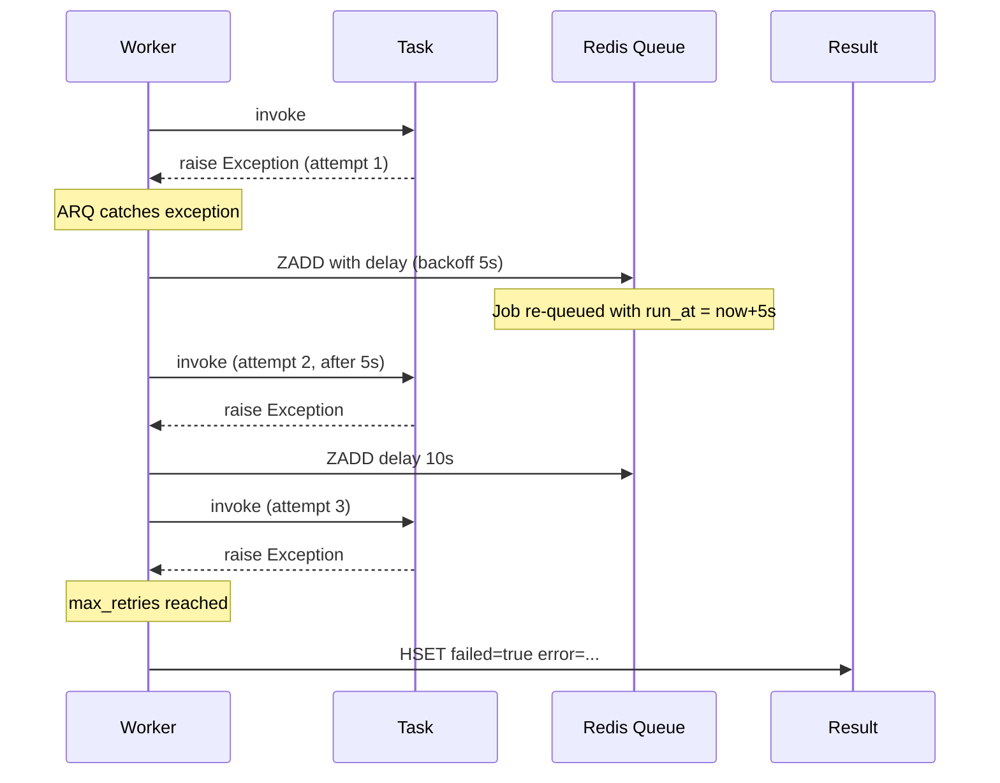
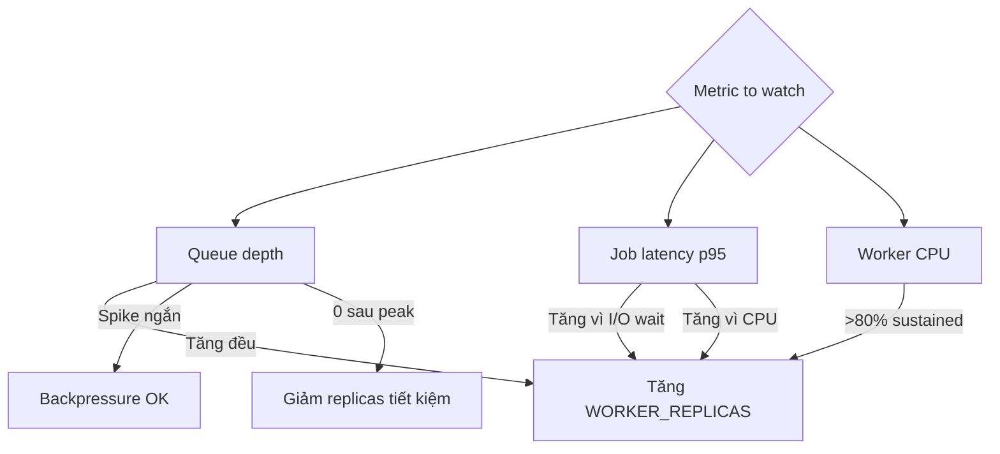

# 14 — Queue & Workers (ARQ): cách job được pick, retry, idempotent

ARQ là Redis-backed async task queue. Doc này giải thích bên trong: từ lúc API
gọi `enqueue_job` đến lúc worker hoàn tất, có gì xảy ra, và cách handle lỗi.

---

## 1. Tổng quan: tại sao có queue



**Vấn đề không có queue**: API thread giữ 30s để parse PDF + embed → user không
thấy phản hồi → timeout → retry → snowball.

**Có queue**: API trả 202 ngay (~200ms), worker xử lý nền, client poll/stream
progress.

---

## 2. ARQ kiến trúc



### Cấu trúc Redis ARQ tạo

| Key | Type | Mục đích |
|-----|------|----------|
| `arq:queue` | ZSET | Job pending, score = epoch ms khi nên chạy |
| `arq:job:<jid>` | HASH | Serialized args, function name, enqueue_time |
| `arq:in-progress` | SET | Job đang được worker xử lý (heartbeat) |
| `arq:result:<jid>` | HASH | Kết quả + status sau khi xong |
| `arq:health-check` | STRING | Worker liveness signal |

---

## 3. Job lifecycle



### Từng bước chi tiết

```python
# API enqueue
job: Job = await arq.enqueue_job("process_document", str(doc_id))
# Redis: ZADD arq:queue <run_at> <jid>
#        HSET arq:job:<jid> function "process_document" args [<doc_id>] enqueue_time ...
```

```python
# Worker (đơn giản hoá ARQ code)
while True:
    jid = await redis.bzpopmin("arq:queue", timeout=1)
    if jid:
        await redis.sadd("arq:in-progress", jid)
        try:
            result = await process_document(ctx, doc_id)
            await redis.hset(f"arq:result:{jid}", mapping={"r": serialize(result), "success": True})
        except Exception as e:
            # retry logic
            ...
        finally:
            await redis.srem("arq:in-progress", jid)
```

---

## 4. Why ARQ (không Celery, Dramatiq, RQ)



| Tiêu chí | ARQ | Celery | Dramatiq | RQ |
|---------|-----|--------|----------|-----|
| Async native | ✅ | ⚠️ eventlet hack | ⚠️ middleware | ❌ |
| Broker | Redis only | Redis/RabbitMQ | Redis/RabbitMQ | Redis |
| Setup phức tạp | Thấp | Cao (worker+beat+flower) | Medium | Thấp |
| Scheduling (cron) | ✅ | ✅ (beat) | thêm apscheduler | thêm |
| Resource (RAM/worker) | ~ 80 MB | ~ 150 MB | ~ 100 MB | ~ 50 MB |
| Maturity | Medium-high | Rất cao | High | High |

**ARQ là sweet spot** cho stack async + Redis. Celery vẫn tốt nếu đã có
infrastructure RabbitMQ + Flower hoặc cần task graph phức tạp.

---

## 5. Idempotency: re-deliver không gây hại

ARQ có thể re-deliver job khi:
- Worker crash giữa chừng (job vẫn ở `in-progress`, không có kết quả).
- Worker timeout (job > `job_timeout`).
- Network glitch — worker không ACK được.

**Tất cả task của hệ thống phải idempotent**: chạy 2 lần ra cùng kết quả.

### Idempotency của `process_document`



Hai chốt quan trọng:
1. **Check status đầu**: nếu đã indexed, skip ngay. Không re-parse, không
   tốn embed.
2. **Delete vectors cũ trước upsert**: nếu lần trước fail sau khi upsert vector
   nhưng trước khi insert Postgres chunks → vectors mồ côi. Lần này xóa sạch
   rồi index lại.

### Idempotency của `extract_facts`

Dedupe trong `save_fact()` (vector similarity > 0.92 → skip).

→ Worker re-deliver chạy lại extraction nhưng tất cả fact đã tồn tại sẽ được
skip ở stage dedupe.

---

## 6. Retry strategy



### Cấu hình ARQ retry
```python
class WorkerSettings:
    max_tries = 3
    # delay tăng theo bậc 2: 5s, 10s, 20s
```

Hiện code trong [src/worker/main.py](../src/worker/main.py) **chưa set
`max_tries`** explicit → ARQ default 5.

### Khi nào nên không retry?
Một số lỗi không bao giờ self-recover (vd file corrupt). Trong task:
```python
except FileFormatError as e:
    # Mark failed, do not retry
    await repo.set_status(doc_id, "failed", error=str(e))
    return {"status": "failed", "fatal": True}
```

Return successfully (không raise) → ARQ coi job thành công, không retry.

---

## 7. Job priority & queue separation

Hiện code 1 queue duy nhất (`default`). Khi scale:
- Job nhanh (extract_facts ~3s) đứng sau job chậm (process_document ~30s)
  trong queue → latency tệ.

### Tách queue
```python
# api side
arq_ingestion = await create_pool(_redis_settings(), queue_name="ingestion")
arq_memory = await create_pool(_redis_settings(), queue_name="memory")

# enqueue khác bucket
await arq_ingestion.enqueue_job("process_document", ...)
await arq_memory.enqueue_job("extract_facts", ...)
```

### Worker chuyên trách
```python
class IngestionWorker:
    queue_name = "ingestion"
    functions = [process_document]
    max_jobs = 4

class MemoryWorker:
    queue_name = "memory"
    functions = [extract_facts]
    max_jobs = 16
```

Tách giúp:
- Memory worker không bị block bởi PDF parse.
- Scale độc lập: nhiều memory worker khi traffic chat cao.

→ TODO khi load tăng.

---

## 8. Backpressure & rate limiting upstream

Worker gọi Gemini API. Nếu rate limit quá nhiệt:
- Tất cả job fail với 429.
- ARQ retry ngay → vẫn 429 → cascade.

### Mitigation
Tenacity backoff đã handle. Ngoài ra:

```python
# Pseudo: token bucket trong worker
from asyncio import Semaphore

embedding_sem = Semaphore(8)  # max 8 concurrent embedding calls / worker process

async def index_chunks(...):
    async with embedding_sem:
        vectors = await emb.embed(texts)
```

Hoặc dùng `aiolimiter`:
```python
from aiolimiter import AsyncLimiter
limiter = AsyncLimiter(max_rate=1500, time_period=60)  # 1500/phút

async with limiter:
    await emb.embed(...)
```

Chưa implement, đợi observed limit hit.

---

## 9. Sweep stuck jobs (TODO)

Có khả năng:
- Worker crash hard (OOM, kernel kill).
- Job ở `arq:in-progress` mãi mãi.
- Doc Postgres stuck ở `parsing`.

### Cron sweep
```python
# scripts/sweep_stuck.py — chạy bằng arq cron job
async def sweep_stuck(ctx):
    cutoff = datetime.utcnow() - timedelta(minutes=10)
    async with session_scope() as s:
        rows = await s.execute(
            select(Document).where(
                Document.status.in_(["parsing", "chunking", "embedding"]),
                Document.updated_at < cutoff
            )
        )
        for d in rows.scalars():
            log.warning("resurrecting_stuck_doc", doc_id=d.id, age=cutoff - d.updated_at)
            await ctx['arq'].enqueue_job("process_document", str(d.id))
```

Register vào ARQ cron:
```python
class WorkerSettings:
    cron_jobs = [
        cron(sweep_stuck, minute=set(range(0, 60, 5)))   # mỗi 5 phút
    ]
```

---

## 10. Dead Letter Queue (DLQ)

Job fail max_retries → biến mất. Để debug, lưu lại:

```python
# Custom on_job_end hook
async def on_job_end(ctx, job_id, result, success, ...):
    if not success:
        await ctx['redis'].lpush("arq:dlq", json.dumps({
            "job_id": job_id, "function": ..., "args": ..., "error": ...,
            "at": datetime.utcnow().isoformat(),
        }))
        await ctx['redis'].ltrim("arq:dlq", 0, 1000)
```

CLI inspect:
```bash
docker compose exec redis redis-cli LRANGE arq:dlq 0 10
```

Production: Slack webhook khi DLQ tăng nhanh.

---

## 11. Worker scaling decisions



### Heuristic
- 1 worker replica xử lý ~ 10 ingestion job/phút (giả định avg 6s/file).
- Memory extraction ~ 30 job/phút.
- Nếu user upload burst 100 file → 100/10 = 10 phút clear với 1 replica.
- Tăng lên 5 replica → 2 phút clear. Trade off RAM 5 × 200MB = 1GB.

### Auto-scale (K8s)
HPA metric "ARQ queue depth" (qua prometheus exporter custom). Khi depth > 50
trong 2 phút → scale lên.

---

## 12. Observability worker

### Prometheus metrics (gợi ý expose)
```python
from prometheus_client import Counter, Histogram, Gauge

jobs_total = Counter("arq_jobs_total", "Jobs processed", ["function", "status"])
job_duration = Histogram("arq_job_duration_seconds", "Job duration", ["function"])
queue_depth = Gauge("arq_queue_depth", "Pending jobs")

# Trong task
with job_duration.labels("process_document").time():
    ...
jobs_total.labels("process_document", "success").inc()
```

### Langfuse trace
Worker task wrap `@observe(name="task.process_document")` → trace LLM call
trong embedding step.

### Logs
```bash
make logs SERVICE=worker
# structured JSON:
# {"event":"ingestion_start","doc_id":"...","request_id":"..."}
# {"event":"embedding_chunks","n":150,"doc_id":"..."}
# {"event":"ingestion_done","doc_id":"...","n_chunks":150}
```

Tail trong production: `kubectl logs -l app=worker --tail=100 -f | jq`.

---

## 13. Khi nào KHÔNG dùng queue

Workload phù hợp queue:
- > 1s.
- Có thể chậm vài giây không ảnh hưởng UX.
- Có thể retry.
- Volume cao, cần buffer khi spike.

Workload **KHÔNG** nên queue:
- Phải trả lời trong response request (vd auth check).
- Cần ordering nghiêm ngặt (queue có thể out-of-order khi retry).
- Cần transaction với DB (queue commit không atomic với DB).

→ Trong hệ thống, chat generation **không** qua queue (cần stream); chỉ memory
extraction post-chat đi queue (fire-and-forget OK chậm vài giây).
