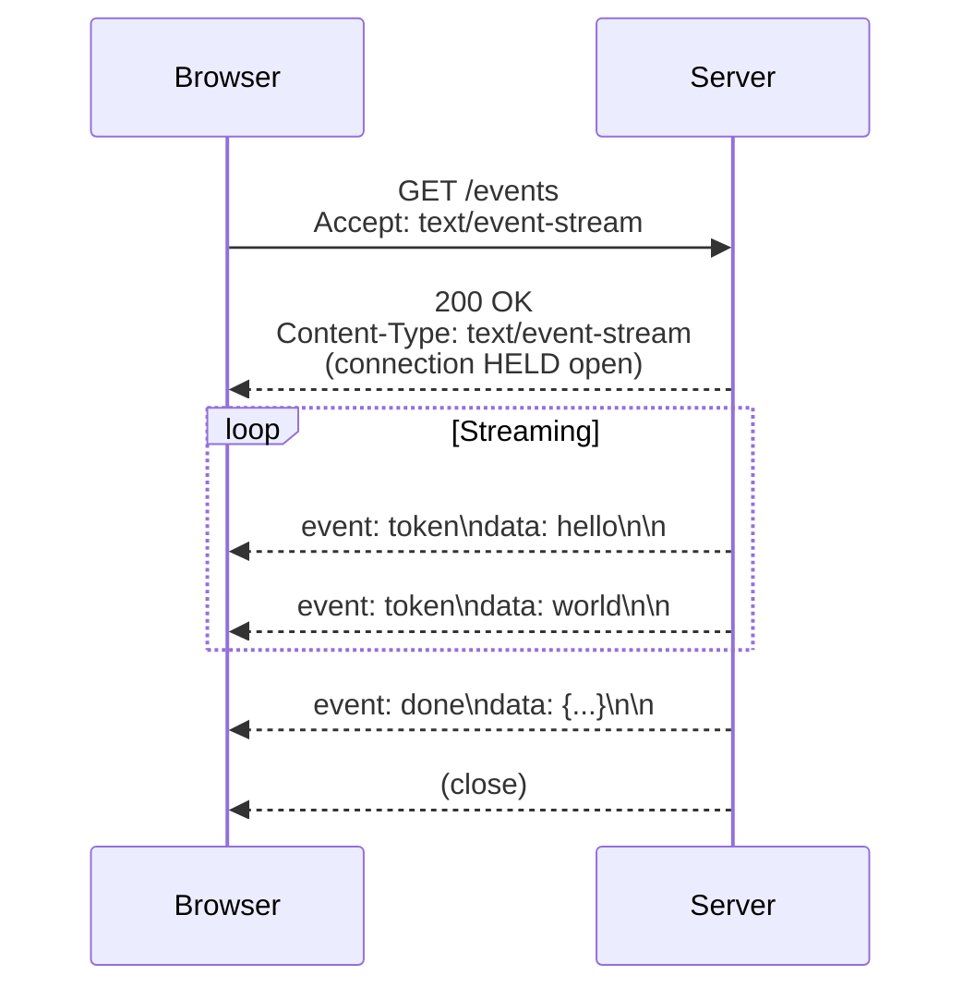
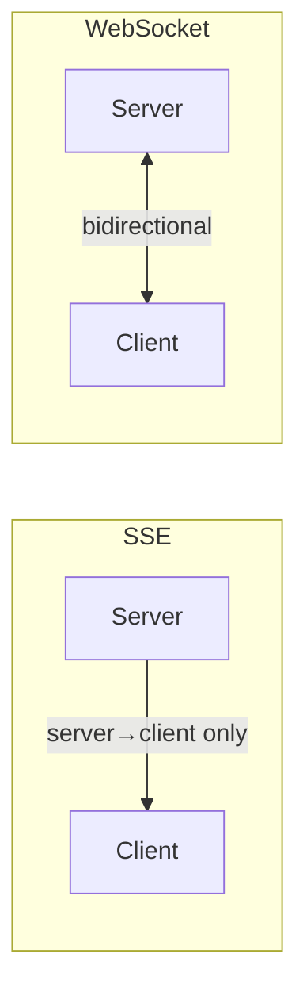
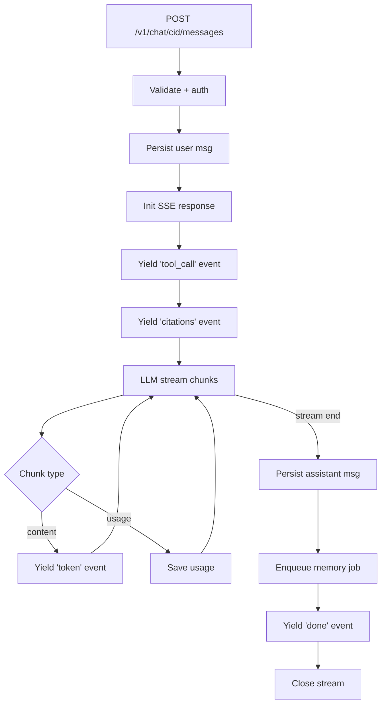
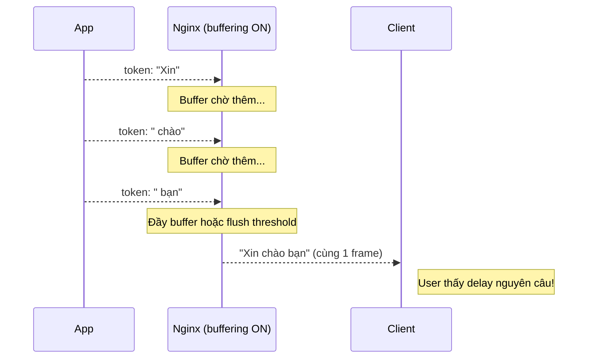
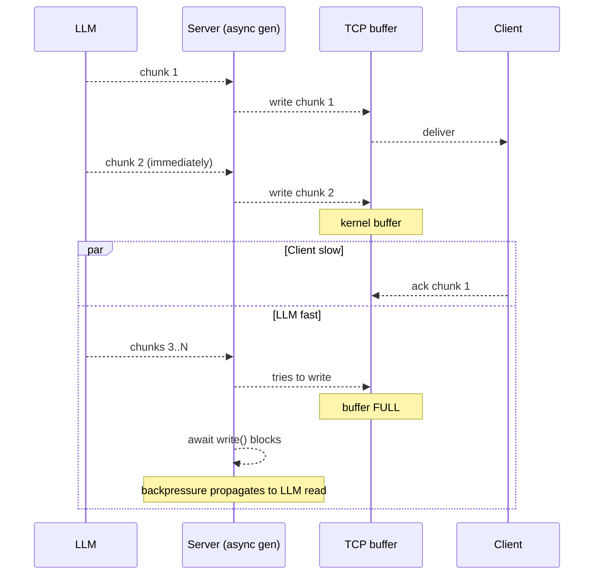
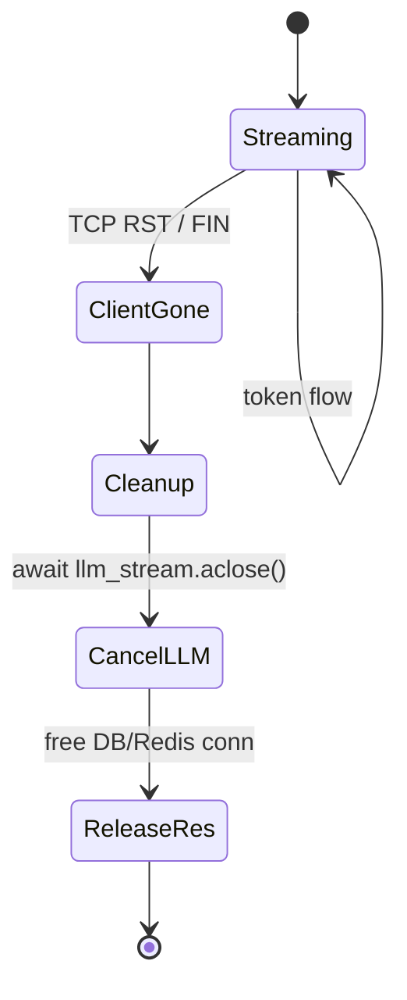
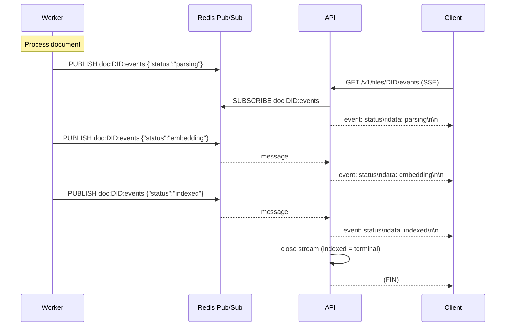
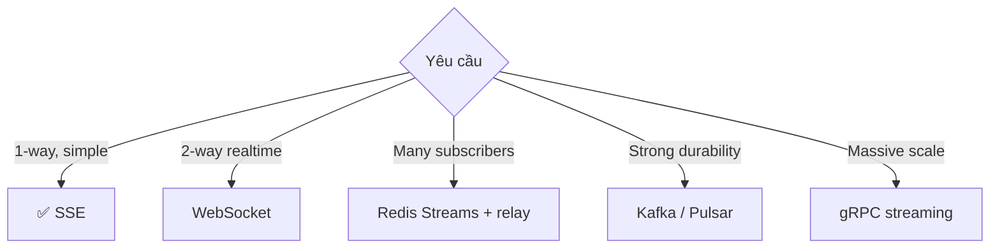

# 15 — SSE Streaming Mechanics

Streaming là **trải nghiệm cốt lõi** của chat AI. User mong chờ token đầu tiên
xuất hiện <200ms. Doc này giải thích cơ chế: SSE vs WebSocket, protocol trên
dây, backpressure, reconnect, heartbeat.

---

## 1. SSE là gì (ngắn)



SSE = **server-sent events**, 1 chiều server → client, dùng HTTP plain.

### Wire format
Mỗi message là text frame:
```
event: token
data: hello

event: citation
data: {"doc_id":"...","chunk_id":"..."}

event: done
data: {"usage":{"prompt_tokens":1234}}

```

Trailing blank line `\n\n` là **separator bắt buộc**.

### Đặc tính kỹ thuật
- HTTP/1.1 hoặc HTTP/2.
- `Transfer-Encoding: chunked`.
- Connection HELD open cho đến khi server close hoặc client disconnect.
- Browser native `EventSource` API auto-reconnect.

---

## 2. Vì sao chọn SSE thay vì WebSocket



| Tiêu chí | SSE | WebSocket |
|----------|-----|-----------|
| Direction | server → client | full-duplex |
| Protocol | HTTP plain | upgrade ws:// |
| Auto-reconnect | ✅ EventSource native | ❌ tự code |
| Proxy/CDN friendly | ✅ (HTTP) | ⚠️ cần config |
| Auth header (Bearer) | ✅ | ⚠️ chỉ URL hoặc subprotocol |
| Browser API | EventSource (đơn giản) | WebSocket (phức tạp hơn) |
| Server connection cost | 1 HTTP conn | 1 TCP socket |
| Compression | gzip/br (cần tắt) | per-message deflate |
| Backpressure | TCP level | API level |

**Chat 1 chiều = SSE perfect**. User input đi qua POST riêng, không cần socket
2 chiều.

WebSocket cần khi:
- Bidirectional với latency cực thấp (game).
- Server cần push tới nhiều subscriber realtime (collab editor).

---

## 3. Server implementation (FastAPI + sse-starlette)



### Code
```python
# src/api/routes/chat.py (rút gọn)
return EventSourceResponse(gen(), ping=15)

async def gen():
    async for evt in run_agent_stream(...):
        if evt["type"] == "token":
            yield {"event": "token", "data": evt["data"]}
        elif evt["type"] == "done":
            ...
            yield {"event": "done", "data": json.dumps(...)}
```

`EventSourceResponse` của `sse-starlette` lo:
- Set headers (`Content-Type: text/event-stream`, `Cache-Control: no-cache`).
- Encode frame đúng format.
- Periodic `ping` (heartbeat).
- Detect client disconnect → cancel generator.

---

## 4. Nginx: tại sao MUST `proxy_buffering off`

Default Nginx buffer response để gửi gộp → tốt cho throughput nhưng PHẢ HUỶ
SSE vì:



```nginx
# docker/nginx/conf.d/api.conf
location ~* ^/v1/(chat|files/[^/]+/events) {
    proxy_buffering off;            # ← key
    proxy_cache off;
    proxy_set_header X-Accel-Buffering no;
    gzip off;                       # gzip cũng buffer
    chunked_transfer_encoding on;
    proxy_read_timeout 1h;          # long-lived
}
```

### Test buffer
```bash
# Nếu buffer ON, output ra cụm dài; nếu OFF, từng dòng ngay
curl -N http://localhost/v1/chat/<cid>/messages -H "Authorization: Bearer $T" -d '{"message":"..."}'
```

`-N` tắt curl buffer ở client side để đo chuẩn.

---

## 5. Heartbeat: chống dead-connection

Long-running TCP connection có thể bị **firewall/proxy timeout** sau ~60s
inactivity. Browser cũng có thể "đông cứng" connection nếu tab background.

### Giải pháp: ping định kỳ
`EventSourceResponse(gen(), ping=15)` → mỗi 15s server emit:
```
: ping

```

Comment line (bắt đầu với `:`) → SSE spec ignore. Mục đích duy nhất: giữ
connection có "activity" để firewall/proxy không reset.

```mermaid
gantt
    title SSE connection 60 phút (không token mới)
    dateFormat ss
    axisFormat %S
    section Server
    ping        :00, 15s
    ping        :15, 15s
    ping        :30, 15s
    ping        :45, 15s
    section Firewall
    no idle timeout reset :crit, active, 00, 60s
```



Nếu không có ping: 60s sau, firewall đóng → client `onerror` → auto-reconnect.

---

## 6. Client implementation

### Browser (EventSource)
```javascript
const es = new EventSource('/v1/chat/abc/messages', {withCredentials: true});

es.addEventListener('token', e => {
    document.getElementById('answer').textContent += e.data;
});
es.addEventListener('citations', e => {
    const cites = JSON.parse(e.data);
    showCitations(cites);
});
es.addEventListener('done', e => {
    es.close();
    finalize(JSON.parse(e.data));
});
es.onerror = () => {
    console.log("error, auto-reconnect...");
};
```

**Vấn đề**: EventSource không support custom headers, không POST.

→ Buộc dùng `fetch` với `getReader()`:
```javascript
const resp = await fetch('/v1/chat/abc/messages', {
    method: 'POST',
    headers: {'Authorization': 'Bearer ...', 'Content-Type': 'application/json'},
    body: JSON.stringify({message: '...'}),
});
const reader = resp.body.pipeThrough(new TextDecoderStream()).getReader();

let buffer = '';
while (true) {
    const {done, value} = await reader.read();
    if (done) break;
    buffer += value;
    // parse SSE frames
    const frames = buffer.split('\n\n');
    buffer = frames.pop();
    for (const frame of frames) {
        // parse "event:...\ndata:..."
        ...
    }
}
```

Phức tạp hơn nhưng linh hoạt. Có thư viện `@microsoft/fetch-event-source`
hỗ trợ.

### CLI (curl)
```bash
curl -N -X POST http://localhost/v1/chat/abc/messages \
  -H "Authorization: Bearer $T" \
  -H "Content-Type: application/json" \
  -d '{"message":"Hello"}'
```

---

## 7. Backpressure: nếu client chậm hơn server



Trong asyncio:
- `yield` từ generator → `EventSourceResponse` write tới socket.
- Khi socket buffer đầy, `write()` await → generator pause.
- LLM stream tự pause vì server không consume chunk mới.

→ **Backpressure tự nhiên qua TCP**, không cần explicit code.

Risk: nếu client cố ý slow để giữ resource → DOS attempt. Mitigation:
- Timeout overall: `proxy_read_timeout 1h` ở Nginx.
- Rate limit số connection per IP (Nginx `limit_conn`).

---

## 8. Disconnect detection



### Cơ chế phát hiện
Starlette wrap `Request.is_disconnected()` — check khi write fail.
`sse-starlette` poll request mỗi `ping` interval:
```python
# pseudo
async for evt in gen():
    if await request.is_disconnected():
        break
    yield evt
```

Khi detect:
- `gen()` exit → `async for chunk in llm.complete_stream(...)` cancelled.
- httpx close upstream connection (TCP FIN tới Gemini).
- Gemini stop billing tokens (gần như, có overlap nhỏ).

### Test thủ công
```bash
curl -N http://localhost/v1/chat/<cid>/messages ... &
PID=$!
sleep 2
kill $PID    # client disconnect
# Server log nên có "client disconnected" hoặc generator cancelled
```

---

## 9. Reconnect & "last event id"

SSE spec hỗ trợ resume bằng header `Last-Event-ID`:
```
GET /events
Last-Event-ID: msg-123
```

Server có thể replay events sau `msg-123`.

### Hệ thống hiện tại
Không implement resume cho chat. Lý do:
- Generation ngắn (<10s) → reconnect = chấp nhận user lặp lại câu.
- Resume cần buffer events server-side → tăng phức tạp.

Có implement cho `/v1/files/{doc_id}/events`:
- Khi reconnect, server gửi state hiện tại trước (`event: status data: {...}`),
  rồi subscribe Pub/Sub.

```python
# src/api/routes/files.py
async def gen():
    pubsub = r.pubsub()
    await pubsub.subscribe(f"doc:{doc_id}:events")
    yield {"event": "status", "data": json.dumps({"status": d.status})}  # initial
    async for msg in pubsub.listen():
        yield {...}
```

Khách hàng disconnect rồi reconnect → vẫn nhận status hiện tại + future events.

---

## 10. SSE qua Pub/Sub Redis (cho file events)



Vì sao Pub/Sub:
- Worker không biết user nào đang xem progress. Pub/Sub → 0-N subscriber, không
  cần biết.
- 2 device cùng user xem cùng file → 2 subscriber, đều nhận event.

Vì sao KHÔNG dùng polling DB:
- Latency cao (polling 1s = trễ 1s).
- Tải DB không cần thiết (mỗi user mỗi giây 1 query).

---

## 11. Streaming với multiple events trong 1 request

Chat stream gửi nhiều loại event:

```mermaid
gantt
    title 1 lượt chat (T=0 -> T=3.5s)
    dateFormat X
    axisFormat %S
    section Events
    tool_call(load_memory)  :milestone, 0.1, 0
    tool_call(retrieve_docs):milestone, 0.3, 0
    citations              :milestone, 0.8, 0
    token: "Xin"           :milestone, 1.0, 0
    token: " chào"         :milestone, 1.1, 0
    token: ...             :milestone, 1.2, 0
    token: "."             :milestone, 3.2, 0
    done                   :milestone, 3.5, 0
```

Client phân biệt event qua field `event:`:
```javascript
es.addEventListener('tool_call', e => showLoading(JSON.parse(e.data).name));
es.addEventListener('citations', e => prepareCitationBar(JSON.parse(e.data)));
es.addEventListener('token', e => appendText(e.data));
es.addEventListener('done', e => finalize());
es.addEventListener('error', e => showError(e.data));
```

### Tại sao tách `tool_call` event
UX rất quan trọng: user thấy "Đang tìm trong tài liệu..." → cảm giác đang
hoạt động, không phải đứng hình.

---

## 12. Common pitfalls

| Symptom | Nguyên nhân thường gặp |
|---------|------------------------|
| Client thấy nguyên câu cùng lúc | Nginx buffering chưa tắt |
| Client gắn `?token=...` vẫn 401 | EventSource không gửi cookie/header → đổi sang fetch |
| Stream cắt giữa chừng | proxy_read_timeout quá thấp (default 60s) |
| Token "đầy" chậm lần đầu | LLM TTFT (time-to-first-token), không phải bug |
| Console spam reconnect | Server return non-200 → EventSource retry. Check log |
| Server log "BrokenPipeError" | Client disconnect, OK ignore |
| Memory leak khi 1000 SSE | Generator không cleanup → kiểm tra `finally:` cancel upstream |

---

## 13. Production tuning

```nginx
# Mở rộng giới hạn cho streaming endpoint
worker_connections 4096;     # tổng connection cùng lúc / worker process
keepalive_timeout 75s;       # giữ keep-alive HTTP

# Cho /v1/chat/*
proxy_read_timeout 30m;      # tối đa stream
proxy_send_timeout 30m;
proxy_connect_timeout 30s;
```

Postgres connection per stream:
- Mỗi SSE chat giữ DB connection? **Không** — connection chỉ acquire khi
  query, release ngay sau (qua repository pattern, không keep connection).
- 1000 stream đồng thời = 1000 coroutine, ~10 DB conn cùng lúc.

Redis connection per stream:
- Pub/Sub channel cần 1 connection per subscriber. 1000 file events stream →
  1000 connection Redis.
- Redis default `maxclients 10000` đủ; tăng nếu cần.
- Pub/Sub không scale linearly nếu publish rate cao + subscriber lớn. Khi cần
  → Redis Streams hoặc NATS.

---

## 14. Alternatives khi SSE không đủ



Hệ thống hiện chat = SSE, file events = SSE qua Pub/Sub. Cấu hình tốt cho
~1000 concurrent stream. Vượt 10k → cân nhắc hub pattern (1 process subscribe
Redis, fan-out tới các SSE connection).
