# 17 — Failure Modes & Resilience

Distributed system = nhiều thứ có thể fail cùng lúc. Doc này liệt kê **mọi
failure mode đã nghĩ ra**, hệ thống xử lý ra sao, và playbook recovery khi
fail thật.

---

## 1. Failure landscape

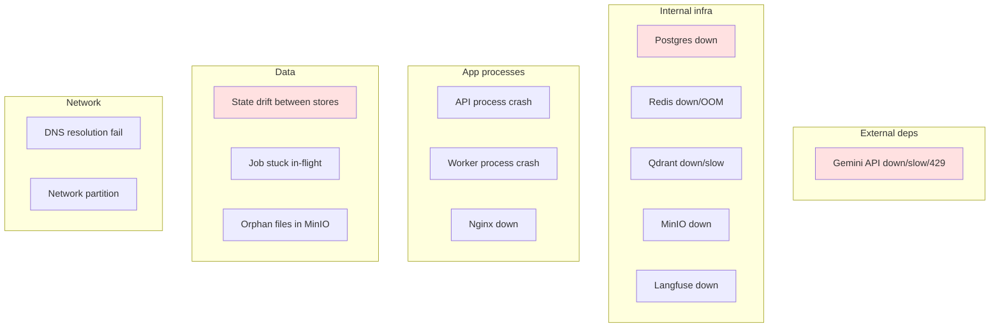

---

## 2. Decision tree: phản ứng theo loại failure

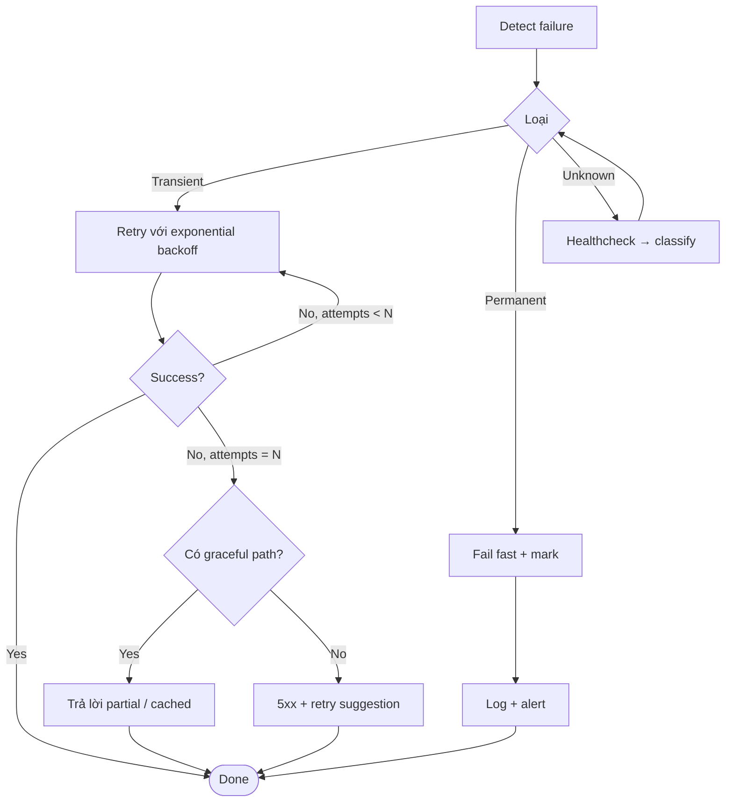

---

## 3. Gemini API failures

### 3.1. Rate limit 429

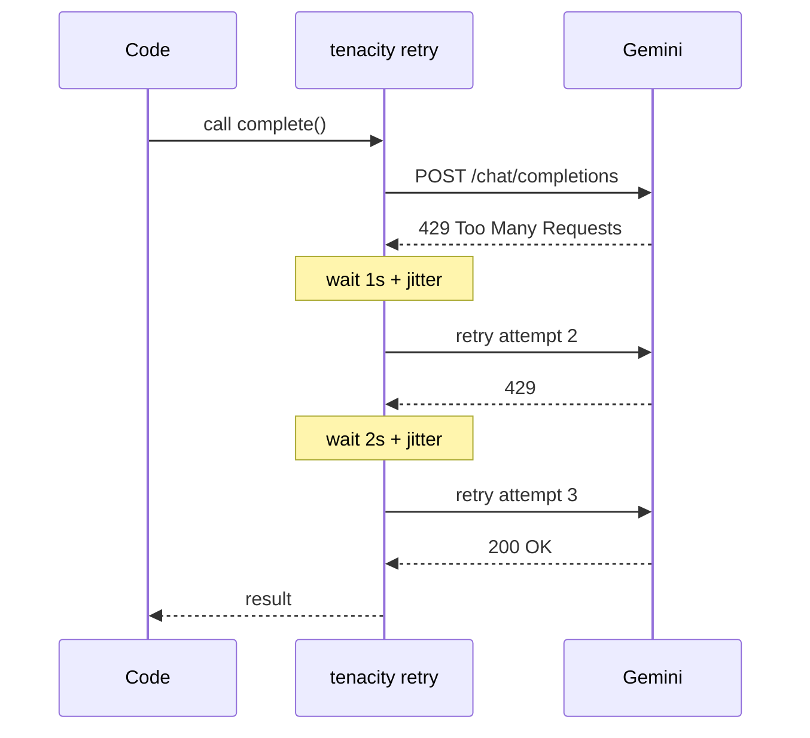

Code:
```python
# src/llm/client.py
@retry(
    retry=retry_if_exception_type((TimeoutError, ConnectionError)),
    stop=stop_after_attempt(self._s.llm_max_retries),
    wait=wait_exponential_jitter(initial=1, max=10),
    reraise=True,
)
```

**Vấn đề hiện tại**: tenacity chỉ retry trên `TimeoutError` và `ConnectionError`,
KHÔNG retry trên HTTP 429 từ OpenAI SDK (sẽ raise `RateLimitError`). Cần sửa:

```python
from openai import RateLimitError, APIError
retry_if_exception_type((TimeoutError, ConnectionError, RateLimitError, APIError))
```

(TODO sửa.)

### 3.2. Service unavailable / 5xx
Tenacity retry 3 lần. Nếu vẫn fail:
- Chat: API trả `event: error` → client thấy message lỗi friendly.
- Worker (embedding/rerank): job retry qua ARQ (up to max_tries). Cuối cùng
  doc → `failed`.

### 3.3. Latency cao bất thường
- HTTP timeout 60s (config `llm_timeout_s`).
- httpx ngắt → tenacity coi như TimeoutError → retry.
- Cumulative request time có thể vượt SSE timeout của Nginx (1h) — không
  vấn đề thường.

### 3.4. Circuit breaker (TODO)

Khi Gemini fail >50% trong 30s, mở circuit 60s — fail nhanh để không waste
retry latency:

```python
# pseudo, dùng aiocircuitbreaker
from aiocircuitbreaker import circuit

@circuit(failure_threshold=5, recovery_timeout=60)
async def _call(...):
    ...
```

Open state: trả error ngay, không gọi upstream. Half-open sau 60s: thử 1
request; OK → close; fail → open lại.

---

## 4. Postgres failure

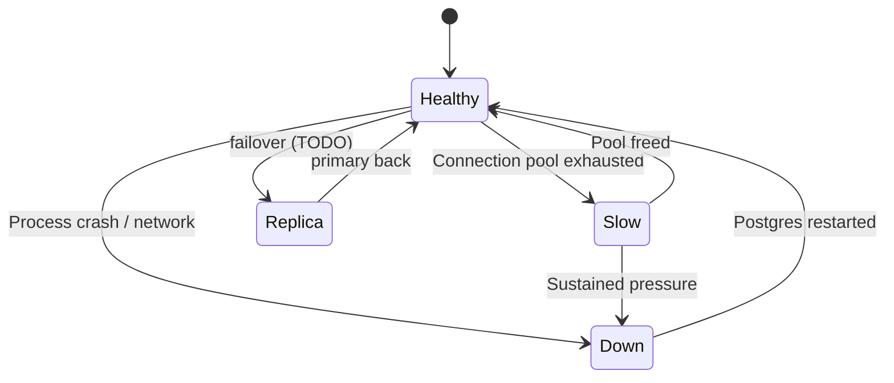

### Pool exhausted
- Symptom: `sqlalchemy.exc.TimeoutError: QueuePool limit overflow`.
- Cause: long transaction + nhiều concurrent request.
- Mitigation: tăng `db_pool_size`, hoặc đặt PgBouncer.

### Hard down
- Healthcheck `/health/ready` fail → Nginx route đi replica (chưa có HA).
- Mọi write fail → 500 cho user.
- Recovery: docker compose restart postgres → migrations idempotent rerun OK.

### Failover (HA, TODO)
- Postgres streaming replica (read-only).
- pgbouncer config primary/replica.
- Promote replica khi primary down → app reconnect.

### Data loss risk
Postgres `fsync=on` (default) → mọi commit durable trên disk. Power failure
mất ≤ 1 WAL segment chưa flush.

Backup chiến lược: xem [docs/04-deployment.md](04-deployment.md#7-backup--restore).

---

## 5. Redis failure

Redis nhiều role → tùy role mức độ ảnh hưởng khác nhau:

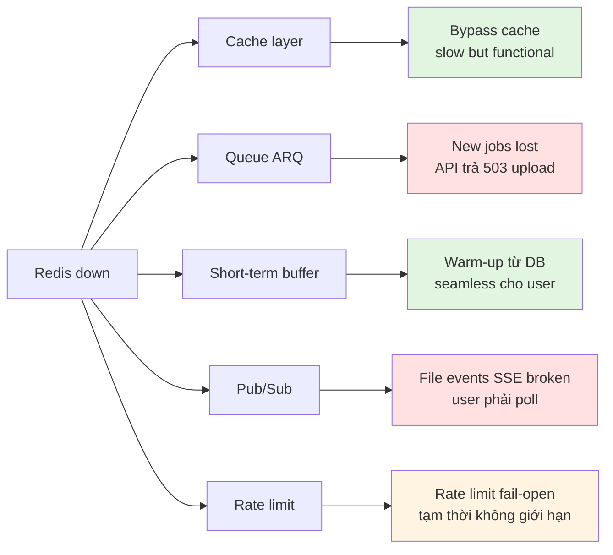

### Graceful degradation cho cache
Cache function nên try/except, không raise:
```python
async def cache_get(key):
    try:
        raw = await r.get(key)
        return orjson.loads(raw) if raw else None
    except Exception:
        return None    # cache miss → upstream
```

Hiện code chưa wrap try → khi Redis down, exception lên → request fail. **TODO
fix**.

### Persistence
- `appendonly yes` + `save 60 1000` → AOF flush mỗi giây.
- Mất tối đa ~1 giây data khi crash → buffer hơi mất nhưng warm-up từ DB OK.

### Memory pressure
`maxmemory 512mb` + `allkeys-lru` → tự evict entry cũ. Không OOM hard.

---

## 6. Qdrant failure

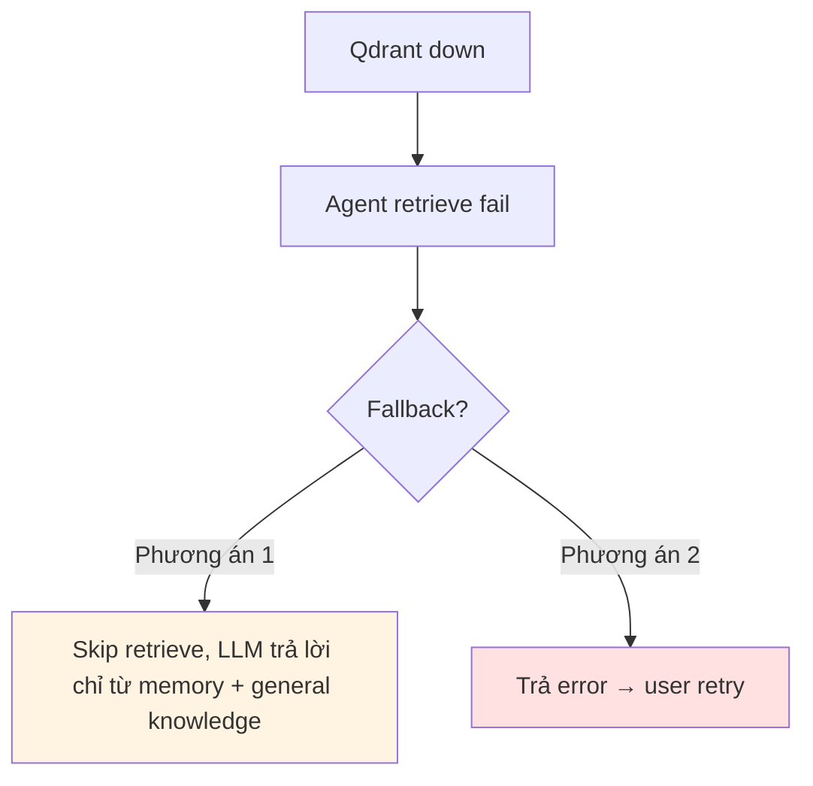

Hiện code dùng phương án 2 (raise → SSE error). Phương án 1 tốt hơn UX nhưng
risk: LLM hallucinate vì không có context.

### Vectors loss
Nếu Qdrant data corrupt:
- **Source-of-truth ở Postgres** (`document_chunks.text`).
- Embedding cache Redis 7d → cache hits cao khi rebuild.
- Script rebuild:
  ```python
  # scripts/rebuild_qdrant.py (TODO)
  docs = await session.execute(select(Document).where(status='indexed'))
  for doc in docs:
      chunks = await get_chunks(doc.id)
      vectors = await embedder.embed([c.text for c in chunks])
      await qc.upsert(...)
  ```

---

## 7. MinIO failure

Storage tier — chứa file gốc.

### Mất file gốc
Nếu MinIO data corrupt + không có backup:
- Document Postgres còn metadata + chunks text → **vẫn search được**.
- Mất khả năng re-parse / re-chunk / download nguyên bản.

→ MinIO backup quan trọng. Mirror sang offsite định kỳ
(xem [04-deployment.md](04-deployment.md)).

### Upload fail
Symptom: `S3Error` khi `put_object`.
- API code: raise → 500 cho client → user retry.
- Worker code: `process_document` raise → ARQ retry → cuối cùng `failed`.

---

## 8. Langfuse failure

Quan trọng: **Langfuse fail KHÔNG được làm app fail**.

Code đã handle:
```python
# src/observability/langfuse.py
def trace_score(...):
    if _lf is None:
        return       # no-op nếu chưa init
    try:
        ...
    except Exception:
        pass         # swallow
```

→ Observability là nice-to-have. App vẫn serve, mất visibility.

Langfuse có **internal queue** flush batch → app chỉ write local buffer, không
synchronous với Langfuse server.

---

## 9. Worker process crash

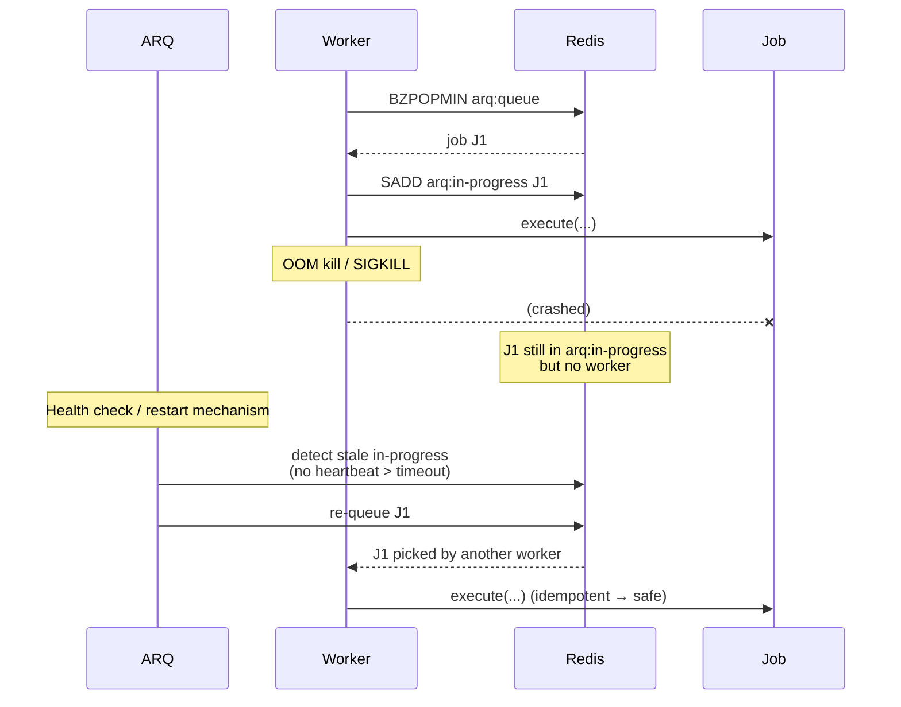

### Idempotency là cứu cánh
Vì task được thiết kế idempotent (check `status==indexed`, delete-then-upsert
Qdrant, dedupe facts), re-deliver không gây side effect xấu.

### Stuck job (no heartbeat)
ARQ default: nếu worker không update heartbeat trong `job_timeout=600s`, job
được consider lost → re-queue. Hiện cấu hình OK.

### Doc stuck `parsing`
Cron sweep (TODO):
```python
# Mỗi 5 phút
async def sweep_stuck(ctx):
    cutoff = now - 10 phút
    stuck = SELECT documents WHERE status IN ('parsing','chunking','embedding')
                                AND updated_at < cutoff
    for d in stuck:
        log.warning("resurrect", doc_id=d.id)
        await arq.enqueue_job("process_document", str(d.id))
```

---

## 10. API process crash giữa stream

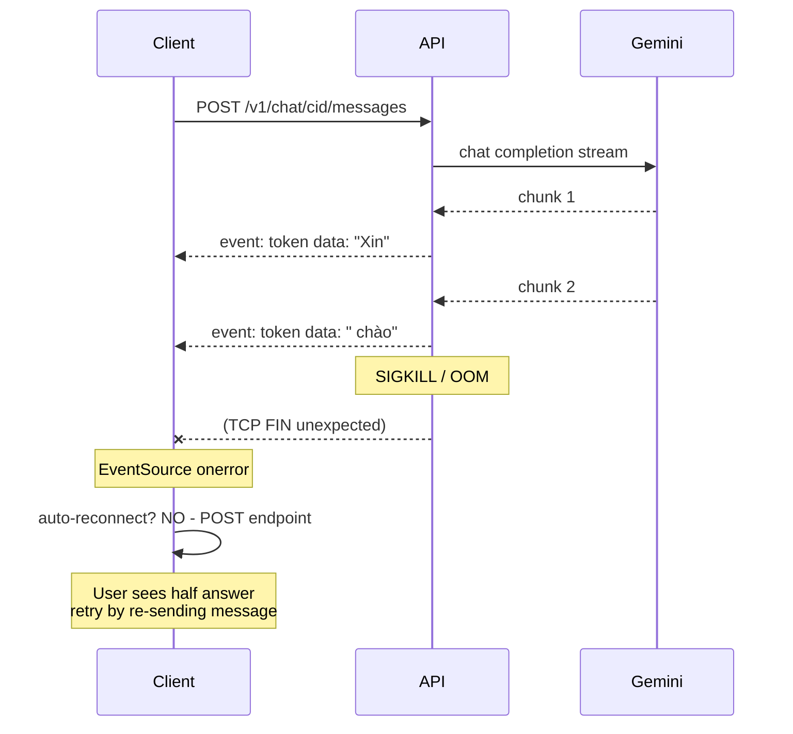

### State sau crash
- User message **đã persist** (insert trước stream).
- Assistant message **KHÔNG persist** (insert sau stream done).
- Buffer Redis: chỉ có user message, không có assistant.

→ User retry → bot trả lời message lần 2, có history cũ (user msg). UX kém
nhưng không broken.

### Improvement: incremental persist (TODO)
Mỗi 500ms hoặc 100 token, append chunk vào DB. Nếu crash:
- Lưu partial message trong DB với flag `meta.incomplete=true`.
- Khi user reconnect, show partial + cho phép "continue".

Phức tạp; chưa làm.

---

## 11. Nginx down

Nginx là single point of failure ở compose single-host.

### Mitigation
- `restart: unless-stopped` → auto-restart container.
- Healthcheck → docker thấy unhealthy → restart.

### HA setup (K8s)
- 2 Nginx pods sau LoadBalancer (ELB).
- Nếu 1 pod chết, LB drain.

---

## 12. Data drift between stores

Tình huống tệ nhất: 3 store khác nhau (Postgres, Qdrant, MinIO) không đồng bộ.

### Drift patterns

| Drift | Triệu chứng | Fix |
|-------|------------|-----|
| Doc Postgres `indexed`, không có vectors Qdrant | Search miss | Re-enqueue `process_document` |
| Vectors Qdrant tồn tại, doc Postgres không có | Search trả "ghost" | Cron sweep Qdrant orphan |
| Chunks Postgres không có Qdrant point | Citation OK, search miss | Re-embed |
| File MinIO không có doc Postgres | Storage rác | Cron sweep MinIO orphan |
| Doc Postgres không có file MinIO | Cannot re-parse | Mark `failed`, request user re-upload |

### Detection script (TODO)
```python
# scripts/audit_consistency.py
async def audit():
    # 1. Mỗi doc indexed -> count vectors Qdrant matching doc_id
    docs = await pg.execute(select(Document).where(status='indexed'))
    for d in docs:
        pg_chunks = await pg.execute(select(func.count()).filter(...))
        qd_count = await qc.count(filter_by_doc_id=d.id)
        if pg_chunks != qd_count:
            log.error("drift", doc_id=d.id, pg=pg_chunks, qd=qd_count)

    # 2. Qdrant orphan: doc_id không có trong Postgres
    qd_doc_ids = await qc.scroll_unique_doc_ids()
    pg_doc_ids = await pg.execute(select(Document.id))
    orphan = qd_doc_ids - set(pg_doc_ids)
    log.warning("qdrant_orphans", count=len(orphan))
```

Chạy hàng tuần như cron.

---

## 13. Total system recovery

Scenario: data center power loss, restart cả stack.

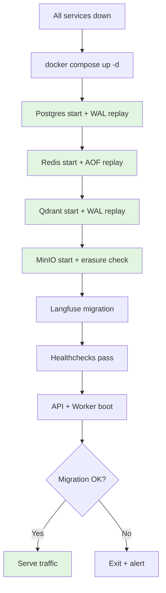

Mỗi component có recovery của riêng:
- Postgres WAL: rollback transaction chưa commit, replay committed.
- Redis AOF: replay commands.
- Qdrant WAL: replay upsert chưa flush.
- MinIO: scan disk integrity.

**RTO** (Recovery Time Objective): ~ 2-5 phút cho cold start.
**RPO** (Recovery Point Objective): ~ 1 giây mất data Redis cache; 0 cho
Postgres/MinIO (fsync default).

---

## 14. Runbook: troubleshooting cheat sheet

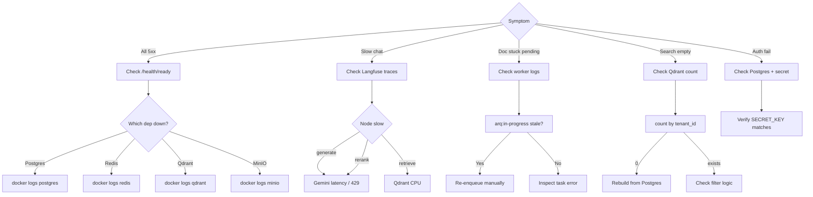

### Commands tham khảo
```bash
# Health
curl -s http://localhost/health/ready | jq

# Stuck docs
make psql -c "SELECT id, title, status, updated_at FROM documents WHERE status NOT IN ('indexed','failed') ORDER BY updated_at;"

# ARQ queue depth
docker compose exec redis redis-cli ZCARD arq:queue

# Qdrant collection info
curl -s http://localhost:6333/collections/documents | jq

# Redis memory pressure
docker compose exec redis redis-cli INFO memory | grep used_memory_human

# Worker logs
make logs SERVICE=worker
```

---

## 15. Chaos testing (TODO)

Để verify resilience:

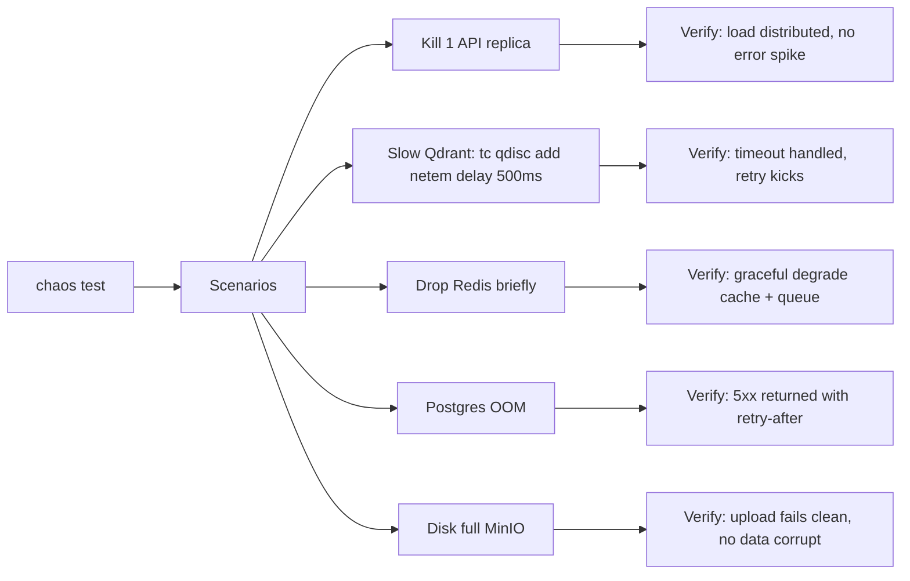

Tool: `pumba` (Docker chaos), `chaos-mesh` (K8s).

---

## 16. Lessons learned principles

1. **Failure không phải exception** — là norm. Code phải assume mọi I/O sẽ
   fail rồi handle.
2. **Idempotency là superpower** — retry an toàn = ngủ ngon.
3. **Fail loud, recover gracefully** — log mọi exception, nhưng user thấy
   message friendly.
4. **Defense in depth** — không trust 1 layer. Cache miss + DB filter + RLS.
5. **Source-of-truth single** — Postgres. Mọi store khác rebuild được.
6. **Test recovery thực sự** — không chỉ test happy path.
7. **Observability trước resilience** — không đo được thì không fix được.
