# 19 — Database Operations Deep Dive

Tài liệu này giải thích **chi tiết** cách hệ thống đọc/ghi dữ liệu với PostgreSQL, Redis, và Qdrant —
bao gồm connection management, transaction patterns, và data lifecycle.

---

## 1. Tổng quan — Vai trò mỗi Database

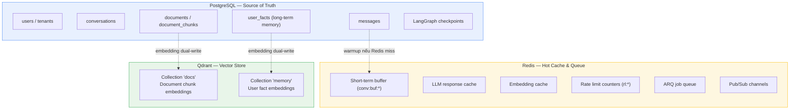

---

## 2. PostgreSQL — Connection & Session Management

### 2.1. Engine Singleton

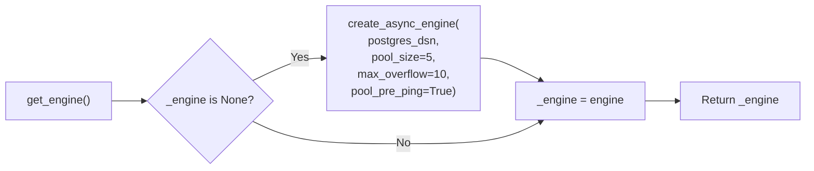

**File**: `src/core/db.py`

**Cấu hình quan trọng**:

| Parameter | Giá trị | Tại sao |
|-----------|---------|---------|
| `pool_size` | 5 | Số connection thường trực. Nhỏ vì có PgBouncer phía trước |
| `max_overflow` | 10 | Connection thêm khi pool đầy. Tổng max = 15/process |
| `pool_timeout` | 30s | Thời gian chờ lấy connection từ pool |
| `pool_pre_ping` | True | Kiểm tra connection sống trước khi dùng (detect stale conn) |
| `expire_on_commit` | False | Sau commit, object ORM vẫn dùng được (không cần reload) |
| `autoflush` | False | Tránh auto-flush gây side effect; flush tường minh |

### 2.2. Session Patterns — 2 kiểu

#### Pattern 1: FastAPI Dependency (`get_session`)

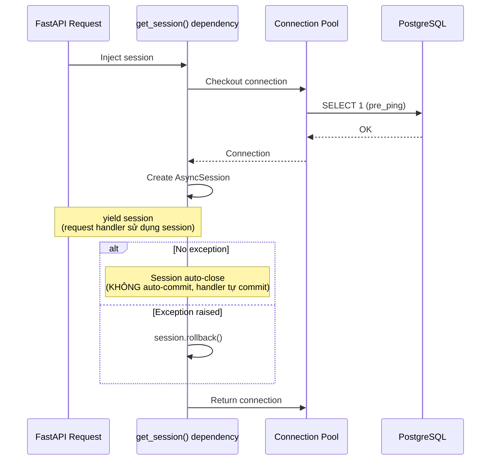

**Dùng khi**: Request handler cần kiểm soát commit timing (ví dụ: persist user message rồi mới chạy agent).

```python
# src/api/routes/chat.py
async def chat_stream(session: SessionDep):
    repo = ConversationRepo(session)
    user_msg = await repo.add_message(...)
    await session.commit()    # ← Handler tự commit
```

#### Pattern 2: Context Manager (`session_scope`)

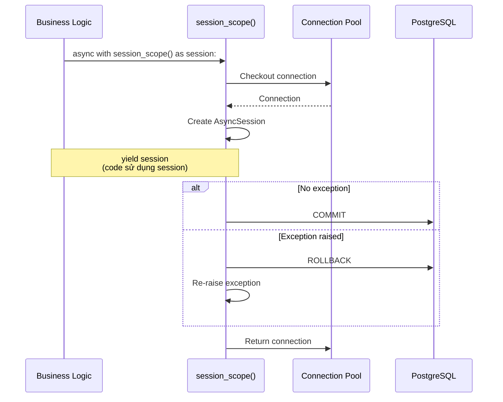

**Dùng khi**: Code ngoài request context (worker, background tasks, SSE generator).

```python
# src/api/routes/chat.py — trong SSE generator
async with session_scope() as s2:
    await ConversationRepo(s2).add_message(
        conversation_id=conv_id,
        role="assistant",
        content=full_answer,
    )
# Auto-commit ở đây
```

### 2.3. Tại sao 2 pattern?

| Scenario | Pattern | Lý do |
|----------|---------|-------|
| API route handler | `get_session` (dependency) | FastAPI inject, handler control commit timing |
| SSE generator (async iterator) | `session_scope()` | Generator chạy sau response trả, session gốc có thể expired |
| Worker task | `session_scope()` | Worker không có FastAPI dependency injection |
| Healthcheck | `session_scope()` | Standalone, cần auto-commit/rollback |

---

## 3. PostgreSQL — CRUD Operations chi tiết

### 3.1. Conversation Lifecycle

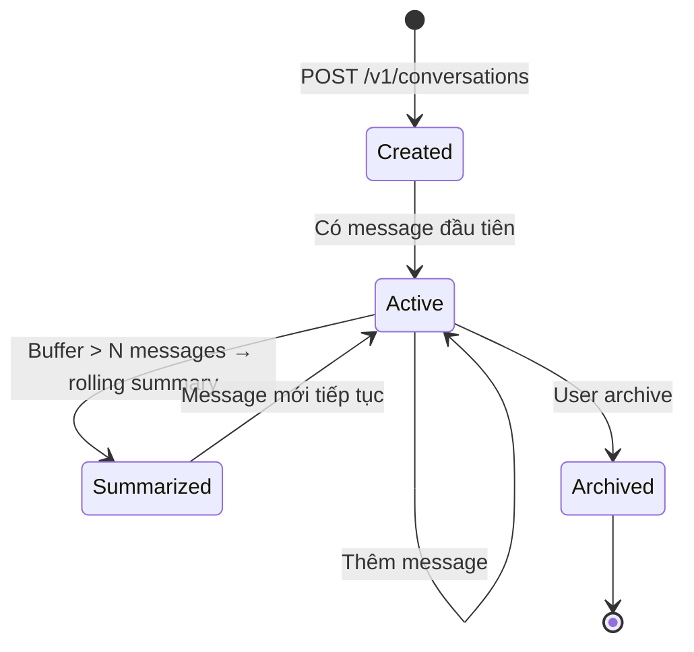

#### Tạo Conversation

```sql
INSERT INTO conversations (id, tenant_id, user_id, title, message_count, archived)
VALUES (gen_random_uuid(), :tenant_id, :user_id, 'New conversation', 0, false);
```

#### Thêm Message

```python
async def add_message(self, *, conversation_id, role, content, meta=None, 
                      tokens_in=None, tokens_out=None, latency_ms=None) -> Message:
    # 1) INSERT message
    m = Message(conversation_id=conversation_id, role=role, content=content,
                meta=meta or {}, tokens_in=tokens_in, tokens_out=tokens_out,
                latency_ms=latency_ms)
    self.s.add(m)
    
    # 2) UPDATE conversation counters (trong cùng transaction)
    conv = await self.s.get(Conversation, conversation_id)
    if conv:
        conv.message_count = (conv.message_count or 0) + 1
        conv.last_message_at = datetime.now(UTC)
    
    # 3) FLUSH (ghi xuống DB nhưng chưa commit)
    await self.s.flush()
    return m
```

**Diagram ghi Message**:

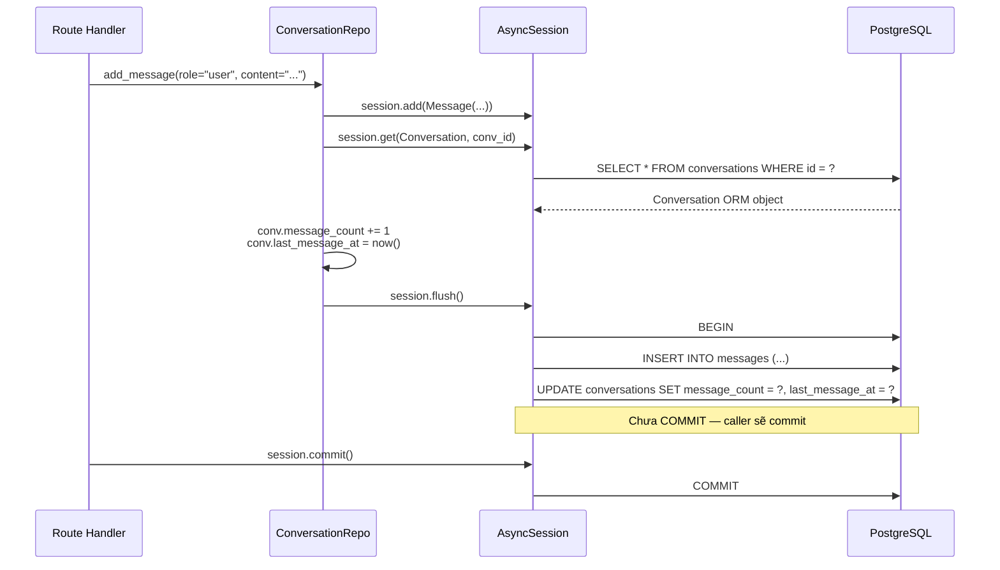

### 3.2. Message Schema — Lưu những gì

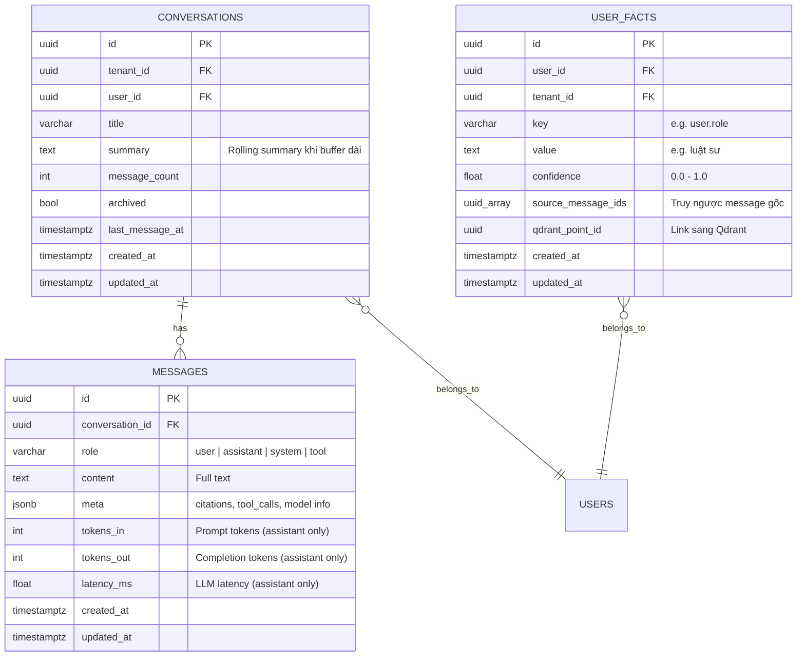

### 3.3. Indexes — Tại sao

```sql
-- Liệt kê conversation của user, sort by updated
CREATE INDEX ix_conv_user_updated ON conversations (user_id, updated_at);

-- Filter theo tenant (admin queries)
CREATE INDEX ix_conv_tenant ON conversations (tenant_id);

-- Lấy messages theo conversation + thời gian (cho pagination, recent_messages)
CREATE INDEX ix_msg_conv_created ON messages (conversation_id, created_at);

-- Lấy facts của user (memory retrieval fallback)
CREATE INDEX ix_fact_user ON user_facts (user_id);

-- Dedupe facts (cùng user + cùng key)
CREATE INDEX ix_fact_user_key ON user_facts (user_id, key);
```

---

## 4. Redis — Operations chi tiết

### 4.1. Short-Term Buffer Operations

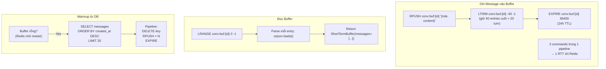

### 4.2. Cache Operations (LLM & Embedding)

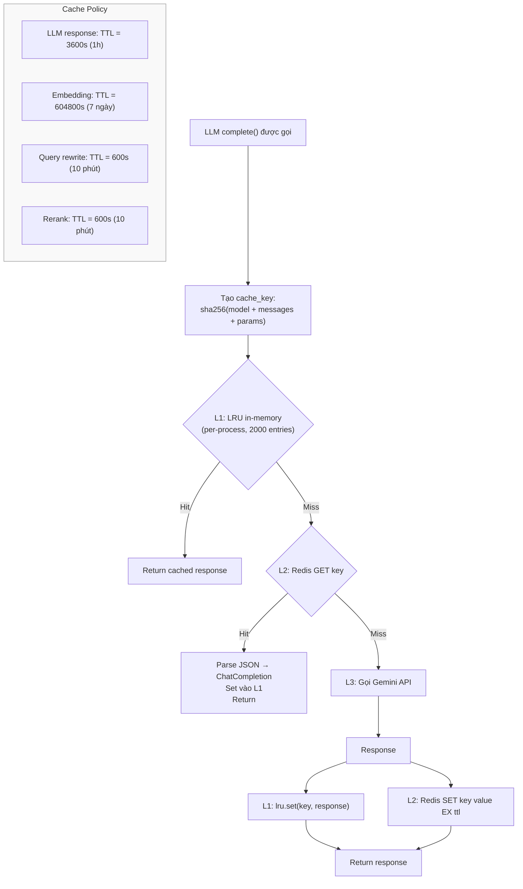

**Khi nào KHÔNG cache?**

| Condition | Cache? | Lý do |
|-----------|--------|-------|
| `temperature > 0` | ❌ | Non-deterministic, kết quả khác nhau mỗi lần |
| `stream = True` | ❌ | UX cần token ngay, không chờ cache |
| `tools != None` | ❌ | Tool calling responses phụ thuộc context |
| `use_cache = False` | ❌ | Caller yêu cầu bypass (eval, debug) |

### 4.3. Rate Limit — Sliding Window

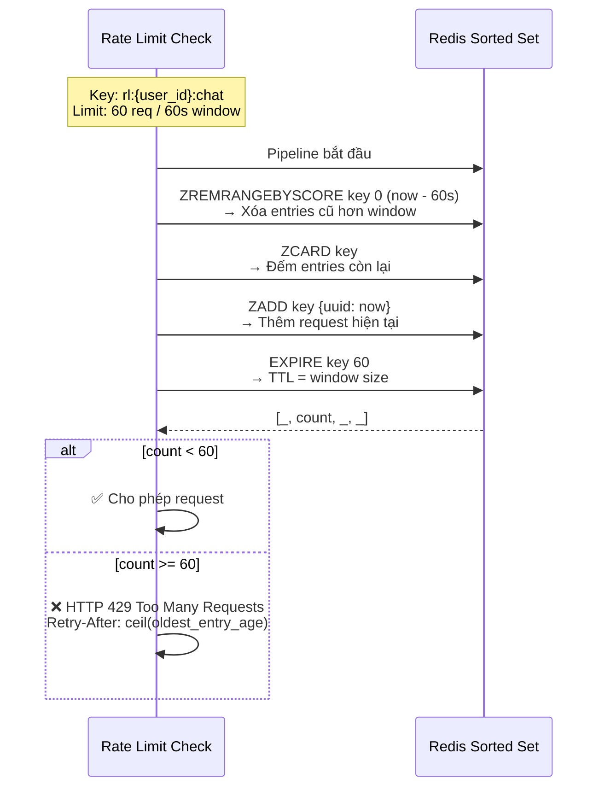

### 4.4. ARQ Job Queue

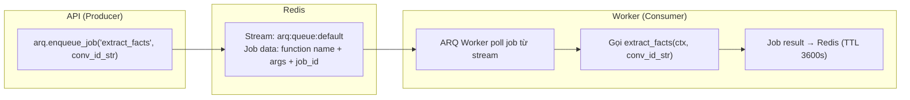

---

## 5. Qdrant — Vector Operations chi tiết

### 5.1. Collection Schema

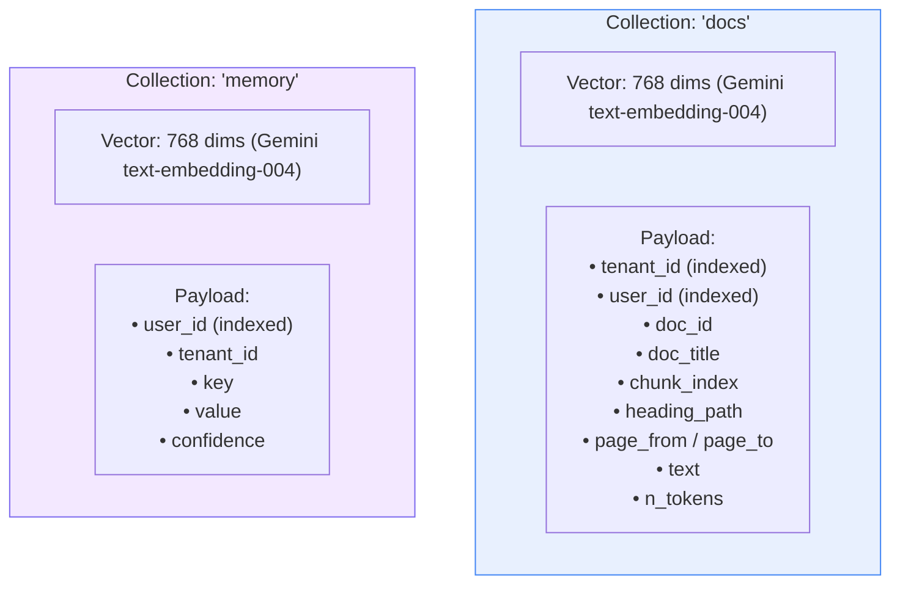

### 5.2. Search Operation — Cách filter multi-tenant

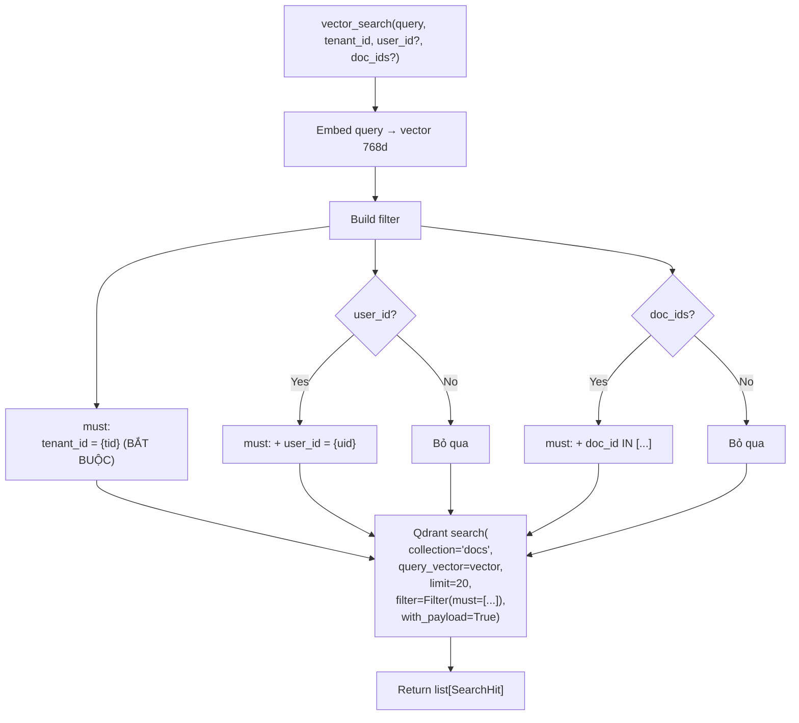

**Tại sao filter `tenant_id` BẮT BUỘC?**
- Multi-tenancy isolation: user thuộc tenant A **không bao giờ** thấy docs của tenant B.
- Qdrant index trên `tenant_id` payload → filter trước khi HNSW search → nhanh.

### 5.3. Dual Write Pattern (Postgres + Qdrant)

Khi lưu user facts (long-term memory), hệ thống ghi cả 2 nơi:

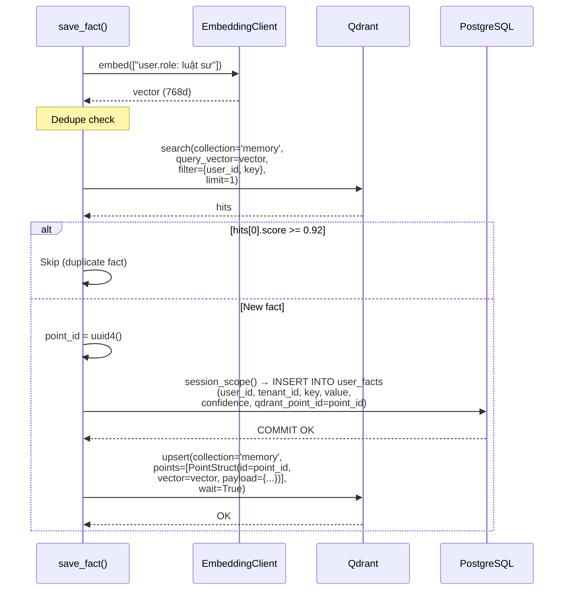

**Consistency trade-off**:
- Postgres commit trước Qdrant upsert → nếu Qdrant fail, fact ở Postgres nhưng không searchable.
- Chấp nhận được vì: (1) Qdrant ít khi fail, (2) fact vẫn ở Postgres, (3) retry worker có thể sync lại.

---

## 6. Data Lifecycle — Message từ lúc sinh đến lúc dùng

```mermaid
flowchart TB
    subgraph T0["T=0: User gửi message"]
        A1["Client → API"]
    end

    subgraph T1["T=0.02s: Persist"]
        B1["INSERT INTO messages<br/>(role='user', content='...')"]
        B2["UPDATE conversations<br/>(message_count++, last_message_at)"]
        B3["RPUSH conv:buf:{id}"]
    end

    subgraph T2["T=0.04s: Agent đọc"]
        C1["LRANGE conv:buf:{id}<br/>→ short_term_history"]
        C2["Qdrant search 'memory'<br/>→ long_term_facts"]
    end

    subgraph T3["T=0.8-2.5s: Generate"]
        D1["Messages list = system + history + user_msg<br/>→ Gemini API stream"]
    end

    subgraph T4["T=2.5s: Persist response"]
        E1["INSERT INTO messages<br/>(role='assistant', content='...',<br/>meta={citations}, tokens_in, tokens_out, latency_ms)"]
        E2["RPUSH conv:buf:{id}<br/>('assistant', full_answer)"]
    end

    subgraph T5["T=2.5s+: Background"]
        F1["ARQ job: extract_facts"]
        F2["Fetch 20 recent messages từ Postgres"]
        F3["LLM trích xuất facts"]
        F4["Dedupe + INSERT user_facts"]
        F5["Upsert Qdrant 'memory'"]
    end

    subgraph T_Next["Lần chat tiếp theo"]
        G1["load_memory_node đọc buffer Redis"]
        G2["retrieve_user_facts từ Qdrant 'memory'"]
        G3["Facts inject vào system prompt"]
    end

    T0 --> T1 --> T2 --> T3 --> T4 --> T5
    T5 -.->|async| T_Next

    style T5 fill:#fff3e0,stroke:#ff9800
```

---

## 7. Transaction Boundaries — Ai commit ở đâu

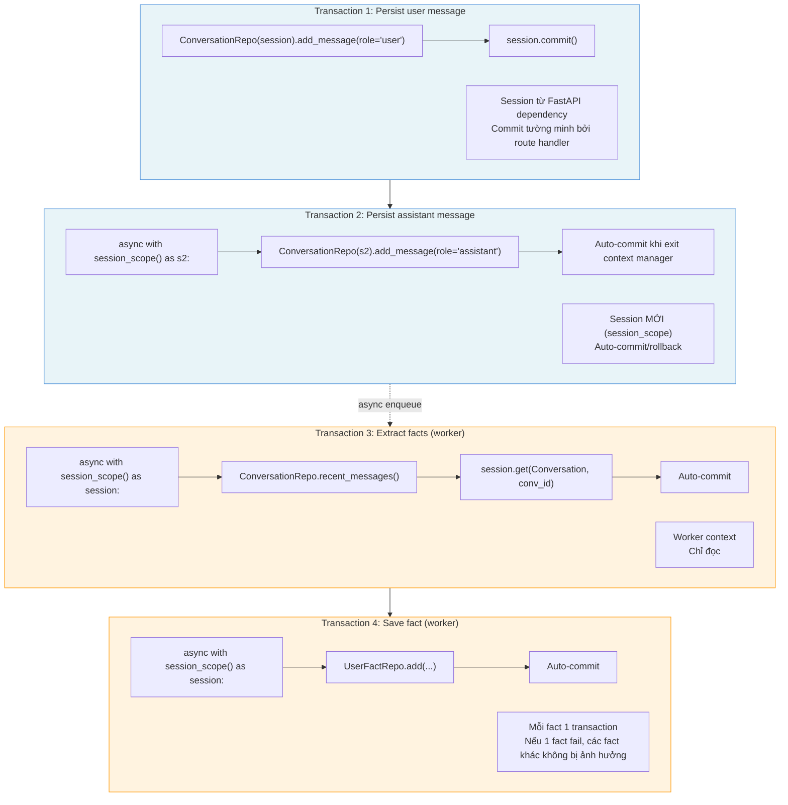

---

## 8. Tham chiếu Code

| Component | File | Class/Function |
|-----------|------|----------------|
| Engine + Session | `src/core/db.py` | `get_engine()`, `session_scope()`, `get_session()` |
| Conversation CRUD | `src/db/repositories/conversation.py` | `ConversationRepo` |
| Memory CRUD | `src/db/repositories/memory.py` | `UserFactRepo` |
| Conversation Model | `src/db/models/conversation.py` | `Conversation`, `Message` |
| Memory Model | `src/db/models/memory.py` | `UserFact` |
| Redis Buffer | `src/memory/short_term.py` | `append_message()`, `get_buffer()`, `warmup_from_db()` |
| Redis Cache | `src/core/redis.py` | `cache_get()`, `cache_set()`, `make_key()` |
| LLM Cache | `src/llm/client.py` | `LLMClient.complete()` (cache logic inline) |
| Qdrant Search | `src/retrieval/search.py` | `vector_search()` |
| Qdrant Memory | `src/memory/long_term.py` | `save_fact()`, `retrieve_user_facts()` |
| Rate Limit | `src/cache/rate_limit.py` | `allow_request()` |
