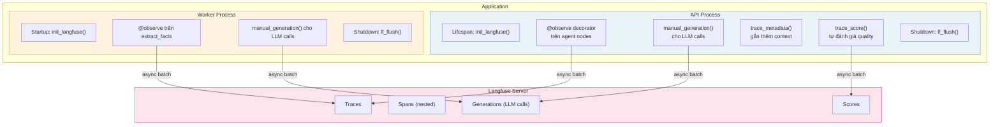
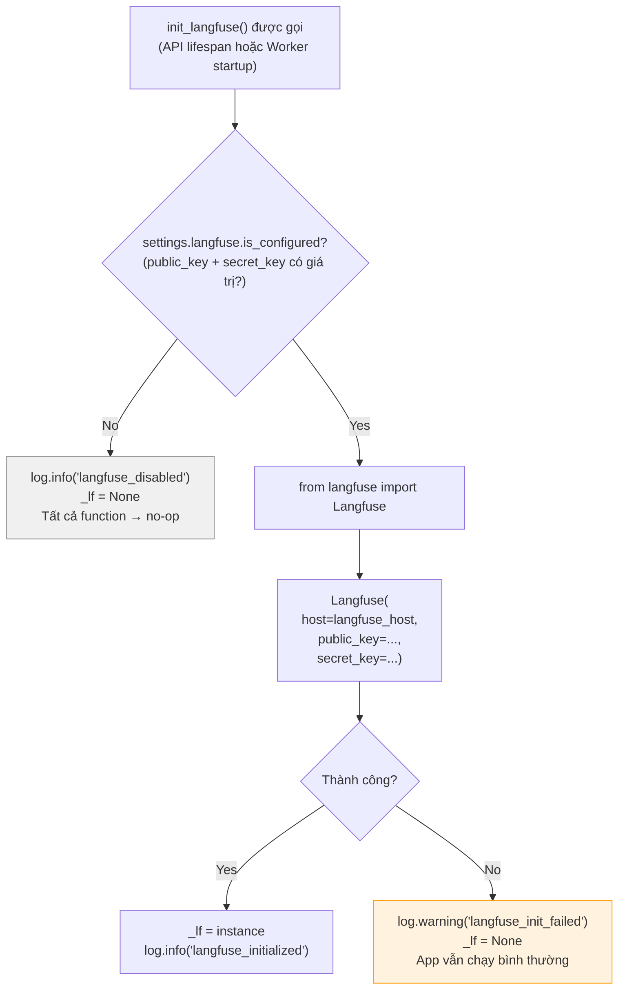
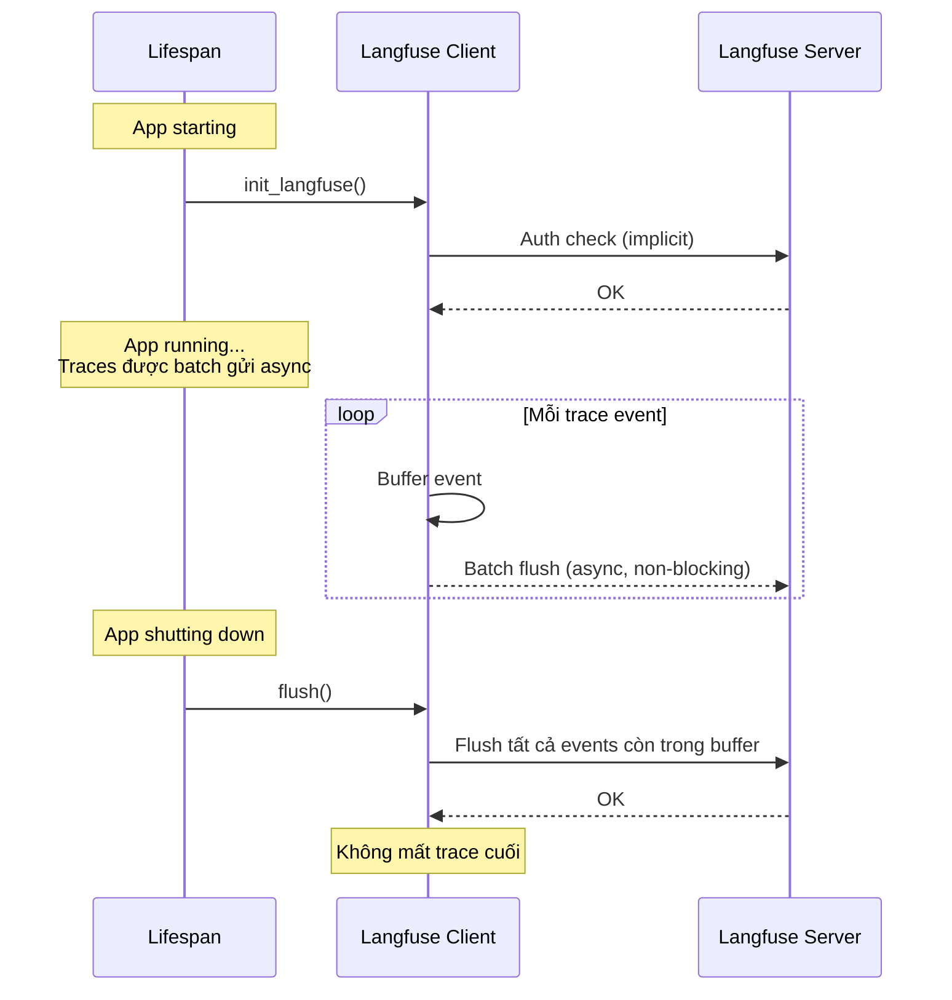
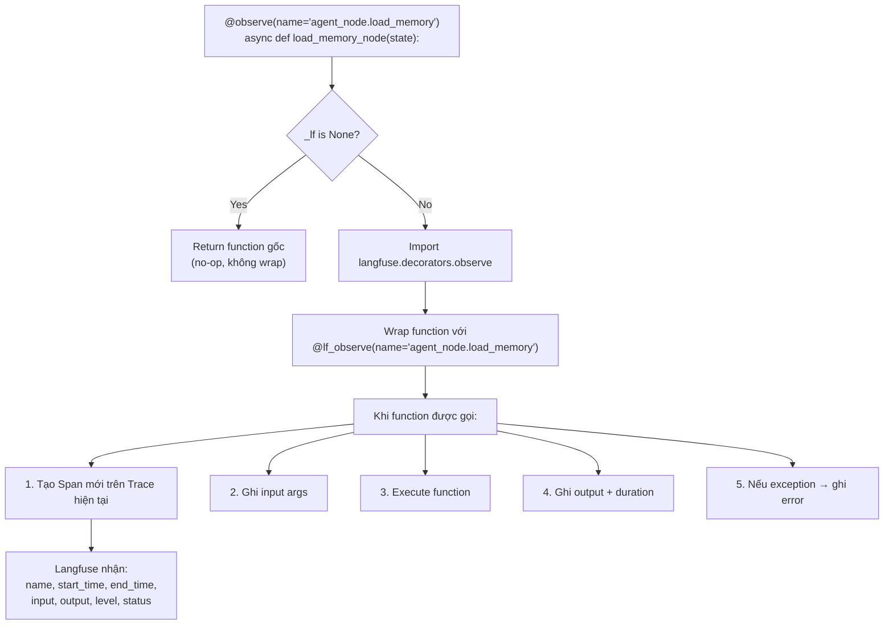
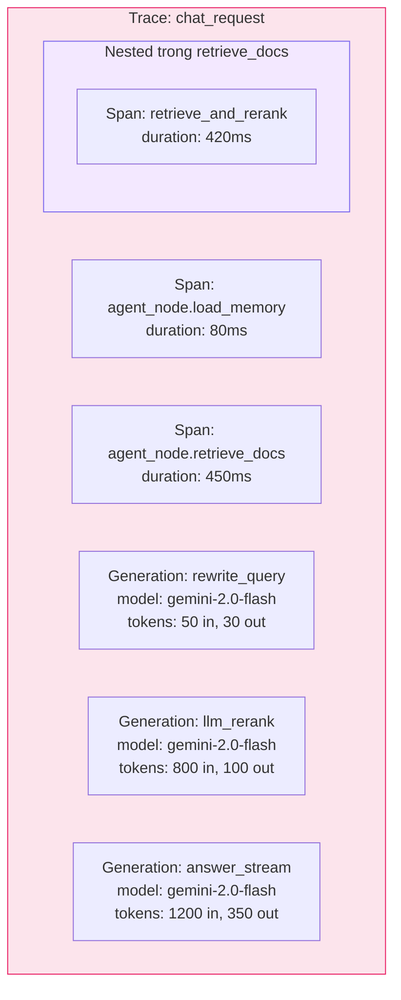
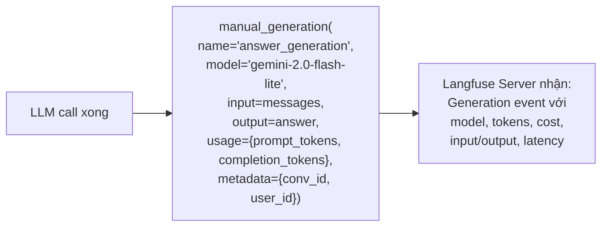
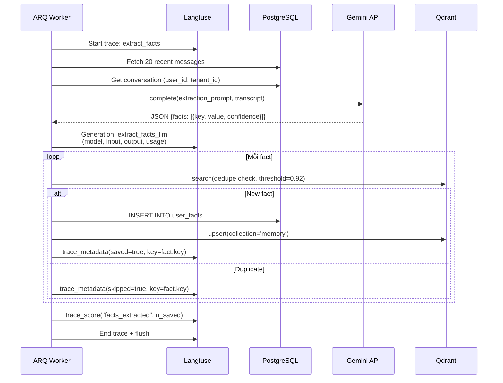
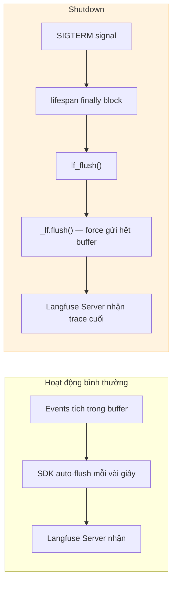
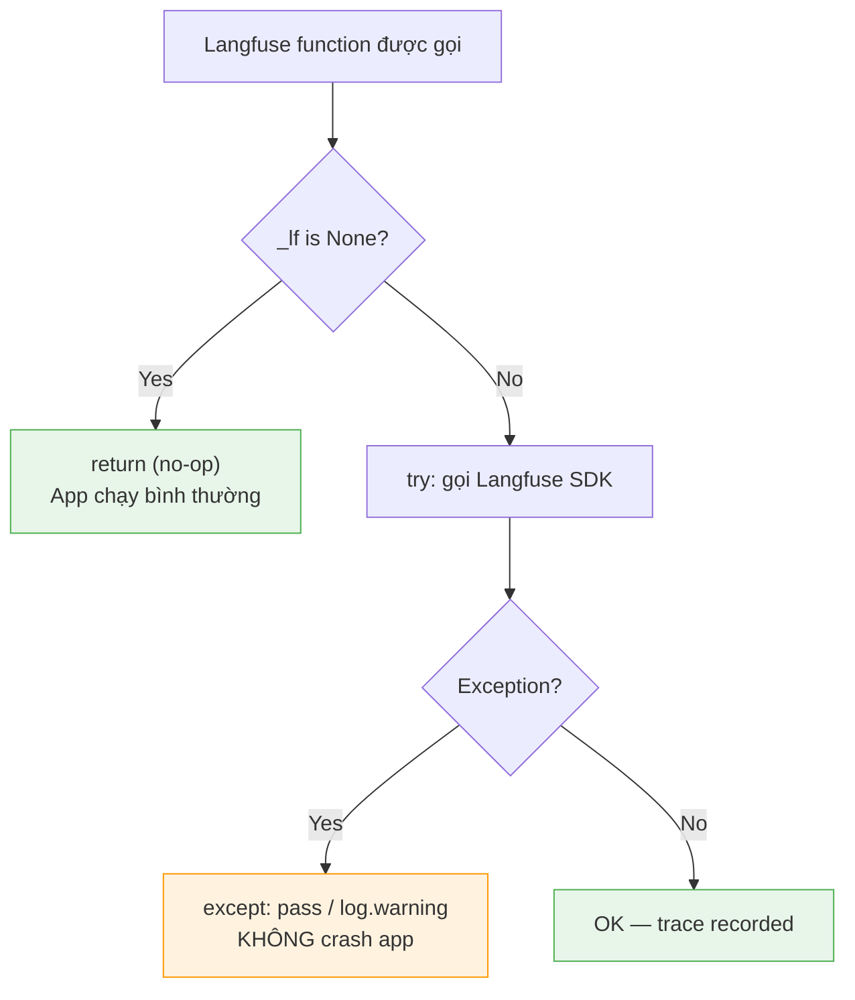

# 20 — Langfuse Observability: Trace, Spans & Scoring

Tài liệu này giải thích **chi tiết** cách hệ thống tích hợp Langfuse để trace toàn bộ pipeline RAG —
từ khởi tạo, qua decorator `@observe`, đến manual generation logging và scoring.

---

## 1. Tổng quan — Langfuse trong hệ thống



---

## 2. Khởi tạo — `init_langfuse()`

### 2.1. Flow khởi tạo



**File**: `src/observability/langfuse.py`

**Nguyên tắc thiết kế**: Langfuse là **optional**. Nếu không cấu hình hoặc lỗi, app KHÔNG crash.
Tất cả function (`observe()`, `trace_metadata()`, `trace_score()`, `manual_generation()`) đều check `_lf is None` → no-op.

### 2.2. Cấu hình (.env)

```bash
# Langfuse (optional — bỏ trống = disabled)
LANGFUSE_HOST=http://langfuse:3000        # Self-hosted Langfuse URL
LANGFUSE_PUBLIC_KEY=pk-lf-xxx             # Project public key
LANGFUSE_SECRET_KEY=sk-lf-xxx             # Project secret key
```

### 2.3. Lifecycle trong API



---

## 3. `@observe` Decorator — Auto Tracing

### 3.1. Cách hoạt động



### 3.2. Các function được observe

| Function | Name | Module | Ghi gì |
|----------|------|--------|--------|
| `load_memory_node()` | `agent_node.load_memory` | `src/agent/nodes/memory.py` | Short-term history + long-term facts loaded |
| `retrieve_docs_node()` | `agent_node.retrieve_docs` | `src/agent/nodes/retrieval.py` | Retrieved chunks + citations |
| `generate_node()` | `agent_node.generate` | `src/agent/nodes/generate.py` | Answer (non-streaming only) |
| `retrieve_and_rerank()` | `retrieve_and_rerank` | `src/retrieval/pipeline.py` | Full retrieval pipeline |

### 3.3. Trace Hierarchy (Nested Spans)



---

## 4. `manual_generation()` — Log LLM Calls

### 4.1. Khi nào dùng

`@observe` tự động trace function execution, nhưng **không** biết chi tiết LLM call (model, tokens, prompt).
`manual_generation()` ghi **thủ công** 1 LLM generation event với đầy đủ metadata.



### 4.2. Implementation

```python
def manual_generation(
    name: str,
    *,
    model: str,
    input: Any,
    output: Any,
    usage: dict[str, int] | None = None,
    metadata: dict[str, Any] | None = None,
) -> None:
    if _lf is None:
        return                      # No-op nếu Langfuse disabled
    try:
        _lf.generation(
            name=name,
            model=model,
            input=input,            # Prompt messages
            output=output,          # Response content
            usage=usage,            # {prompt_tokens, completion_tokens, total_tokens}
            metadata=metadata,      # Custom: conv_id, user_id, tenant_id
        )
    except Exception:
        pass                        # Silently fail — không crash app
```

### 4.3. Ví dụ data trong Langfuse UI

```json
{
  "name": "answer_generation",
  "model": "gemini-2.0-flash-lite",
  "input": [
    {"role": "system", "content": "Bạn là trợ lý AI chuyên trả lời..."},
    {"role": "user", "content": "Chào bạn"},
    {"role": "assistant", "content": "Xin chào!"},
    {"role": "user", "content": "Điều 12 Luật DN 2020 quy định gì?"}
  ],
  "output": "Theo Điều 12 Luật Doanh nghiệp 2020 [#1], quy định về...",
  "usage": {
    "prompt_tokens": 1200,
    "completion_tokens": 350,
    "total_tokens": 1550
  },
  "metadata": {
    "conversation_id": "550e8400-...",
    "user_id": "a1b2c3d4-..."
  },
  "latency_ms": 1800
}
```

---

## 5. `trace_metadata()` — Gắn Context vào Trace

### 5.1. Mục đích

Khi function đang chạy trong context của 1 Langfuse trace (tạo bởi `@observe`),
có thể gắn thêm metadata (key-value) vào observation hiện tại.

```python
def trace_metadata(**kwargs: Any) -> None:
    if _lf is None:
        return
    try:
        from langfuse.decorators import langfuse_context
        langfuse_context.update_current_observation(metadata=kwargs)
    except Exception:
        pass
```

### 5.2. Ví dụ sử dụng

```python
@observe(name="retrieve_and_rerank")
async def retrieve_and_rerank(query, *, tenant_id, user_id, ...):
    # ... retrieval logic ...
    
    trace_metadata(
        n_queries=len(queries),
        n_unique_hits=len(by_id),
        n_reranked=len(ranked),
        cache_hit_rewrite=True,
    )
```

Trong Langfuse UI, span `retrieve_and_rerank` sẽ có metadata tab:
```json
{
  "n_queries": 3,
  "n_unique_hits": 42,
  "n_reranked": 5,
  "cache_hit_rewrite": true
}
```

---

## 6. `trace_score()` — Tự đánh giá Quality

### 6.1. Mục đích

Ghi 1 score lên observation hiện tại — dùng cho tự đánh giá (self-eval) hoặc ghi nhận metrics.

```python
def trace_score(name: str, value: float, comment: str | None = None) -> None:
    if _lf is None:
        return
    try:
        from langfuse.decorators import langfuse_context
        langfuse_context.score_current_observation(
            name=name, value=value, comment=comment
        )
    except Exception:
        pass
```

### 6.2. Ví dụ use cases

```python
# Sau khi retrieve, đánh giá quality
trace_score("retrieval_relevance", 0.85, comment="Top-1 score > 0.8")

# Sau khi generate, đánh giá nếu answer có citation
has_citation = "[#" in answer
trace_score("has_citation", 1.0 if has_citation else 0.0)

# Đánh giá latency
trace_score("latency_acceptable", 1.0 if latency_ms < 3000 else 0.0,
            comment=f"latency={latency_ms}ms")
```

Trong Langfuse UI → Scores tab:

| Score Name | Value | Comment |
|-----------|-------|---------|
| retrieval_relevance | 0.85 | Top-1 score > 0.8 |
| has_citation | 1.0 | — |
| latency_acceptable | 1.0 | latency=2150ms |

---

## 7. End-to-End Trace — Toàn bộ 1 Chat Request

### 7.1. Complete Trace Diagram

```mermaid
gantt
    title Langfuse Trace: Chat Request
    dateFormat X
    axisFormat %Lms

    section Trace Level
    trace: chat_request (conv_id, user_id)  :0, 2500

    section Spans
    agent_node.load_memory         :0, 80
    agent_node.retrieve_docs       :80, 530
    retrieve_and_rerank (nested)   :85, 525

    section Generations
    rewrite_query (Gemini Flash)           :90, 180
    vector_search embedding (cached)       :180, 195
    llm_rerank (Gemini Flash)              :300, 525
    answer_stream (Gemini Flash)           :530, 2350

    section Scores
    retrieval_relevance: 0.85              :525, 530
    has_citation: 1.0                      :2350, 2360
```

### 7.2. Trace trong Langfuse UI — Cấu trúc cây

```
📊 Trace: chat_request
├── 🔍 Span: agent_node.load_memory (80ms)
│   ├── Input: {user_message, conversation_id, user_id}
│   ├── Output: {short_term_history: 6 msgs, long_term_facts: 2 facts}
│   └── Metadata: {buffer_source: "redis"}
│
├── 🔍 Span: agent_node.retrieve_docs (450ms)
│   ├── 🔍 Span: retrieve_and_rerank (420ms)
│   │   ├── 🤖 Generation: rewrite_query
│   │   │   ├── Model: gemini-2.0-flash-lite
│   │   │   ├── Input: system + user query
│   │   │   ├── Output: {"queries": ["q1", "q2", "q3"]}
│   │   │   ├── Tokens: 50 in, 30 out
│   │   │   └── Cached: true
│   │   │
│   │   ├── 🤖 Generation: llm_rerank
│   │   │   ├── Model: gemini-2.0-flash-lite
│   │   │   ├── Input: query + 40 candidates
│   │   │   ├── Output: {"ranked": [{id:3, score:0.95}, ...]}
│   │   │   └── Tokens: 800 in, 100 out
│   │   │
│   │   └── Metadata: {n_queries: 3, n_unique: 42, n_reranked: 5}
│   │
│   ├── Output: {retrieved: 5 chunks, citations: 5}
│   └── ⭐ Score: retrieval_relevance = 0.85
│
├── 🤖 Generation: answer_stream
│   ├── Model: gemini-2.0-flash-lite
│   ├── Input: [system, history×6, user_msg]
│   ├── Output: "Theo Điều 12 Luật Doanh nghiệp 2020 [#1]..."
│   ├── Tokens: 1200 in, 350 out
│   └── Latency: 1800ms
│
└── ⭐ Score: has_citation = 1.0
```

---

## 8. Worker Traces — extract_facts

### 8.1. Trace khi worker chạy extract_facts



### 8.2. Ví dụ trace output

```
📊 Trace: extract_facts (conv_id: 550e8400...)
├── 🤖 Generation: extraction
│   ├── Model: gemini-2.0-flash-lite
│   ├── Input: "[user] Tôi là luật sư, chuyên về M&A\n[assistant] Rất vui..."
│   ├── Output: {"facts": [
│   │     {"key":"user.role","value":"luật sư","confidence":0.9},
│   │     {"key":"user.specialization","value":"M&A","confidence":0.85}
│   │   ]}
│   └── Tokens: 400 in, 80 out
│
├── Metadata: {facts_found: 2, facts_saved: 1, facts_skipped: 1}
└── ⭐ Score: facts_extracted = 1
```

---

## 9. Flush & Shutdown — Không mất trace

### 9.1. Tại sao cần flush?

Langfuse SDK buffer events rồi batch-send async. Nếu app shutdown đột ngột, events trong buffer sẽ mất.



### 9.2. Implementation

```python
# src/api/main.py — API process
@asynccontextmanager
async def lifespan(app: FastAPI) -> AsyncIterator[None]:
    init_langfuse()               # ← Khởi tạo
    # ... bootstrap ...
    try:
        yield
    finally:
        lf_flush()                # ← Flush trước shutdown
        await close_arq_pool()
        await close_redis()
        # ...

# src/worker/main.py — Worker process
async def startup(ctx):
    init_langfuse()               # ← Khởi tạo

async def shutdown(ctx):
    lf_flush()                    # ← Flush trước shutdown
    await close_qdrant()
    await close_redis()
```

---

## 10. No-Op Pattern — Tại sao an toàn

Toàn bộ Langfuse integration follow pattern **graceful degradation**:



**Mọi** function trong `langfuse.py` đều:
1. Check `_lf is None` → return ngay
2. Wrap trong `try/except` → không raise
3. Log warning nếu lỗi (nhưng không crash)

Điều này đảm bảo:
- Dev local không cần setup Langfuse
- Production nếu Langfuse server down → app vẫn serve requests
- Không có single point of failure cho observability

---

## 11. Tham chiếu Code

| Component | File | Function |
|-----------|------|----------|
| Langfuse wrapper | `src/observability/langfuse.py` | `init_langfuse()`, `get_langfuse()`, `flush()` |
| Observe decorator | `src/observability/langfuse.py` | `observe(name)` |
| Trace metadata | `src/observability/langfuse.py` | `trace_metadata(**kwargs)` |
| Trace score | `src/observability/langfuse.py` | `trace_score(name, value, comment)` |
| Manual generation | `src/observability/langfuse.py` | `manual_generation(name, model, input, output, usage, metadata)` |
| API lifespan | `src/api/main.py` | `lifespan()` — init + flush |
| Worker lifecycle | `src/worker/main.py` | `startup()`, `shutdown()` |
| Memory node (observed) | `src/agent/nodes/memory.py` | `@observe("agent_node.load_memory")` |
| Retrieval node (observed) | `src/agent/nodes/retrieval.py` | `@observe("agent_node.retrieve_docs")` |
| Generate node (observed) | `src/agent/nodes/generate.py` | `@observe("agent_node.generate")` |
| Pipeline (observed) | `src/retrieval/pipeline.py` | `@observe("retrieve_and_rerank")` |
