# 21 — Architecture Visual (Diagram trực quan)

> Đây là bản **diagram-first** của [01-architecture-overview.md](./01-architecture-overview.md).
> Cùng nội dung, nhưng mọi thứ được thể hiện bằng Mermaid thay vì text thuần.

---

## 1. Mục tiêu & NFR

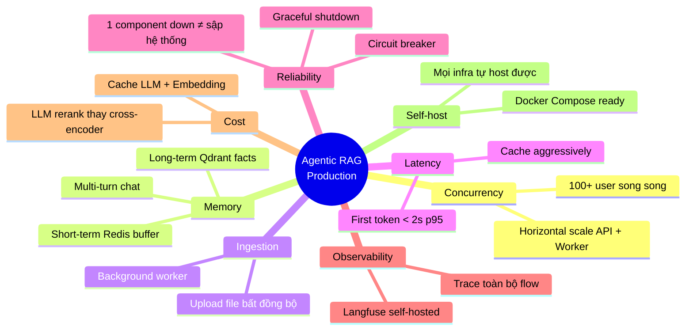

---

## 2. High-Level Architecture

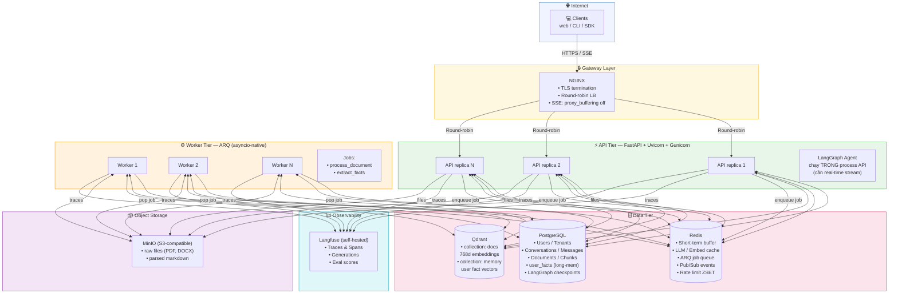

---

## 3. Phân tách trách nhiệm (Process Types)

```mermaid
flowchart LR
    subgraph API["⚡ API Process\n(stateless, nhiều replica)"]
        direction TB
        a1["✅ Nhận HTTP / SSE"]
        a2["✅ JWT Auth + Validate"]
        a3["✅ Rate limit"]
        a4["✅ LangGraph Agent stream"]
        a5["✅ Enqueue background jobs"]
        a6["❌ KHÔNG parse PDF"]
        a7["❌ KHÔNG embed batch lớn"]
    end

    subgraph Worker["⚙️ Worker Process\n(background, nhiều replica)"]
        direction TB
        w1["✅ Parse PDF → Markdown"]
        w2["✅ Chunk document"]
        w3["✅ Batch embed → Qdrant"]
        w4["✅ Extract long-term facts"]
        w5["✅ Publish progress events"]
        w6["❌ KHÔNG serve HTTP"]
    end

    subgraph Why["💡 Tại sao tách?"]
        direction TB
        r1["Parse PDF: ~30s\n→ block event loop nếu trong API"]
        r2["Worker fail ≠ API fail"]
        r3["Scale worker độc lập\nvới API"]
    end

    API -- "enqueue\n(Redis Stream)" --> Worker
    Worker -- "UPDATE status\n(Postgres)" --> API
    Worker -. "Pub/Sub event\n(Redis)" .-> API

    style API fill:#e8f5e9,stroke:#43a047
    style Worker fill:#fff3e0,stroke:#fb8c00
    style Why fill:#f5f5f5,stroke:#9e9e9e
```

---

## 4. Vai trò của Redis — 6 Use Cases

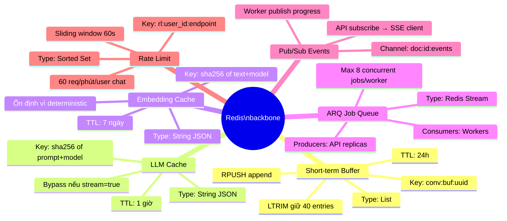

---

## 5. Flow Upload File (Ingestion Pipeline)

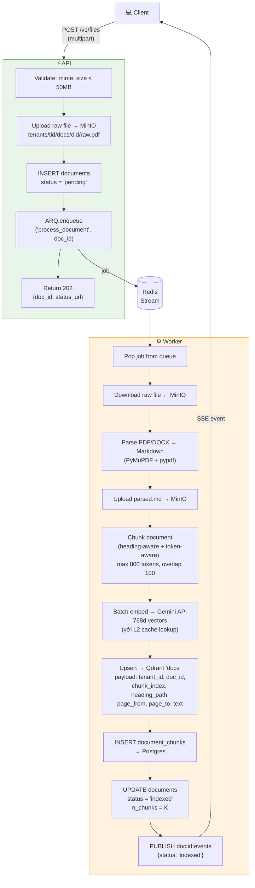

**Document status state machine:**

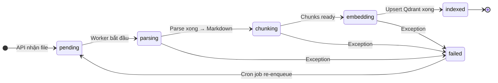

---

## 6. Flow Chat Multi-Turn (Streaming)

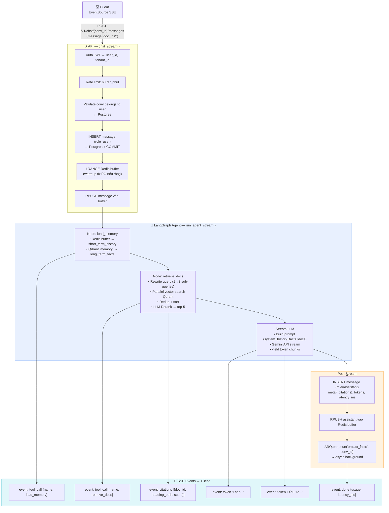

---

## 7. Agent Graph — LangGraph Nodes

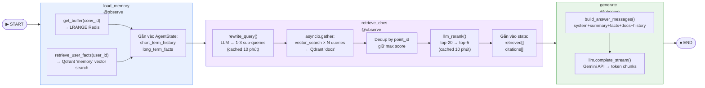

---

## 8. Cache Hierarchy — 3 Tầng

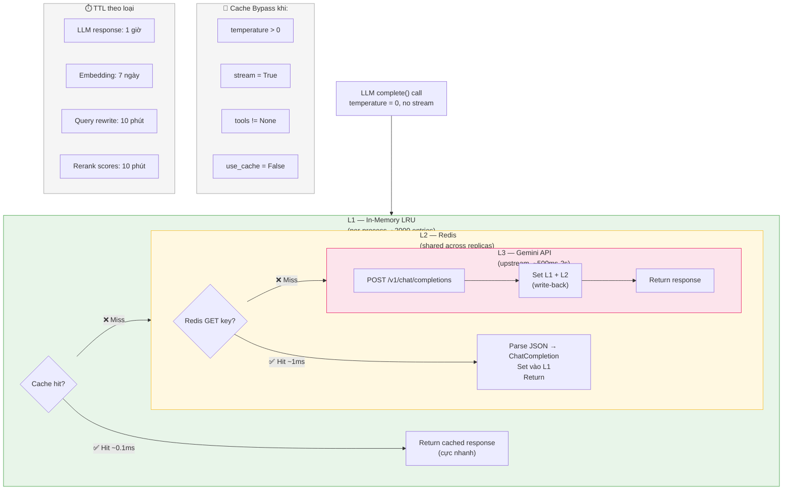

---

## 9. Long-Term Memory — Extract Facts Pipeline

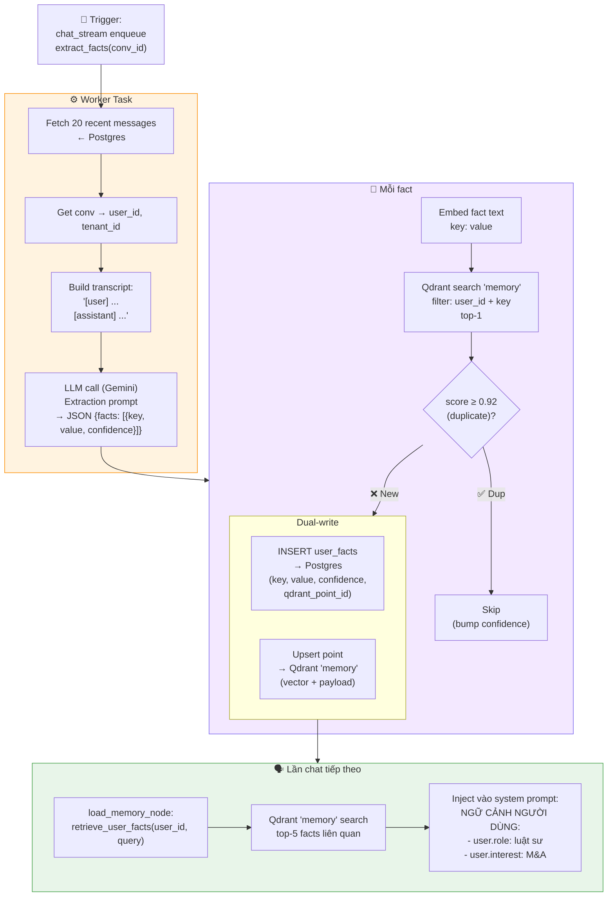

---

## 10. Security & Multi-tenancy Model

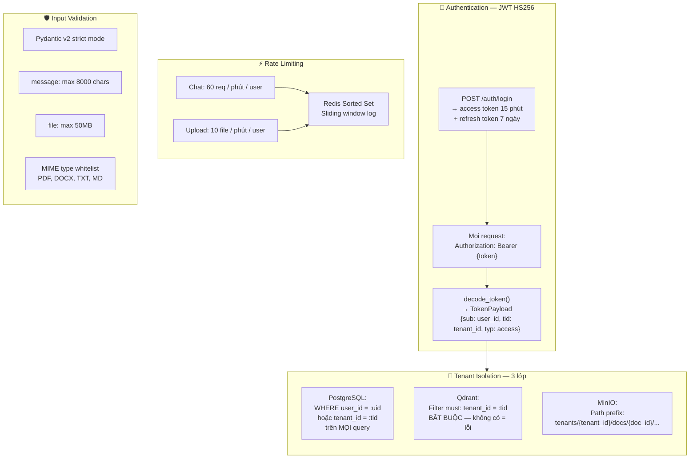

---

## 11. Scaling Model — Horizontal Scale

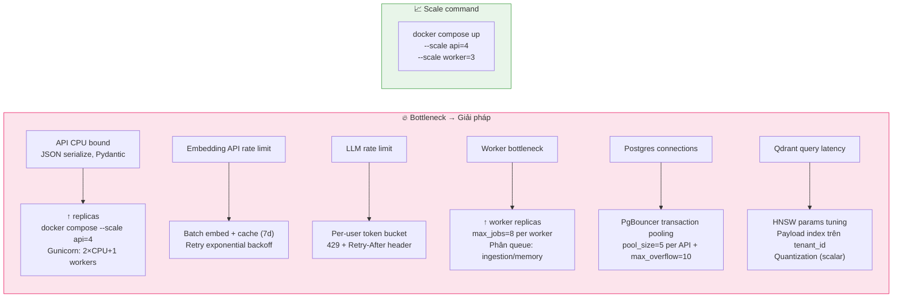

**Tại sao stateless = scale dễ:**

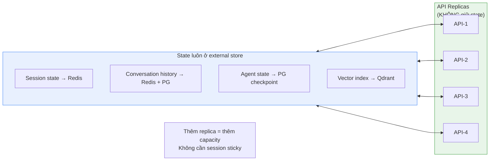

---

## 12. Reliability Patterns

```mermaid
flowchart TB
    subgraph Idempotent["♻️ Idempotent Jobs"]
        I1["Mỗi job có job_id UUID"]
        I2["Worker check: doc.status == 'indexed'?"]
        I3["Nếu Yes → skip, return sớm"]
        I1 --> I2 --> I3
    end

    subgraph CircuitBreaker["⚡ Circuit Breaker (Gemini API)"]
        CB1["Bình thường: pass-through"]
        CB2["Lỗi > 5 lần / 30s\n→ Mở circuit 60s"]
        CB3["Trả lỗi nhanh\nkhông retry vô tận"]
        CB4["Sau 60s: half-open\nThử 1 request"]
        CB5{"Thành công?"}
        CB5 -->|Yes| CB1
        CB5 -->|No| CB2
        CB1 --> CB2
        CB2 --> CB3 --> CB4 --> CB5
    end

    subgraph Retry["🔄 Retry Policy (tenacity)"]
        R1["retry_if_exception_type:\nTimeoutError, ConnectionError"]
        R2["stop_after_attempt: 3"]
        R3["wait_exponential_jitter:\ninitial=1s, max=10s"]
        R1 & R2 & R3
    end

    subgraph Graceful["🛑 Graceful Shutdown"]
        G1["SIGTERM signal"]
        G2["Finish in-flight requests"]
        G3["lf_flush() Langfuse"]
        G4["Close Redis, Qdrant, DB pool"]
        G1 --> G2 --> G3 --> G4
    end

    subgraph Health["💊 Healthcheck"]
        H1["/health/live\nProcess còn sống?"]
        H2["/health/ready\nDeps OK?\n• PG SELECT 1\n• Redis PING\n• Qdrant GET /"]
        H1 & H2
    end
```

---

## 13. Tại sao Agentic, không phải Plain RAG?

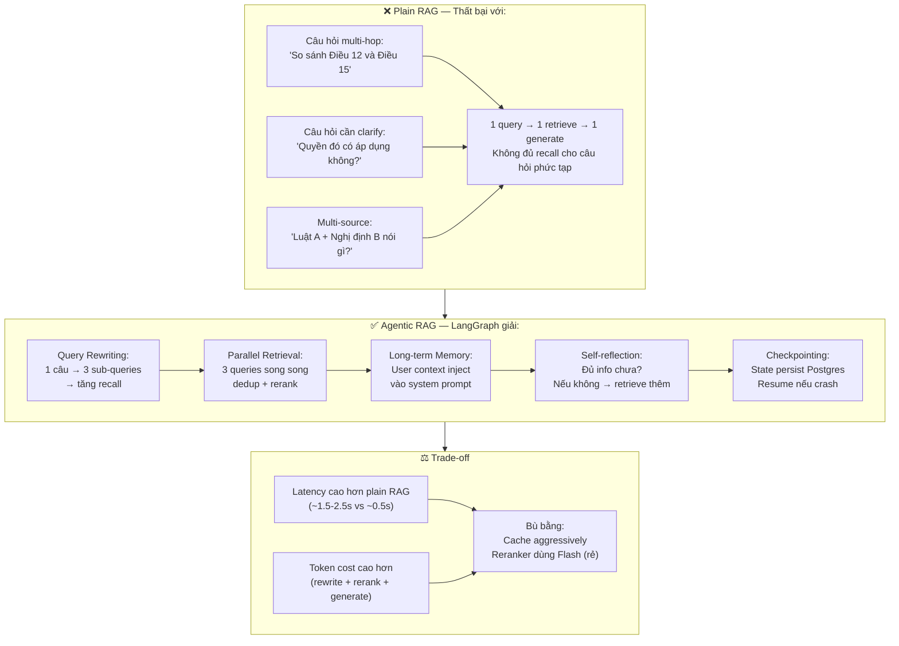

---

## 14. Component Decision Map

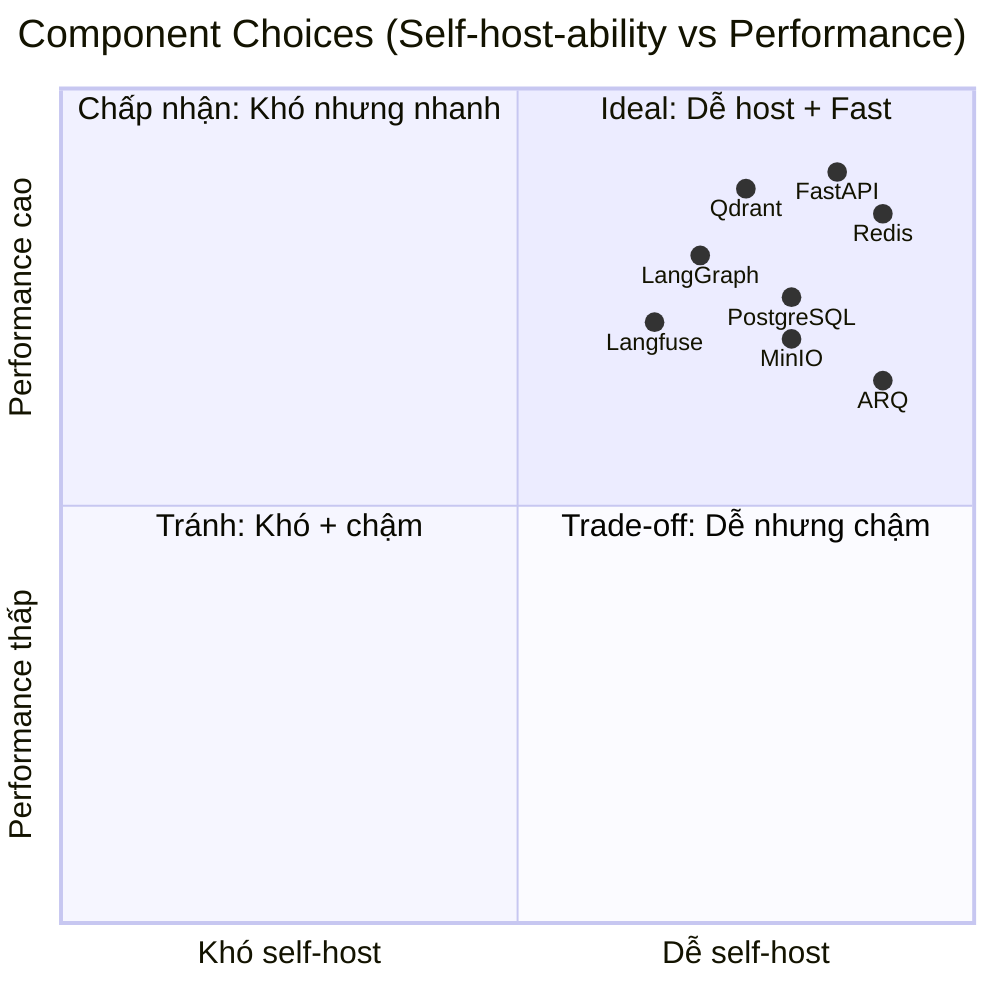

---

## 15. Tham chiếu tài liệu

| Doc | Nội dung |
|-----|---------|
| [01-architecture-overview.md](./01-architecture-overview.md) | Bản text gốc + giải thích chi tiết |
| [02-data-flow.md](./02-data-flow.md) | Sequence diagrams từng flow |
| [13-database-design.md](./13-database-design.md) | Schema DB chi tiết |
| [18-chat-request-workflow.md](./18-chat-request-workflow.md) | Chat workflow step-by-step |
| [19-database-operations-deep-dive.md](./19-database-operations-deep-dive.md) | Session, transaction, Redis ops |
| [20-langfuse-observability.md](./20-langfuse-observability.md) | Langfuse trace, spans, scoring |
