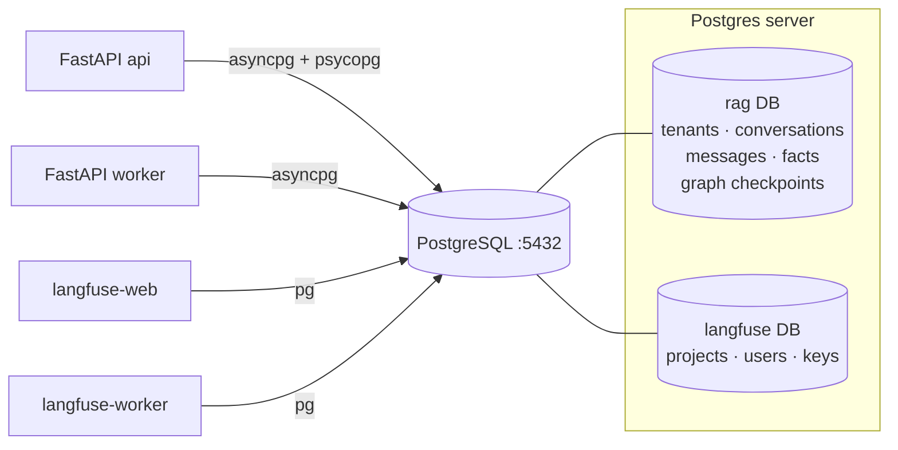

# PostgreSQL — Relational System of Record

> The durable, transactional source of truth. Stores everything that must
> survive a restart and must be consistent: tenants, conversations, messages,
> extracted long-term facts, LangGraph checkpoints — and also backs Langfuse.

Image: `postgres:16-alpine` · Service: `postgres` · Port `5432`.

---

## 1. What is its task?

PostgreSQL is the **relational system of record**. In this stack it serves three
distinct consumers, all on the same server (different logical databases):

1. **Application data** (`rag` DB) — tenants, users, conversations, messages,
   file/document metadata (SHA-256 dedup), and **long-term memory facts**.
2. **LangGraph checkpointer** (`rag` DB) — serialized agent graph state, so a
   multi-turn conversation is **resumable** after a crash or across replicas.
3. **Langfuse metadata** (`langfuse` DB) — projects, users, API keys, and trace
   metadata for the observability stack (high-volume trace *events* go to
   ClickHouse, not here).

It is the anchor of correctness: anything requiring ACID transactions, foreign
keys, or strong multi-tenant isolation lives here, not in Qdrant/Redis.

---

## 2. How does it work?

### Two driver paths (important nuance)
The app uses **two different DSNs** against the same database:

| DSN | Driver | Used by |
|-----|--------|---------|
| `postgresql+asyncpg://…` (`postgres_dsn`) | async `asyncpg` | All app request paths (SQLAlchemy async) |
| `sync_dsn` (computed in `DBSettings`) | sync `psycopg` | Alembic migrations **and** the LangGraph Postgres checkpointer |

`sync_dsn` is derived from the async DSN automatically — app code never uses it
directly except via the checkpointer.

### Schema & migrations
- Schema is managed by **Alembic** (`alembic.ini`, `src/db/migrations/`).
- Migrations execute on **`api` container start** (`docker/entrypoint.sh`). An
  **Alembic advisory lock** ensures only one of the `API_REPLICAS` performs the
  migration; the others block until it finishes — safe concurrent boot.
- Repositories (`src/db/repositories/`) are the only way app code touches tables,
  and **every query filters by `tenant_id`** (multi-tenant invariant).

### Durability & init
- Data persists in the `postgres-data` named volume.
- First-boot SQL in `./docker/postgres/init` runs via
  `/docker-entrypoint-initdb.d` (e.g. creating the `langfuse` database).
- Healthcheck: `pg_isready -U rag -d rag` every 5s — gates dependent services.

---

## 3. How does it communicate with the other services?

PostgreSQL is a **passive TCP server** — it never initiates connections; clients
connect to `postgres:5432` over the `backend` Docker network.

| Client | DB | Driver | Why |
|--------|----|--------|-----|
| **FastAPI `api`** | `rag` | asyncpg (app) + psycopg (checkpointer) | CRUD + agent state |
| **FastAPI `worker`** | `rag` | asyncpg | Persist documents & extracted facts |
| **langfuse-web** | `langfuse` | node `pg` | App metadata, auth, projects |
| **langfuse-worker** | `langfuse` | node `pg` | Background processing metadata |

Note: long-term **facts live in BOTH** Postgres (canonical row) and Qdrant
(embedding for semantic recall) — Postgres is the source of truth, Qdrant the
search index.

### Diagram

---

## 4. Operational notes & failure modes

- **Single point of truth = single point of failure.** If Postgres is down, the
  API healthcheck fails and Nginx pulls the replica from rotation. Production
  should use managed HA / replication.
- **Checkpointer growth:** graph checkpoints accumulate per conversation — needs
  a retention/cleanup policy (see `docs/08-data-lifecycle.md`).
- **Connection pool sizing:** with `API_REPLICAS × WEB_CONCURRENCY` event loops
  plus workers, watch `max_connections`; use pooling (PgBouncer) at scale.
- **Backups:** `postgres-data` volume must be backed up; `make down-clean`
  deletes it (data loss).
