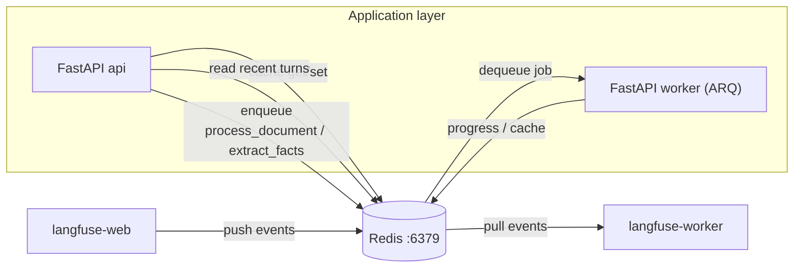
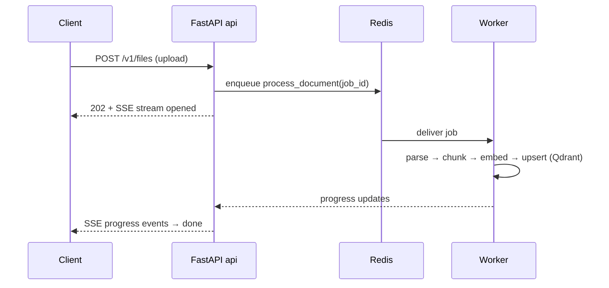

# Redis — Cache, Short-Term Memory & Job Queue

> The fast, ephemeral coordination layer. One Redis instance plays **three roles**
> at once: low-latency cache, conversational short-term memory, and the ARQ job
> queue that drives async ingestion. Langfuse reuses it too.

Image: `redis:7-alpine` · Service: `redis` · Port `6379` · DB `0` (app).

---

## 1. What is its task?

Redis is the system's **in-memory data + messaging hub**. Its jobs:

1. **Cache** (`src/cache/`) — query-rewrite results, embeddings (Redis tier on
   top of an in-memory LRU), and other hot lookups. Cuts repeat LLM/embedding
   cost and latency.
2. **Short-term memory** (`src/memory/`) — a **ring buffer** of the most recent
   conversation turns per session, read by the `load_memory` graph node.
3. **Job queue (ARQ)** — `process_document` and `extract_facts` jobs. The `api`
   enqueues; the `worker` dequeues. **No separate broker** (RabbitMQ/Celery) —
   ARQ uses Redis directly.
4. **Langfuse queue/cache** — Langfuse v3 uses Redis as its event queue between
   `langfuse-web` and `langfuse-worker`.

---

## 2. How does it work?

### Persistence & eviction (from `docker-compose.yml`)
```
redis-server
  --appendonly yes            # AOF: durable across restarts
  --maxmemory 512mb
  --maxmemory-policy allkeys-lru   # evict least-recently-used when full
  --save 60 1000              # RDB snapshot every 60s if ≥1000 writes
```
`allkeys-lru` means Redis behaves as a **cache that can drop any key** under
memory pressure — important: nothing here is treated as a guaranteed-durable
store. Truly durable data lives in Postgres/Qdrant/MinIO.

### Data-structure usage
- **Cache** → plain keys with TTL (`SET key val EX ttl`).
- **Short-term memory** → list / sorted structure trimmed to a fixed window
  (ring buffer) per conversation key.
- **ARQ queue** → ARQ maintains job lists + a sorted set for scheduled/deferred
  jobs and result keys; workers `BRPOP`-style poll for ready jobs.

### Clients
- App: `redis.asyncio` (async), connection pool created at startup.
- Langfuse: connects via `REDIS_HOST=redis`, `REDIS_PORT=6379`.

Healthcheck: `redis-cli ping` every 5s — gates `api`, `worker`, `langfuse-*`.

---

## 3. How does it communicate with the other services?

Redis is a **passive server** on `backend`; clients connect to `redis:6379`.

| Client | Role | What it does |
|--------|------|--------------|
| **FastAPI `api`** | producer + reader | Cache get/set, read short-term memory, **enqueue** ARQ jobs |
| **FastAPI `worker`** | consumer | **Dequeue** ARQ jobs, write progress, update cache |
| **langfuse-web** | producer | Push trace events onto Langfuse queue |
| **langfuse-worker** | consumer | Pull trace events for processing |

The api↔worker decoupling through Redis is what makes ingestion **asynchronous**:
upload returns immediately while the worker processes the file in the background
and streams progress over SSE.

### Diagram



### Ingestion handoff (sequence)


---

## 4. Operational notes & failure modes

- **Eviction risk:** with `allkeys-lru`, under memory pressure Redis can evict
  cache entries **and** short-term memory keys. Short-term memory loss degrades
  context but is not catastrophic; never store the only copy of durable data here.
- **Queue durability:** AOF (`appendonly yes`) means enqueued jobs survive a
  restart, but eviction policy + memory limits mean a flooded Redis can still
  drop keys — size `maxmemory` for peak queue depth.
- **Single instance:** no clustering here; it's a shared dependency for app +
  Langfuse. If Redis dies, chat loses caching/memory and ingestion stalls.
- **DB index 0** is used by the app (`/0` in `REDIS_URL`); keep Langfuse/app key
  spaces from colliding (Langfuse uses its own prefixes).
