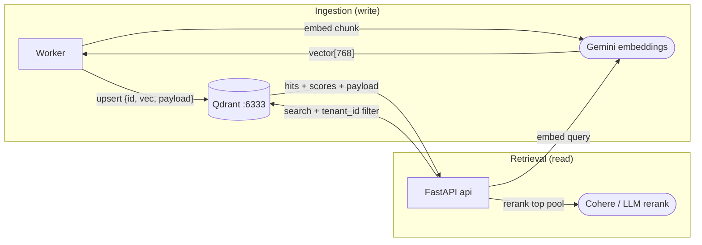

# Qdrant — Vector Search Engine

> The semantic-search core of RAG. Stores the dense embeddings of legal-document
> chunks (and long-term memory facts) and answers "which chunks are most similar
> to this query?" — with mandatory multi-tenant filtering.

Image: `qdrant/qdrant:v1.12.4` · Service: `qdrant` · REST `6333`, gRPC `6334`.

---

## 1. What is its task?

Qdrant is the **vector database**. Its responsibilities:

- Store **768-dim dense embeddings** (Gemini `gemini-embedding-001` truncated to
  768 to match the collection) for every document chunk produced by ingestion.
- Store embeddings of **long-term memory facts** for semantic recall.
- Serve **ANN (approximate nearest-neighbor) similarity search** with payload
  **filtering** — crucially a required `tenant_id` filter (plus optional
  `user_id` / `doc_ids`) so tenants never see each other's data.
- Return candidate chunks (with scores + payload) that the retrieval pipeline
  then **reranks** (Cohere/LLM) down to top-K.

Today only **dense** vectors are used; `search.py` and the collection are
structured so **sparse / hybrid** search can be added later.

---

## 2. How does it work?

### Indexing model
- A **collection** holds points; each **point** = `{id, vector[768], payload}`.
- Payload carries `tenant_id`, `user_id`, `doc_id`, page range, chunk text, etc.
- Qdrant builds an **HNSW** graph index for fast ANN; cosine similarity over the
  embedding vectors.
- **Payload indexes** on `tenant_id` make the tenant filter cheap and exact.

### Write path (ingestion)
Worker parses → chunks Vietnamese legal docs by **Điều** (article) with per-chunk
page ranges → embeds each chunk → **upserts** points
(`src/ingestion/indexer.py`). Points are keyed by a stable `point_id`.

### Read path (retrieval, `src/retrieval/`)
1. Query rewrite → ≤3 sub-queries.
2. `vector_search` per sub-query — **requires** a `tenant_id` filter (hard
   invariant; no code path may omit it).
3. **Dedup** by `point_id`, keeping max score.
4. Rerank the pooled candidates → top-K passed to the LLM.

### Bootstrap & auth
- On startup both `api` and `worker` **ensure the collection(s) exist** (idempotent).
- Auth via `QDRANT__SERVICE__API_KEY`. ⚠️ An **empty** key string means "auth on
  with empty key" → 401s; the `.env` sets a real `QDRANT_API_KEY` deliberately.
- Storage persists in the `qdrant-data` volume.

---

## 3. How does it communicate with the other services?

Qdrant is a **passive server** on `backend`; the app connects to
`http://qdrant:6333` (REST) — gRPC `6334` available for higher throughput.

| Client | Operation | Purpose |
|--------|-----------|---------|
| **FastAPI `worker`** | `upsert` points | Index document chunks + facts after embedding |
| **FastAPI `api`** | `search` (filtered) | Retrieve candidate chunks for a query; recall facts |
| **FastAPI (both)** | `create_collection` (ensure) | Idempotent bootstrap on startup |

Qdrant does **not** call out to anything — it only stores vectors. The embeddings
themselves are produced by the **Gemini embedding API** (called by app/worker),
then handed to Qdrant.

### Diagram

---

## 4. Operational notes & failure modes

- **Tenant filter is non-negotiable.** A search without `tenant_id` is a security
  bug (cross-tenant leak). Enforced in `vector_search`; see `docs/16-security-deep.md`.
- **Dimension lock-in:** the collection is fixed at 768 dims. Changing the
  embedding model/dimension requires a re-index (recompute + re-upsert all points).
- **Healthcheck quirk:** Qdrant has no default `/healthz`; compose checks a raw
  TCP connect to `6333`.
- **Recall vs. latency:** HNSW is approximate — `ef`/`hnsw` params trade recall
  for speed. Rerank compensates by re-scoring a larger candidate pool.
- **Durability:** vectors are recomputable from MinIO source files + Postgres
  metadata, but re-indexing is expensive — back up `qdrant-data`.
