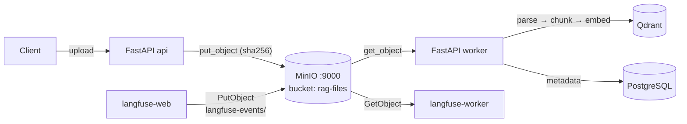
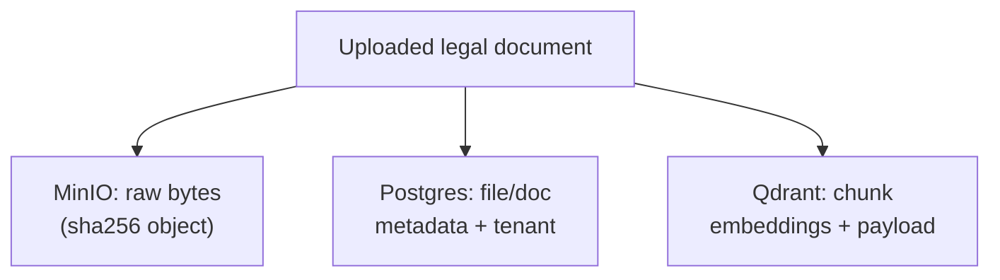

# MinIO — S3-Compatible Object Storage

> The blob store. Holds the **raw bytes** of every uploaded legal document and
> the event payloads Langfuse offloads from its queue. Everything large and
> binary lives here, not in Postgres or Qdrant.

Image: `minio/minio:RELEASE.2024-12-18...` · Service: `minio` · API `9000`,
Console `9001` · Bucket: `rag-files`.

---

## 1. What is its task?

MinIO is the **object storage** layer, speaking the **S3 API**. Its jobs:

1. **Store raw uploaded files** — the original PDF/DOCX/MD/TXT bytes a user
   uploads, before/after parsing. Files **dedupe by SHA-256**, so the same
   document uploaded twice maps to one object.
2. **Serve files back** — the worker fetches raw bytes from MinIO to parse,
   chunk, and embed; the API can return source files / page references.
3. **Back Langfuse event uploads** — Langfuse v3 offloads large trace-event
   payloads to S3; here it reuses this MinIO under the
   `langfuse-events/` prefix in the same bucket.

The split of concerns: **MinIO = bytes**, **Postgres = metadata**, **Qdrant =
embeddings**. A document is reconstructed by joining the three.

---

## 2. How does it work?

### Server
`minio server /data --console-address ":9001"`
- `:9000` — S3 API endpoint (programmatic access).
- `:9001` — web console (human admin UI).
- Data persists in the `minio-data` volume.
- Root credentials via `MINIO_ROOT_USER` / `MINIO_ROOT_PASSWORD`.

### Bucket bootstrap (`minio-init` one-shot container)
On first boot a `minio/mc` container runs:
```sh
mc alias set local http://minio:9000 $USER $PASS
mc mb --ignore-existing local/rag-files     # create bucket (idempotent)
mc anonymous set none local/rag-files        # private: no anonymous access
```
It then exits (`restart: "no"`). The `api`/`worker` also ensure the bucket on
startup as a safety net.

### Object layout (logical)
```
rag-files/
 ├─ <tenant>/<sha256>.<ext>     # raw uploaded documents
 └─ langfuse-events/...         # Langfuse S3 event uploads
```
Access from the app uses an S3 client with `MINIO_ENDPOINT=minio:9000`,
`MINIO_SECURE=false` (plain HTTP inside the Docker network).

---

## 3. How does it communicate with the other services?

MinIO is a **passive S3 server** on `backend`; clients connect to `minio:9000`.

| Client | Operation | Purpose |
|--------|-----------|---------|
| **FastAPI `api`** | `put_object` | Store uploaded file bytes (after SHA-256 dedup check) |
| **FastAPI `worker`** | `get_object` | Fetch raw bytes to parse → chunk → embed |
| **langfuse-web** | S3 `PutObject` | Offload large trace-event payloads (`langfuse-events/`) |
| **langfuse-worker** | S3 `GetObject` | Read those event payloads for processing |
| **minio-init** | `mb` / `anonymous` | One-time bucket creation + lock-down |

MinIO never initiates outbound calls — it only responds to S3 requests.

### Diagram



### Where a document lives (the 3-way join)


---

## 4. Operational notes & failure modes

- **Private bucket:** `mc anonymous set none` — no public/anonymous reads. All
  access is credentialed; never expose `:9000`/`:9001` publicly without auth.
- **Source of truth for bytes:** if MinIO is lost, embeddings in Qdrant remain
  but you can't re-parse or serve originals — back up `minio-data`.
- **Shared bucket with Langfuse:** RAG files and Langfuse events coexist in
  `rag-files` separated by prefix; consider a dedicated bucket in production.
- **Path-style addressing:** Langfuse uses
  `LANGFUSE_S3_..._FORCE_PATH_STYLE=true` because MinIO uses path-style URLs
  (`minio:9000/bucket`) rather than virtual-host style.
- **TLS:** `MINIO_SECURE=false` is fine inside the Docker network; terminate TLS
  at Nginx / use HTTPS for any external access.
