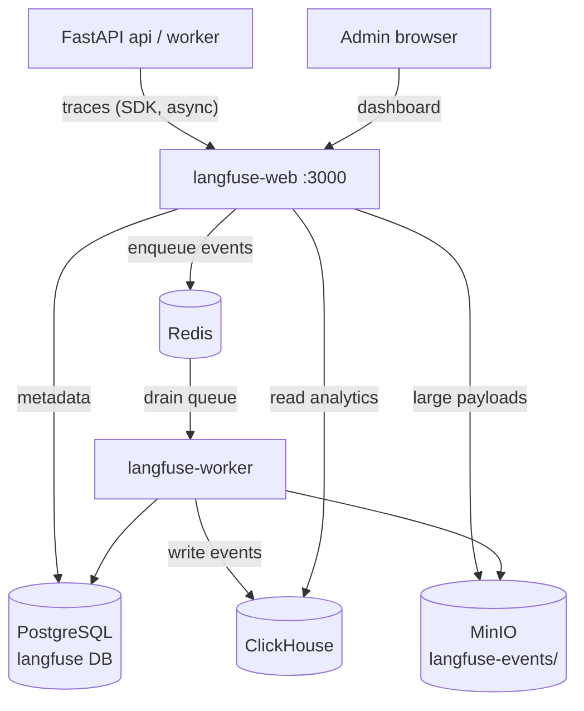

# Langfuse — LLM Observability & Tracing

> The eyes of the system. Records every LLM call, retrieval step, and agent run
> as structured **traces** so you can debug quality, measure latency/cost, and
> evaluate the RAG pipeline. Langfuse v3 is itself a mini-stack that **reuses**
> the data services already present.

Images: `langfuse/langfuse:3` (web) + `langfuse/langfuse-worker:3` · UI port `3000`.

---

## 1. What is its task?

Langfuse provides **observability for the LLM/agent layer**:

- **Tracing** — each chat request becomes a trace with nested spans:
  `load_memory → retrieve_docs (vector search, rerank) → generate (LLM tokens)`.
- **Generations** — prompt, model, token counts, latency, and **cost** per LLM
  call (Gemini default / heavy, embeddings, LLM-rerank fallback).
- **Evaluation & datasets** — store eval runs (`docs/07-evaluation.md`).
- **Debugging** — see exactly which chunks were retrieved/reranked and what the
  model actually received — essential for a citation-grounded legal RAG.

In this stack it is **opt-in**: `LANGFUSE_ENABLED=false` by default; you create a
project in the UI, paste `LANGFUSE_PUBLIC_KEY` / `LANGFUSE_SECRET_KEY` into `.env`,
and the app starts emitting traces.

---

## 2. How does it work?

Langfuse v3 is **two app containers + four backing stores**:

| Container | Role |
|-----------|------|
| `langfuse-web` | UI + ingestion API; receives traces from the app, serves the dashboard on `:3000` |
| `langfuse-worker` | Background processor: consumes the event queue, writes analytics to ClickHouse |

Backing stores (note the **reuse** of existing infra):

| Store | Used for |
|-------|----------|
| **PostgreSQL** (`langfuse` DB) | App metadata: projects, users, API keys, configs |
| **ClickHouse** (`24.10`) | High-volume **trace/observation/score events** (columnar OLAP) |
| **Redis** | Event queue between web → worker; caching |
| **MinIO (S3)** | Large event payload uploads (`langfuse-events/` prefix) |

### Data flow inside Langfuse
1. App SDK batches spans and POSTs them to `langfuse-web:3000`.
2. `langfuse-web` enqueues events to **Redis** (and offloads big payloads to
   **MinIO**), storing metadata in **Postgres**.
3. `langfuse-worker` drains the Redis queue and writes the analytical records to
   **ClickHouse**.
4. The UI queries ClickHouse + Postgres to render traces, costs, latency charts.

Secrets: `SALT`, `ENCRYPTION_KEY`, `NEXTAUTH_SECRET` (generated via
`openssl rand -hex 32`). DB migrations (Postgres + ClickHouse) run automatically
on container start.

---

## 3. How does it communicate with the other services?

| Direction | From → To | Protocol | Purpose |
|-----------|-----------|----------|---------|
| Inbound | **FastAPI api/worker → langfuse-web:3000** | HTTPS/SDK | Send traces, spans, generations |
| Internal | langfuse-web ↔ **Redis** | RESP | Event queue |
| Internal | langfuse-web/worker → **Postgres** (`langfuse` DB) | pg | Metadata |
| Internal | langfuse-web/worker → **ClickHouse** (`8123` / `9000`) | HTTP / native | Analytics events |
| Internal | langfuse-web/worker → **MinIO:9000** | S3 | Event payload uploads |
| Inbound | Human browser → **langfuse-web:3000** | HTTP | Dashboard UI |

Key point: Langfuse is **off the request hot path**. The app sends traces
**asynchronously / fire-and-forget**, so a Langfuse outage must never block or
slow a chat response.

### Diagram

---

## 4. Operational notes & failure modes

- **Non-blocking by design:** tracing failures should degrade silently. Verify
  the SDK is configured fire-and-forget so Gemini latency/availability is unaffected.
- **ClickHouse is heavy:** it needs high `nofile` ulimits (set to 262144) and its
  own volumes (`clickhouse-data`, `clickhouse-logs`). It is the largest resource
  consumer in the observe layer.
- **Shared dependencies:** Langfuse leans on the same Postgres/Redis/MinIO as the
  app to save containers. At scale, isolate them so trace volume can't starve the
  app's cache/queue.
- **First-run setup:** until you create a project and fill in the public/secret
  keys, no traces are recorded even if containers are up.
- **Two databases on one Postgres:** app data (`rag`) and Langfuse metadata
  (`langfuse`) are separate logical DBs on the same server.
