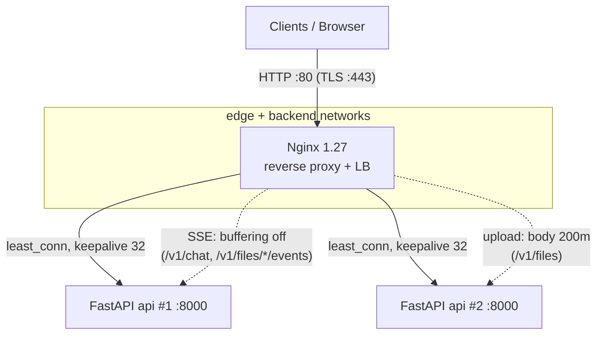
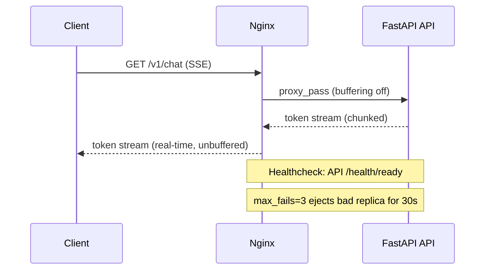

# Nginx — Edge Reverse Proxy & Load Balancer

> The front door. The only service exposed to the outside world. It terminates
> client connections, load-balances across FastAPI replicas, and — critically for
> this app — is tuned to **stream Server-Sent Events (SSE)** without buffering.

Image: `nginx:1.27-alpine` · Service: `nginx` · Port `80` (443 ready for TLS).

---

## 1. What is its task?

Nginx is the **edge / reverse proxy**. Its responsibilities:

1. **Single public entrypoint** — listens on `:80`; the `api` containers are only
   `expose`d (never published), so all traffic must pass through Nginx.
2. **Load balancing** — distributes requests across the `API_REPLICAS` (2) using
   `least_conn`, which suits long, variable-latency streaming chat connections.
3. **SSE-aware streaming** — disables proxy buffering on chat/event endpoints so
   LLM tokens reach the browser the instant FastAPI flushes them.
4. **Upload handling** — allows large request bodies (`client_max_body_size 200m`)
   and buffers uploads.
5. **TLS termination** (production) — `443` block is ready to enable.
6. **Cross-cutting edge concerns** — gzip for JSON, structured JSON access logs,
   `server_tokens off`, forwarded headers (`X-Real-IP`, `X-Forwarded-*`).

It is the **only service on both the `edge` and `backend`** Docker networks —
bridging the public edge to the internal service mesh.

---

## 2. How does it work?

### Upstream (`nginx.conf`)

```nginx
upstream api_upstream {
    least_conn;
    server api:8000 max_fails=3 fail_timeout=30s;
    keepalive 32;
}
```

- Docker DNS resolves `api` to the replica IPs; `least_conn` sends each new
  request to the replica with the fewest active connections.
- `max_fails=3 / fail_timeout=30s` ejects an unhealthy replica for 30s.
- `keepalive 32` reuses upstream connections (needs `proxy_http_version 1.1` +
  `Connection ""`).

### Route map (`conf.d/*.conf`)

| Location                              | Behavior                                                                                             | Why                                                             |
| ------------------------------------- | ---------------------------------------------------------------------------------------------------- | --------------------------------------------------------------- |
| `= /nginx-health`                   | returns `200 ok`                                                                                   | Nginx's own healthcheck (access_log off)                        |
| `~* ^/v1/(chat\|files/[^/]+/events)` | **`proxy_buffering off`**, `gzip off`, `X-Accel-Buffering no`, `proxy_read_timeout 1h` | **SSE streaming** — tokens/progress must not be buffered |
| `/v1/files`                         | `client_max_body_size 200m`, `proxy_request_buffering on`, 600s timeouts                         | **Large uploads**                                         |
| `/` (default)                       | standard proxy, 120s timeouts                                                                        | Everything else                                                 |

### Why buffering off matters

By default Nginx buffers upstream responses and flushes in chunks — fatal for
SSE, where the user would see the whole answer appear at once after a delay. The
chat/events routes turn buffering off and enable `chunked_transfer_encoding` so
each token streams through in real time. Gzip is **off** on SSE (gzip re-buffers).

---

## 3. How does it communicate with the other services?

Nginx talks to **exactly one** internal service: the FastAPI `api` upstream.
Everything else (Postgres, Redis, Qdrant, MinIO, Langfuse) is reached *through*
FastAPI, not by Nginx.

| Direction | Peer                    | Protocol                                   | Notes                        |
| --------- | ----------------------- | ------------------------------------------ | ---------------------------- |
| Inbound   | Internet / clients      | HTTP `:80` (HTTPS `:443` when enabled) | Only exposed port            |
| Outbound  | `api:8000` (upstream) | HTTP/1.1 keep-alive                        | Load-balanced,`least_conn` |

### Diagram



### End-to-end request path



---

## 4. Operational notes & failure modes

- **Don't gzip/buffer SSE.** Any reverse proxy in front (cloud LB, CDN) must also
  pass `X-Accel-Buffering: no` and avoid buffering, or streaming breaks again.
- **Timeouts:** SSE routes use `proxy_read_timeout 1h` for long chats; uploads
  600s; default 120s. Tune for your longest legitimate stream.
- **Replica ejection:** if all `api` replicas fail their checks, Nginx has no
  healthy upstream → `502`. The `/nginx-health` endpoint stays up regardless.
- **Body size:** `client_max_body_size 200m` is set in both `http{}` and the
  upload location; raising upload limits means changing both.
- **TLS:** enable the `443` server block + mount certs; then redirect `80→443`.
- **Networks:** Nginx is the bridge — keep data services off the `edge` network
  so only the proxy is internet-reachable.
